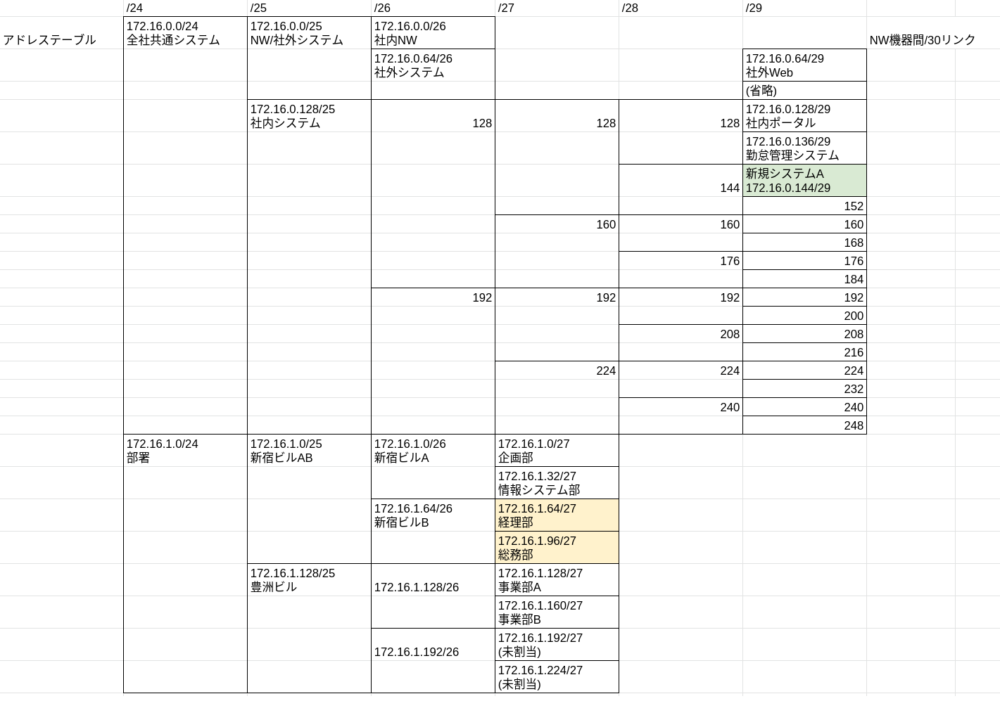

<!-- HEADER -->
[Previous](../app1/question.md) << [Index](../index.md) >> [Next](../app2/question.md)

---
<!-- /HEADER -->

<!-- TOC -->

- [App-1 (解説編)](#app-1-解説編)
  - [構成図](#構成図)
  - [問題1: 新規システムA環境構築](#問題1-新規システムa環境構築)
    - [アドレス割当](#アドレス割当)
    - [アドレス設定](#アドレス設定)
  - [問題2](#問題2)
  - [問題3](#問題3)
    - [Firewall.B パケットフィルタルール](#firewallb-パケットフィルタルール)
    - [Firewall.C パケットフィルタルール](#firewallc-パケットフィルタルール)
  - [まとめ](#まとめ)
    - [ネットワークによる物理的な位置の吸収](#ネットワークによる物理的な位置の吸収)
    - [IPアドレス設計と管理](#ipアドレス設計と管理)
    - [通信要件とファイアウォールのルール設定](#通信要件とファイアウォールのルール設定)

<!-- /TOC -->

# App-1 (解説編)

## 構成図

図 2: 詳細 (`exercise/app1/answer.json`) : 回答用のものがあります


## 問題1: 新規システムA環境構築

### アドレス割当

回答

* 新規システム A のアドレスブロックは 172.16.0.144/29 になります。
* /25 ブロックを /29 ブロックに分割すると 16 個になります。最大 16 システムまで作れます。

ポイント

* 以下のアドレスブロック分割がイメージできているか?



アドレスブロック分割がイメージできていると、サブネットマスクの差だけである程度計算できます。サブネットマスクが 1bit 増える = 半分に割る = ブロック数は x2 です。したがって、サブネットマスクが 2bit 違えば 2^2 = 4 分割されていることになります。これを踏まえると

* 新規システム A のアドレスブロック
  * /29 - /32 でサブネットマスクに 3bit の違いがある → /29 アドレスブロックには 2^3 = 8 個のアドレスがある。(ブロックのサイズ)
  * /25 を /29 に分割して頭から順に使うルールになっています。NW.1a, NW.1b をみると、ネットワークアドレスが 172.16.0.128 → 172.16.0.136 と +8 されていることがわかります。NW.1c は NW.1b 172.16.0.136 の次のブロックなので、さらに +8 して 172.16.0.144 になることがわかります。
* 社内システムはいくつ作れるか
  * /25 - /29 でサブネットマスクに 4bit の違いがある → 2^4 = 16 分割されています。

### アドレス設定

問題 1 は、アドレス割当がメインで設定は副次的な要素です。(設定済みにしてしまうとアドレス採番の答えになってしまうため。)

回答

```sh
# re, s1c ダミーIPアドレスを削除する
re ip addr del 10.0.0.1/24 dev re-eth1.12
s1c ip addr del 10.0.0.2/24 dev s1c-eth0

# re, s1c IPアドレスを設定する。(`nn` はプレフィックスレングス)
re ip addr add 172.16.0.145/29 dev re-eth1.12
s1c ip addr add 172.16.0.146/29 dev s1c-eth0

# s1c 経路情報を設定する
s1c ip route add default via 172.16.0.145
```

ポイント

* 設定箇所 (設定対象インタフェース) が理解できている?
  * ルータ側の VLAN とサブインタフェースの関係
* アドレス採番ルール
  * 172.16.1.144/29 で実際にノードに割り振れるアドレスは .145-.150 です。(サブネットの一番最初のアドレスはネットワークアドレス・最後のアドレスはブロードキャストアドレスなのでノードには使用しない。)
  * ノードに利用可能な範囲の一番最初をデフォルトゲートウェイ (re-eth1.12) に、次のアドレスを Server.1c に設定します。
* IP アドレスの変更をした後で、Server.1c 上で動作しているサーバプロセス (web, ssh) が変更後の IP で listen しているかどうかを確認してください。
* Router.A は社内システム全体 (172.16.0.128/25) を Router.E へ転送しているため特に設定は必要ありません。(すでに含まれている)

サーバプロセスの動作確認

```text
mininet> s1c ps -o pid,args
172.16.0.5 - - [09/Jul/2021 14:40:55] "GET / HTTP/1.1" 200 -
    PID COMMAND
   7295 bash --norc -is mininet:s1c
   7576 python3 -m http.server 8000 -d /exercise/app1/docroot-s1c-http
   7577 python3 -m http.server 22 -d /exercise/app1/docroot-s1c-ssh
   7719 ps -o pid,args
mininet> s1c ss -ntl
State    Recv-Q   Send-Q     Local Address:Port     Peer Address:Port  Process
LISTEN   0        5                0.0.0.0:22            0.0.0.0:*
LISTEN   0        5                0.0.0.0:8000          0.0.0.0:*
```

## 問題2

回答

最小

```text
# ra により優先度の高い "新宿ビル B" ルートを追加
ra ip route add 172.16.1.64/26 via 172.16.0.14
# fb, fc で "新宿ビル B" の転送先を豊洲側に変更
fb ip route del 172.16.1.64/26
fb ip route add 172.16.1.64/26 via 172.16.0.9
fc ip route add 172.16.1.64/26 via 172.16.0.26
```

やや冗長

```text
# 新宿ビル A/B 両方を指す /25 の経路を消して個別に設定し直す
ra ip route del 172.16.1.0/25
ra ip route add 172.16.1.0/26 via 172.16.0.10
ra ip route add 172.16.1.64/26 via 172.16.0.14
# fb, fc については "最小" と同様
```

集約せず部署単位で制御したい場合には分けて書く

```text
# `ra ip route add 172.16.1.64/26 via 172.16.0.14` と同等, 他も同様
ra ip route add 172.16.1.64/27 via 172.16.0.14
ra ip route add 172.16.1.96/27 via 172.16.0.14
```

ポイント

* アドレスブロックの集約・分割と longest match 動作が理解できているか?
  * アドレスブロック分割のツリーを考えると、移動対象の部署 (経理部・総務部) のアドレスブロックは、1 つのアドレスブロックで表現できます。
* Router.A には "172.16.1.0/25" = 新宿ビル A/B 棟全体を Firewall.B 側に転送する経路が入っています。今回、新宿ビル A 棟はまだそのまま、B 棟側だけを豊洲方面へ転送できれば良いことになります。
  * 同様に、Firewall.B/C でも移転対象部署のネットワークを転送する方向を切り替えます。
* Longest-match 動作を考えると、/25 よりも細かいアドレスブロック (長いサブネットマスク）で B 棟宛のルールを設定してやれば、そちらが優先されます。(最小)
* "やや冗長" な書き方は、新宿ビル A/B 全体を新宿ビル A と B に明示的に分割する書き方です。
* 移動対象の部署ごとに /27 経路で 2 つ設定しても構いませんが、今回部署ごとに経路を変更する必要性がないので、これも少し冗長になります。

L3 自動テスト (`l3`) でもよいですが、`pingall` でも確認してみましょう。"最小" の経路を Router.A, Firewall.B/C に設定した状態です。

* 移転後の Host.3a/b → Router.C への通信が失敗していること、同様に Router.C → Host.3a/b への通信が失敗していることに注意してください。
* Router.C から見ると、Host.3a/b のいるネットワークはまだ「自分の足元 (新宿ビル B 棟)」側にいるように見えています。社内ネットワーク的には、NW.3a/b (総務・経理)が 2 箇所にあり、経路制御で豊洲に「寄せている」状態になっています。

```text
mininet> pingall
*** Ping: testing ping reachability
fa -> fb fc h2a h2b h3a h3b h4a h4b inet ra rb rc rd re s0a s1a s1b s1c 
fb -> fa fc h2a h2b h3a h3b h4a h4b inet ra rb rc rd re s0a s1a s1b s1c 
fc -> fa fb h2a h2b h3a h3b h4a h4b inet ra rb rc rd re s0a s1a s1b s1c 
h2a -> fa fb fc h2b h3a h3b h4a h4b inet ra rb rc rd re s0a s1a s1b s1c 
h2b -> fa fb fc h2a h3a h3b h4a h4b inet ra rb rc rd re s0a s1a s1b s1c 
h3a -> fa fb fc h2a h2b h3b h4a h4b inet ra rb X rd re s0a s1a s1b s1c 
h3b -> fa fb fc h2a h2b h3a h4a h4b inet ra rb X rd re s0a s1a s1b s1c 
h4a -> fa fb fc h2a h2b h3a h3b h4b inet ra rb rc rd re s0a s1a s1b s1c 
h4b -> fa fb fc h2a h2b h3a h3b h4a inet ra rb rc rd re s0a s1a s1b s1c 
inet -> fa X X X X X X X X X X X X X s0a X X X 
ra -> fa fb fc h2a h2b h3a h3b h4a h4b inet rb rc rd re s0a s1a s1b s1c 
rb -> fa fb fc h2a h2b h3a h3b h4a h4b inet ra rc rd re s0a s1a s1b s1c 
rc -> fa fb fc h2a h2b X X h4a h4b inet ra rb rd re s0a s1a s1b s1c 
rd -> fa fb fc h2a h2b h3a h3b h4a h4b inet ra rb rc re s0a s1a s1b s1c 
re -> fa fb fc h2a h2b h3a h3b h4a h4b inet ra rb rc rd s0a s1a s1b s1c 
s0a -> fa fb fc h2a h2b h3a h3b h4a h4b inet ra rb rc rd re s1a s1b s1c 
s1a -> fa fb fc h2a h2b h3a h3b h4a h4b inet ra rb rc rd re s0a s1b s1c 
s1b -> fa fb fc h2a h2b h3a h3b h4a h4b inet ra rb rc rd re s0a s1a s1c 
s1c -> fa fb fc h2a h2b h3a h3b h4a h4b inet ra rb rc rd re s0a s1a s1b 
*** Results: 5% dropped (322/342 received)
```

## 問題3

### Firewall.B パケットフィルタルール

回答

* 挿入位置に注意: `state RELATED,ESTABLISHED` の前に挿入してください。

```text
fb iptables -I FORWARD 5 -p tcp -s 172.16.1.0/25 -d 172.16.0.144/29 --dport 8000 -j ACCEPT
```

こうします

```text
mininet> fb iptables -nvL --line-numbers
Chain INPUT (policy ACCEPT 0 packets, 0 bytes)
num   pkts bytes target     prot opt in     out     source               destination

Chain FORWARD (policy DROP 0 packets, 0 bytes)
num   pkts bytes target     prot opt in     out     source               destination
1       60  5040 ACCEPT     icmp --  *      *       0.0.0.0/0            0.0.0.0/0
2       27  1751 ACCEPT     tcp  --  *      *       172.16.1.32/27       172.16.0.0/24        tcp dpt:22
3       40  2582 ACCEPT     tcp  --  *      *       172.16.1.0/25        0.0.0.0/0            tcp dpt:80
4       12   802 ACCEPT     tcp  --  *      *       172.16.1.0/25        172.16.0.136/29      tcp dpt:8000
5       13   854 ACCEPT     tcp  --  *      *       172.16.1.0/25        172.16.0.144/29      tcp dpt:8000
6       80 11246 ACCEPT     all  --  *      *       0.0.0.0/0            0.0.0.0/0            state RELATED,ESTABLISHED
7        4   240 REJECT     all  --  *      *       0.0.0.0/0            0.0.0.0/0            reject-with icmp-port-unreachable

Chain OUTPUT (policy ACCEPT 4 packets, 352 bytes)
num   pkts bytes target     prot opt in     out     source               destination
```

ポイント

* 172.16.1.0/25 は新宿ビル A/B 棟全体です。すでに設定してあるフィルタ設定と管理単位(粒度 = アドレスブロックサイズ)を合わせていますが、移転後なので 172.16.1.0/26 (A 棟) だけに制限しても問題ありません。

### Firewall.C パケットフィルタルール

回答

* 挿入位置に注意: `state RELATED,ESTABLISHED` の前に挿入してください。

```text
fc iptables -I FORWARD 4 -p tcp -s 172.16.1.128/25 -d 172.16.0.144/29 --dport 8000 -j ACCEPT
fc iptables -I FORWARD 5 -p tcp -s 172.16.1.64/26 --dport 80 -j ACCEPT
fc iptables -I FORWARD 6 -p tcp -s 172.16.1.64/26 -d 172.16.0.136/29 --dport 8000 -j ACCEPT
fc iptables -I FORWARD 7 -p tcp -s 172.16.1.64/26 -d 172.16.0.144/29 --dport 8000 -j ACCEPT
```

```text
mininet> fc iptables -nvL --line-numbers
Chain INPUT (policy ACCEPT 0 packets, 0 bytes)
num   pkts bytes target     prot opt in     out     source               destination

Chain FORWARD (policy DROP 0 packets, 0 bytes)
num   pkts bytes target     prot opt in     out     source               destination
1      120 10080 ACCEPT     icmp --  *      *       0.0.0.0/0            0.0.0.0/0
2       38  2478 ACCEPT     tcp  --  *      *       172.16.1.128/25      0.0.0.0/0            tcp dpt:80
3       14   906 ACCEPT     tcp  --  *      *       172.16.1.128/25      172.16.0.136/29      tcp dpt:8000
4       13   854 ACCEPT     tcp  --  *      *       172.16.1.128/25      172.16.0.144/29      tcp dpt:8000
5       40  2582 ACCEPT     tcp  --  *      *       172.16.1.64/26       0.0.0.0/0            tcp dpt:80
6       13   854 ACCEPT     tcp  --  *      *       172.16.1.64/26       172.16.0.136/29      tcp dpt:8000
7       13   854 ACCEPT     tcp  --  *      *       172.16.1.64/26       172.16.0.144/29      tcp dpt:8000
8      117 16364 ACCEPT     all  --  *      *       0.0.0.0/0            0.0.0.0/0            state RELATED,ESTABLISHED
9       16   960 REJECT     all  --  *      *       0.0.0.0/0            0.0.0.0/0            reject-with icmp-port-unreachable

Chain OUTPUT (policy ACCEPT 16 packets, 1408 bytes)
num   pkts bytes target     prot opt in     out     source               destination
```

ポイント

* 事業部→新規システム A 向けと、移転した総務・経理→各社内システム向けのルールを設定します。
* 80/tcp (http) はインターネット向けの可能性があるので、送信先を限定できません。

## まとめ

### ネットワークによる物理的な位置の吸収

移転の前後で、IP アドレス的な観点では「末端からは見た目が変化していない」ことに気づきましたか? 移転対象となった経理部・総務部の PC では IP アドレスを変更していませんし、経理部・総務部からアクセス可能な社内システムなど、見た目は全く変化していません。

IP アドレス (L3, 論理構成) のレベルでは構造が変化していませんが、マッピングする L1/L2 の設定が変わったことによって物理的な場所が変化しています。物理的な場所を返ることによって、中間経路では経路制御設定が変わったりファイアウォールのフィルタルールが変わったりしていますが、これはエンドポイント (エンドユーザ) からは見えていません。(`traceroute` 等で調査すればわかりますが)

L3-L2-L1 のマッピングを適切に設定することで、ネットワークによって「物理的な場所」が吸収されます。計算機の実体がどこにあるのか、どれだけ距離が離れているのかなどを抽象化し、末端 (endpoint) から見えるのは原則その名前 (DNS) と IP アドレスになります。

### IPアドレス設計と管理

実践的なシナリオとして企業ネットワークの経路制御・ファイアウォール設定と "引越し" 対応について考えてみました。特に IP アドレスの割り振り (IP アドレス設計) について、どういった考え方(ポリシ)で分割され、割当が行なわれているかについて理解できたでしょうか?

* IP サブネットマスクの集約・分割しやすい単位になっていると、経路設定やファイアウォール設定が楽になります。
* 要件によっては IP アドレスブロックを組織のサイズに応じて変更する必要があるかもしれません。また、この問題のように再編や移動などの変更を予測する必要も出てきます。業務の要件・将来ありうる変化 (拡張・縮小など) を元に IP アドレスの使い方を設計する必要があります。
  * 例: T 社では「場所 (ビル)」を元にしたアドレスブロック分割が行なわれていましたが、今回のようにビル移転をしていくと、管理単位が次第に実体と合わなくなっていくことが予想されます。今後どのようにアドレスを管理していくのが良いでしょうか?
* IP アドレスや VLAN ID などは、ネットワークに接続するための論理的な「資源」です。一意性を保ち、必要な場所で必要なだけ使用できるように「資源管理」することが求められます。

### 通信要件とファイアウォールのルール設定

[App-1 問題編](question.md) 通信要件表のように、ファイアウォールのルールを決めるには様々な情報が必要になります。

* __通信要件 (どこから・どこへ・なんの通信をするのか)__
  * 検討の起点となる情報です。
  * 実際の案件では、サービスに関わるトラフィックはもちろんですが、共通して使われる運用系の通信もリストアップしてください。特に DNS (名前解決), NTP (時刻同期) は直接的なサービス障害につながります。他にも、ログ系・監視サーバ系・リモートアクセス系などが漏れるとトラブル対応できなくなる恐れがあります。
  * 障害発生時のシステム切り替え (failover) など、状態に応じて通信要求が変化するものに注意してください。
* 通信要件でリストアップしたトラフィックがどこを通るのか = 経路
  * App-1 には含まれていませんが、冗長経路があり、経路に複数のパターンがある場合は注意してください。([L4NW-3](../l4nw3/question.md) では L3 非対称経路がある場合のファイアウォール動作について見ています。)
* 経路上のどこで、どのようなトラフィックコントロールをするのか(パケットフィルタ設計)
  * 一般的にファイアウォールなどのセキュリティ製品は、管理対象領域の境界に置かれます。これは「境界防御」と呼ばれます。
  * 境界の外から中へ入るもの、中から外へ出ていくものそれぞれについて、設計上のポリシがあます。それに基づいて通信制御(通信を通すか)を決めていきます。

ファイアウォールのフィルタは本来、L3/L4 について設計(目的・ルール・ポリシ・考え方)があった上で設定されるものです。T 社のネットワークでは通信要件と経路の検討までが中心で、設計上のポリシなどについては明示されていませんが、ルールを見ていくと以下のような使い分けがあります。ネットワークの構造上、どこでどんな通信をコントロールできる・するべきか、対比させながらルールを考えてみてください。

* Firewall.A
  * インターネット境界 (社内 - インターネット間の通信制御)
  * 社外向け公開サーバ (社外 web サーバ) に対するアクセス制御
* Firewall.B/C
  * 各ビル内にある部署との境界 (部署を起点・終点とする社内通信の通信制御)
* T 社ネットワークのファイアウォールに関する検討点 : 実態は下記のようになっていますが、これらはセキュリティの管理上良いかどうかを考える必要があるでしょう
  * データセンタ内、社内共通システムの境界点にファイアウォールがないので、共通システムへの通信制御は各ビルにある部署境界ルータ (Firewall.B/C) で行なわれています。
  * 特定のビル内にある部署間の通信はフィルタされていません。相互に通信できます。

<!-- FOOTER -->

---

[Previous](../app1/question.md) << [Index](../index.md) >> [Next](../app2/question.md)
<!-- /FOOTER -->
