<!-- HEADER -->
[Previous](../app2/question.md) << [Index](../index.md) >> Next

---
<!-- /HEADER -->

<!-- TOC -->

- [App-2 解説編](#app-2-%E8%A7%A3%E8%AA%AC%E7%B7%A8)
  - [構成図](#%E6%A7%8B%E6%88%90%E5%9B%B3)
  - [問題1](#%E5%95%8F%E9%A1%8C1)
  - [問題2](#%E5%95%8F%E9%A1%8C2)
  - [まとめ](#%E3%81%BE%E3%81%A8%E3%82%81)
    - [プライベートとグローバル](#%E3%83%97%E3%83%A9%E3%82%A4%E3%83%99%E3%83%BC%E3%83%88%E3%81%A8%E3%82%B0%E3%83%AD%E3%83%BC%E3%83%90%E3%83%AB)
    - [アドレスの一意性](#%E3%82%A2%E3%83%89%E3%83%AC%E3%82%B9%E3%81%AE%E4%B8%80%E6%84%8F%E6%80%A7)
    - [インターネットとの通信とNAT](#%E3%82%A4%E3%83%B3%E3%82%BF%E3%83%BC%E3%83%8D%E3%83%83%E3%83%88%E3%81%A8%E3%81%AE%E9%80%9A%E4%BF%A1%E3%81%A8nat)
  - [おまけ A社・T社ネットワーク統合をどう考えるか?](#%E3%81%8A%E3%81%BE%E3%81%91-a%E7%A4%BE%E3%83%BBt%E7%A4%BE%E3%83%8D%E3%83%83%E3%83%88%E3%83%AF%E3%83%BC%E3%82%AF%E7%B5%B1%E5%90%88%E3%82%92%E3%81%A9%E3%81%86%E8%80%83%E3%81%88%E3%82%8B%E3%81%8B)
    - [短期ワークアラウンド](#%E7%9F%AD%E6%9C%9F%E3%83%AF%E3%83%BC%E3%82%AF%E3%82%A2%E3%83%A9%E3%82%A6%E3%83%B3%E3%83%89)
    - [長期根本対策](#%E9%95%B7%E6%9C%9F%E6%A0%B9%E6%9C%AC%E5%AF%BE%E7%AD%96)

<!-- /TOC -->

# App-2 (解説編)

## 構成図

図 1: 構成図(概要)

## 問題1

回答

T 社 - A 社の社内でおなじアドレスブロックが使われています (IP アドレス重複)。

* T 社は国内各地区で 172.16.0.0/16 の範囲内を /25-/22 で区切って使っています。一方、A 社は支社単位で 172.x.0.0/16 に割り振られています。したがって、T 社全域と 172.16.0.0/16 を割り振られた A 社東京本社のアドレスブロックが重複しています。
* A 社東京本社は本社と北関東営業所で 172.16.0.0/16 の一部を使用しているようです。
* A 社東京本社・北関東営業所の 172.16.0.0/18 は 172.16.0.0-172.16.63.254 の範囲となるため、T 社新宿・豊洲・関東圏の拡張予備と重複します。
* A 社東京本社の 172.16.0.64/18 は 172.16.64.0-172.16.127.255 の範囲なので、T 社の名古屋・大阪地区と重複しています。

ポイント

* [L3NW-2](../l3nw2/question.md) で見たように、同じネットワーク内に同一アドレスブロックが複数ある場合、あるノードからはそれらのうち、いずれか 1 つにしか到達できません。
* T 社の広島地区のアドレスはかろうじて重複していません。ただ、それぞれのネットワークの作りを考えれば、T 社広島地区から A 社東京地区宛のつもりで送信した通信は、T 社内の同じアドレスの地区へ優先して転送されるため、A 社には届かないでしょう。

## 問題2

回答

* A 社内のネットワークをつくる際に、プライベートアドレスの範囲を誤解してインターネット上のグローバルアドレスを使用してしまっています。
* そのため、A 社内に X 社のグローバルアドレスと重複するアドレスブロックがあり、T 社内で X 社宛の通信をしようとすると、同じアドレスブロックを持つ T 社内の拠点(台湾地区)に転送されています。

ポイント

* A 社内のアドレス割当ルールは、「支社単位で 172.x.0.0/16」です。東京本社 (x=16) からはじまって国内・海外の支社へ順番に /16 ブロックを割り振っています。
* 問題は、インターネット上の「合意」としては、プライベートアドレスとして使える範囲が 172.16.0.0/12 (172.16.0.0-172.31.255.255) の範囲だということです。よって、A 社内だと、台湾・シンガポール・マレーシア支社のアドレスブロックはプライベートアドレスの範囲を超えている = インターネット上でグローバルに使われる範囲のアドレスブロックです。
* 問題 2 のヒントで出したように、米国 T-Mobile 社が 172.32.0.0/11 を所有しています。
  * この問題の設定では、X 社は T-Mobile が提供する回線サービスを使ってインターネットに接続しており、インターネット上での通信に 172.32.0.0/16 内の IP アドレスを使っています。

## まとめ

### プライベートとグローバル

プライベートアドレスを含む特殊な IP アドレスについては [RFC6890](https://datatracker.ietf.org/doc/html/rfc6890) にまとめられています。プライベートアドレスについては [RFC1918](https://datatracker.ietf.org/doc/html/rfc1918) が初出 (1996 年) となり、よく参照されます。

インターネットの合意 = ネットワークを相互に接続するための合意について考えてみましょう。プライベートアドレスを「組織内など内部で自由に使用して良いアドレス」だとシンプルに捉えている人もいるでしょう。そう考えて支障がないのは、「**世界的な通信網で誰からも一意に見えるアドレス空間が必要な**インターネットの世界では、プライベートアドレスとして定義された範囲は使わないことにしよう」という合意があるからです。

### アドレスの一意性

通信する相手(と自分)の位置を指定するための IP アドレスは、通信を成立させたい範囲内で一意である必要があります。世界中の人と通信できるようにするためには、世界中どこから見ても一意に見えるアドレスが必要になります。これがグローバル IP アドレスと呼ばれているものです。IP アドレスの一意性を保証するための管理団体があり、インターネットへ接続したい団体(事業者)はその管理団体から世界のどこから見ても一意なアドレスブロックの割当を受ける必要があります。

この一意性は、どこからどこへ通信したいのかの範囲によります。一定の領域内でしか通信をしないノードであればその「一意に見える範囲」を狭く考えても問題ありません。実際、合併前なら T 社の範囲内で問題はありませんでした (一意に送受信する相手を識別できていた)。しかし、T/A 社の合併となって、双方の中で一意性が求められたときに破綻しています。[L3NW-2](../l3nw2/question.md) では T 社の新宿 - 豊洲移転について取り上げましたが、移転直後は新宿と豊洲に同じアドレスブロックが存在しており、社内から見て豊洲にある方が「優先される」だけでした。T 社内で、いずれ解約するであろう "新宿ビル B 棟を除けば" 豊洲にあるアドレスブロックが一意に識別できる状態になっています。

同様に A 社も米国の X 社と取引することになるまでは特に問題になっていませんでした。A 社の問題は「プライベートアドレス」についての合意を認識しておらず、グローバルに使われる範囲を社内でプライベートアドレス相当として使ってしまったことでした。

こうした合意があることを理解した上で一意性が保証される範囲を限定し、プライベートアドレス "相当" を拡張する判断もあるかもしれません。つまり、A 社について社内プライベートに 172.16.x.0 (x >= 32) を利用することを許容するかわりに、インターネット経由で米国の一部へアクセスすることをあきらめる設計も可能です。そうした制約やリスクを受容するのであれば、RFC として広く受け入れられている合意から外れることもできるでしょう。ただし、(意図しているかどうかによらず) 合意から外れた行為による責任は、合意から外れた側が取ることになります。「技術的には可能」ですが、特殊な事情や要求がない限りそうした設計をすることはありません。

### インターネットとの通信とNAT

演習には含めていませんが、「インターネット接続する際にはアドレス変換 (NAT) してからインターネットで有効なグローバルアドレスを使うので大丈夫なのでは」という疑問があるかもしれません。確かにプライベートアドレスのままインターネットを経由した通信はできず、アドレスを変換する必要があります。ただ、問題 2 のケースでは NAT は影響しません。

[L3NW-2](../l3nw2/question.md)・[App-1](../app1/question.md) でも見たように、インターネット上のサービスとの通信は、デフォルトルートとして指定された経路に依存します。インターネット上の通信先のアドレスは限定できないためです。デフォルトルートは最も優先度の低い経路となるため、この問題のように「インターネット上のアドレスと重複する社内アドレス」があると、必ず社内アドレスのほうが優先されてしまいます。

問題 2 の状況をもう少し詳しく考えます。たとえば X 社のもつメールサーバ (SMTP サーバ) が `smtp.x-company.example.com` だったとしましょう。A 社内から X 社にメールを送る際、A 社内のメールサーバがこの URL の IP アドレスを引くと 172.32.x.y というアドレスになっているはずです。この IP アドレスは、A 社内ネットワーク観点では「社内の IP アドレス」に見えます。その時点で社内のルーティングポリシに乗ってしまう (デフォルトルートに乗らない) ので、インターネットとの境界 (NAT される箇所) に到達しません。

## (おまけ) A社・T社ネットワーク統合をどう考えるか?

ここまで大幅にアドレスブロックが衝突していると、小手先の方法でうまく解決するのは難しいと思われます。短期的ワークアラウンドと長期的な再設計の 2 面で案を考えてみます。

### 短期ワークアラウンド

問題では A/T 社の部署間が相互に通信できるかと問われていましたが、実際のシステムを考えると、部署間が相互に直接通信できることという要件は企業ネットワークの一般的な要件ではないと思われます。[App-1](../app1/question.md)で、T 社内では共通システムと部署との通信が中心で、部署間の直接通信は強く要求されていませんでした。A/T 社合併についても同様に、部署間の直接通信が必要かどうかをまず見極めたいところです。

もし両社共通システムをハブ(中心)にしてよければ、アドレスの衝突・一意性を考える範囲を大幅に限定できます。その上で短期的な解決を考えるとすると :

* A 社/T 社両方から見て一意になるアドレスブロックを採番して、両社の共通システム (Z とします) を設置できるようにする。T 社-システム Z, A 社-システム Z で通信が可能な状況にして、共通システムを経由して業務を進められないかを考える。
* システム Z からみると、同じアドレスブロックが A/T 2 方向にあるので、そこを識別するための対処が必要。これはおそらく Proxy や NAT で頑張ることになるでしょう。(送信元アドレスを、システム Z から見て一意になるように新しいアドレス範囲にマッピングし直す。)

部署間通信が必要な場合、間に proxy などのゲートウェイ製品を置くか、かなり複雑な NAT (IP アドレス変換) を設置することになると思われます。こうした構成はキャパシティ上のボトルネックになったり、複雑で運用負荷の高いシステムになったりするため、長期的な対策として用意することは勧められません。

### 長期根本対策

そもそもの社内システム・ネットワークの再設計が必要になると思われます。A/T 両社の状況を加味して、IP アドレスの割り振りや両社を接続する回線サービスの選択などを再検討していく必要があるでしょう。

アドレスの再設計の際は、既存業務(今使っている社内システム)との接続が崩壊しないように移行中の中間状態を順を追って考えることになります。移行対象となる部署やシステムがどこと通信しているか、どの範囲で通信対象を一意に識別できなければいけないかというのが重要なインプットになります。

あるいは、いっそ両社ともに社内ネットワークの IPv6 化をすすめて、IPv6 ベースでの通信が主体になるように移行するという方法も考えられます。ただしこの場合、既存機器の IPv6 対応、IPv4 との相互接続方法、NAT によってインターネットから内部を隔離していたセキュリティポリシをどのように考えるかなど、また別の検討点が発生します。

<!-- FOOTER -->

---

[Previous](../app2/question.md) << [Index](../index.md) >> Next
<!-- /FOOTER -->
