<!-- HEADER -->
[Previous](../app1/answer.md) << [Index](../index.md) >> [Next](../app2/answer.md)

---
<!-- /HEADER -->

# App-2 (問題編)

## 前置き

> [!NOTE]
> App-2 は __机上検討のみ__ です。ハンズオンはありません。

* [L3NW-2](../l3nw2/question.md) L3 基礎
* [App-1](../app1/question.md) T 社は App-1 で登場した T 社です

この問題で知ってほしいこと

* これまでのトピックの組み合わせ: 実際のネットワーク設計・運用でどんなことを考えているのか
  * IP アドレスの一意性
  * グローバルとプライベート
* 企業合併(統合)シナリオに沿って、ネットワークに関する「合意」とは何かを理解する。
  * 合併によって 2 つの異なる設計ポリシが混在する、IP アドレス重複が発生することで、どのような問題があるか? アドレスの一意性・設計ポリシ (アドレス管理方針) が統一されていることはなぜ重要なのか?
  * プライベートアドレスに関する「合意」とは何か・そこから外れることでどのような問題がおきるか?

## シナリオ

T 社は A 社と合併することになりました。それにともなって T 社システムを A 社に統合していきます。

* あなたは T 社情報システム部門のメンバーです。
* T/A 社システムの統合に関して、まず両社を相互接続可能にしていきます。ネットワーク構成上の問題点を検討してください。

## 構成図

図 1: 構成図(概要)

## 問題1

システム統合の第一歩として、図 1 のように T 社 - A 社間を閉域網サービスで接続することにします。そのとき T 社 - A 社間の通信で問題がある部門をリストアップしてください。

参考:

* [閉域網ってどんなネットワークなの？ | 日経クロステック（xTECH）](https://xtech.nikkei.com/it/article/COLUMN/20120827/418387/)

## 問題2

あるとき、A 社関西支社がアメリカの X 社と取引を開始することになり、資料をメールで送付しようとしましたがなぜかエラーになりました。何が問題でしょうか?

トラブルシュート状況 :

* A 社関西支社から X 社 Web サーバへの `traceroute` を実行すると、A 社台湾支社のルータから応答があります。
* T 社内から X 社 Web サーバへの `traceroute` はインターネット経由での経路情報が返ってきます。

> [!NOTE]
> [AS21928 T-Mobile USA, Inc. - bgp.he.net](https://bgp.he.net/AS21928#_prefixes)

<!-- FOOTER -->

---

[Previous](../app1/answer.md) << [Index](../index.md) >> [Next](../app2/answer.md)
<!-- /FOOTER -->
