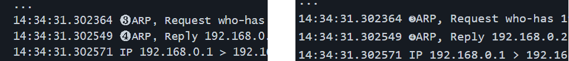
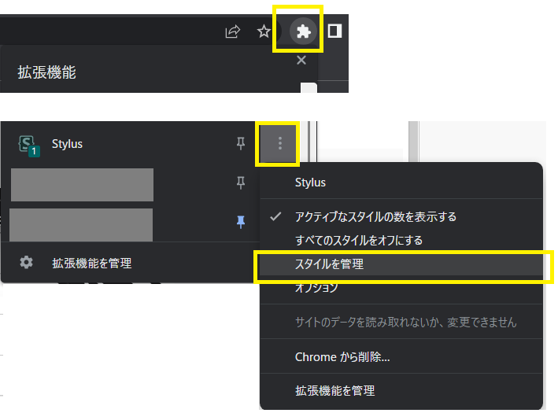
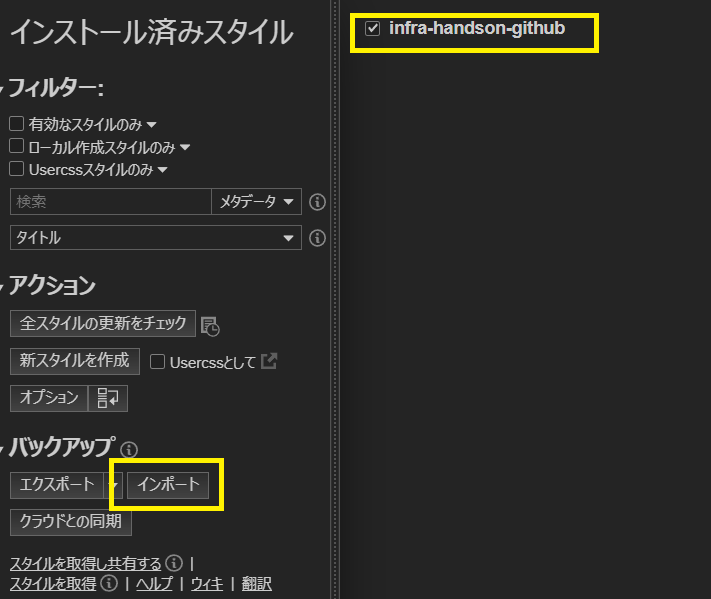
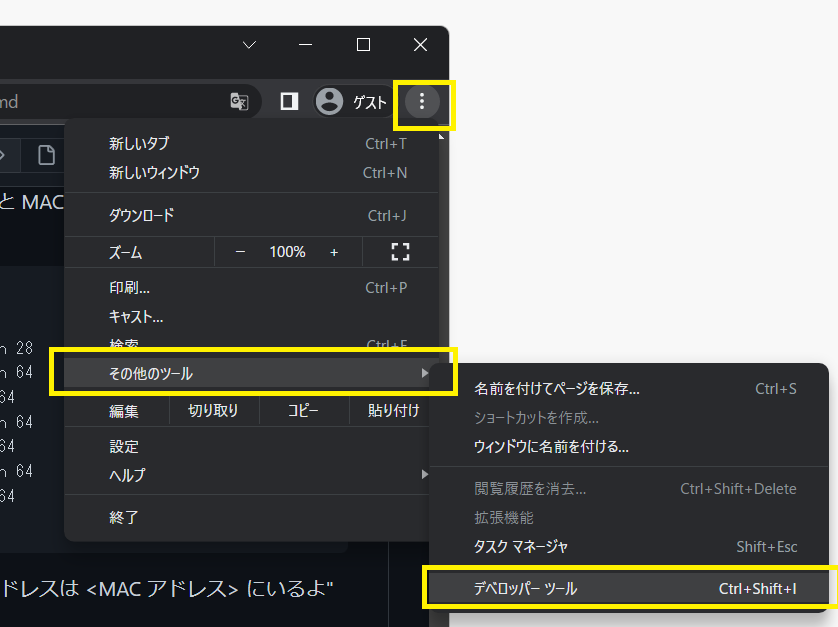
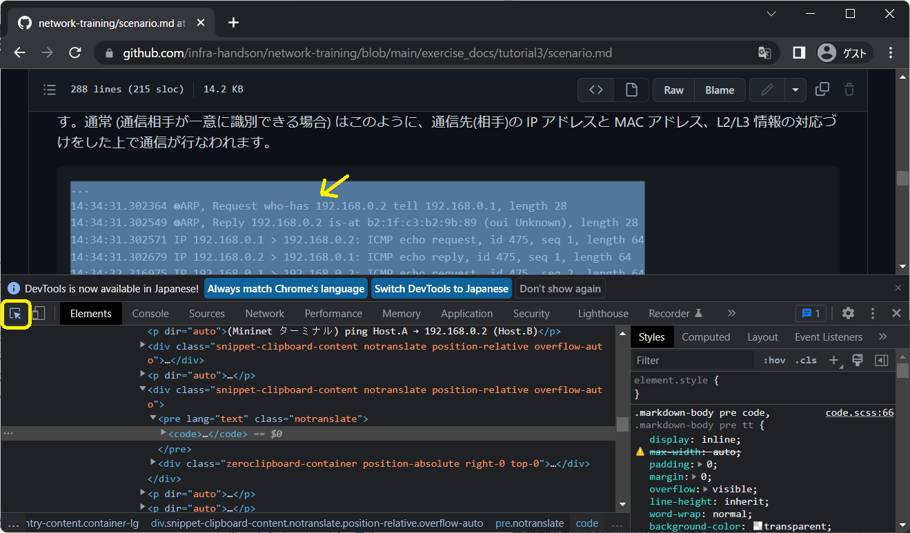
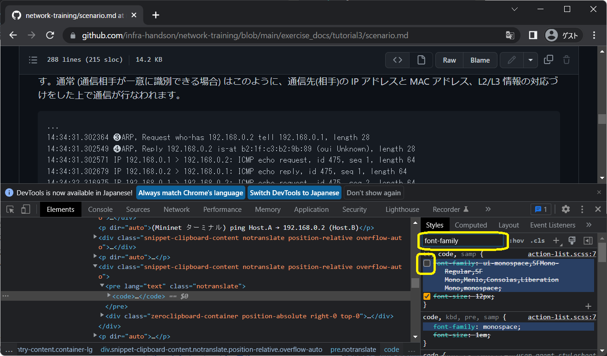

<!-- HEADER -->
[Previous](../common/glossary.md) << [Index](../index.md) >> Next

---
<!-- /HEADER -->

# Windows向け コードブロックのフォント変更

一部のチュートリアル・演習問題では、参照箇所を指定するために黒丸数字 (❶❷❸…) を使用しています。
Github.com で markdown ドキュメントを読む場合、Windows 向けにはコードブロックのフォントとして Consolas が指定されます。
Consolas では黒丸数字が半角幅になってしまうため、読みにくい状態になってしまいます(下図右)。

(図: コードブロック中の黒丸数字を Windows 上で見た場合, 左: Lucida console, 右: Consolas)

Github 側で設定されるスタイルは指定できません。利用者側で個別にフォント指定を変更する必要があります。

## ユーザスタイルシートを指定できる拡張機能を使う

Google Chrome であれば、ユーザスタイルシートを適用する[Stylus](https://chrome.google.com/webstore/detail/stylus/clngdbkpkpeebahjckkjfobafhncgmne) という拡張機能をつかうと特定のサイトに対してユーザスタイルシートを適用できます。

拡張機能をインストールした後、拡張機能のスタイル管理画面を開く

[github.com/infra-handson 用のユーザスタイルシート](/resources/stylus-infra-handson.json) をインポートする。

インポートすると "infra-handson-github" という設定が追加されます。
中身はフォント指定を上書きしているだけです。

## 手動で都度変更する

ブラウザ上で都度指定できます。(ただし、恒久的な変更ではないため、ページを読み込むたびに変更が必要になります。)

ブラウザ上でデベロッパーツールを開きます。(図は Windows 版 chrome の場合)

フォント設定を変更したい HTML 要素 (`<code>`) を選択するため、セレクトモードに切り替えます ([Elements]タブの左上にあるアイコン)。
切り替えたらドキュメント上のコードブロックを選択し、`<code>` が選択された状態にします。

デベロッパーツール右側の CSS 部分で、`font-family` と入力し、フォント設定部分を検索します。

`font-family` のチェックボックスを外し、フォント指定を無効化します。
チェックボックスを外すだけだと、フォント指定が外れてシンプルなゴシック体に変わります。もう少し読みやすいフォントを使いたい場合は、`font-family` 内の `Consolas` を `Lucida console` に変更してください。

<!-- FOOTER -->

---

[Previous](../common/glossary.md) << [Index](../index.md) >> Next
<!-- /FOOTER -->
