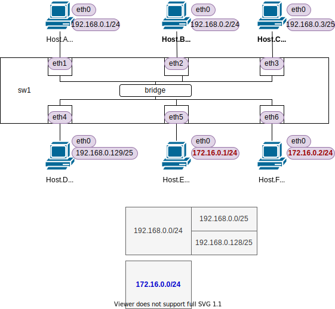

<!-- HEADER -->
Previous << [Index](../index.md) >> [Next](../l2nw1/answer.md)

---
<!-- /HEADER -->

<!-- TOC -->

- [L2NW-1 問題編](#l2nw-1-%E5%95%8F%E9%A1%8C%E7%B7%A8)
  - [前置き](#%E5%89%8D%E7%BD%AE%E3%81%8D)
  - [構成図](#%E6%A7%8B%E6%88%90%E5%9B%B3)
  - [問題1](#%E5%95%8F%E9%A1%8C1)

<!-- /TOC -->

# L2NW-1 (問題編)

## 前置き

前提

- [チュートリアル 2](../tutorial2/scenario.md): L2 基礎 (1)
- [チュートリアル 3](../tutorial2/scenario.md): L2 基礎 (2)

この問題で知ってほしいこと :

- L3-L2 のマッピング
  - サブネットとブロードキャストドメインの対応関係: もし、1 つの L2 セグメントに複数のサブネットを設定してしまったらどうなるか?
    - サブネットマスクの設定ミス (オペミスによる異なるサブネットの混在) があるとどうなるか?
    - 本当に全く別のサブネットを混在させてみるとどうなるか?
    - 同じ L2 セグメントに所属している = 同じ通信媒体で直結している状態 (neighbor) になったとき、「隣から聞こえてくる」ものはなにか?
- アドレス設定ミスによってどんなトラブルが起きるか?
- なぜネットワークによる「セグメント分け (セグメンテーション)」が必要なのか? それがセキュリティ面で重要なのはなぜか?

この問題で使用するコマンド :

* インタフェースの一覧表示・設定確認
  * MAC アドレスの確認
    * `ip link show [dev インタフェース名]`
  * IP アドレス一の確認
    * `ip addr show [dev インタフェース名]`
* L3 の通信確認
  * `ping 宛先IPアドレス` (オプション `-c N` は送信するパケット数を指定します。)
* ARP テーブルの確認
  * `arp -n`
  * `ip neigh`
* パケットキャプチャ (ARP Request の確認)
  * `tcpdump -l [-i インタフェース名]` : オプション `-l` がないとリアルタイムに表示されません。
* スイッチの設定確認
  * スイッチ・ポートの設定確認
    * `ovs-vsctl show`
  * インタフェース名とポート番号の対応確認
    * `ovs-ofctl show スイッチ名`
* スイッチの状態確認
  * MAC アドレステーブル確認
    * `ovs-appctl sh ovs-appctl fdb/show スイッチ名`

## 構成図

図 1: l2nw1/question (`exercise/l2nw1/question.json`)

* 1 台のスイッチ・6 台のホストがあります。
* スイッチは 1 つの L2 セグメントを持っています。
* ホストは全てスイッチと接続しています。
* ホストは 4 個のグループ (サブネット) に分けられます
  * Host.A/B : 192.168.0.0/24
  * Host.C : 192.168.0.0/25 (192.168.0.0/24 に含まれます)
  * Host.D : 192.168.0.128/25 (192.168.0.0/24 に含まれます)
  * Host.E/F : 172.16.0.0/24

## 問題1

* l2nw1/question (図 1) のネットワークを起動してください。
* Shell ターミナルで Host.A のパケットキャプチャを表示してください。
* 以下の表の各パターンで通信確認 (ping) を実行して、どういった応答が見えるかを確認してください。
  * ping が成功するか?
  * ping 送信元ホストで arp が成功しているか? (ARP テーブルを表示したときに送信先アドレスの MAC アドレスが解決できているか?)
  * Host.A パケットキャプチャで ARP Request が見えるか?

|No.| ping | ping 成功? | arp | arp 成功? | Host.Aでarp req見えた? |
|---|------|------------|-----|-----------|------------------------|
| 1 | `ha ping -c3 hb` | ? | `ha arp` | ? | ? |
| 2 | `ha ping -c3 hc` | ? | `ha arp` | ? | ? |
| 3 | `ha ping -c3 hd` | ? | `ha arp` | ? | ? |
| 4 | `ha ping -c3 he` | ? | `ha arp` | ? | ? |
| 5 | `he ping -c3 hf` | ? | `he arp` | ? | ? |

<!-- FOOTER -->

---

Previous << [Index](../index.md) >> [Next](../l2nw1/answer.md)
<!-- /FOOTER -->
