<!-- HEADER -->
[Previous](../l2nw2/question.md) << [Index](../index.md) >> [Next](../l3nw1/question.md)

---
<!-- /HEADER -->

# L2NW-2 (解説編)

## 構成図

図 1: l2nw2/question_a (`exercise/l2nw2/question_a.json`)


図 2: l2nw2/question_b (`exercise/l2nw2/question_b.json`)


**question a/b どちらも、下図のように "L3 の観点で見ると同じ" ネットワーク** です。L3 → L2 → L1 の対応関係(マッピング)にどんな選択肢があるのかを見てほしい演習でした。



## 問題1

### 相互に通信できること

確認だけなら `pingall` で可能です。

```text
mininet> pingall
*** Ping: testing ping reachability
ha -> hb hc hd ra 
hb -> ha hc hd ra 
hc -> ha hb hd ra 
hd -> ha hb hc ra 
ra -> ha hb hc hd 
*** Results: 0% dropped (20/20 received)
```

### Host.B→Host.Dの経路

回答

* 行き経路 (リンク単位で改行, 戻りも同様)
  * hb-eth0 → sw2-eth2
  * → sw2-eth0 → sw1-eth4
  * → sw1-eth0 → ra-eth0
  * → ra-eth1 → sw1-eth1
  * → sw1-eth5 → sw2-eth1
  * → sw2-eth3 → hd-eth0



ポイント

* Host.B と Host.D は異なるサブネットに所属しています : 異なるサブネット (サブネットにマップされた VLAN) をまたぐ通信なのでルータに中継してもらう必要があります。
* Host.B が所属するサブネットは VLAN10 に、Host.D が所属するサブネットは VLAN20 にマッピングされています。
  * Host.B はまず同じ L2 セグメント内でルータを探します。VLAN10 に接続されたリンクをたどっていくと経路は 1 本だけです。
  * ルータは中継する際に宛先サブネット (対応する L2 セグメント) で Host.D を探します。同様に VLAN20 に接続されたリンクは一本道です。

> **Note**
> 上記は L2 スイッチの設定を基に回答していますが、[チュートリアル2](../tutorial2/scenario.md)・[チュートリアル 6](../tutorial6/scenario.md) のように、ARP テーブル・MAC アドレステーブルの内容からパケットが実際に通ったポートをトレースして経路を見ることもできます。

* その場合、まず Host.B → Host.D への通信 (ping 等) を流します。次に、各ホスト・ルータの ARP テーブルと、スイッチの MAC アドレステーブルを確認して、どのパケットがどのポートへ転送されるかを追跡します。
* ARP テーブルや MAC アドレステーブルの情報には有効期限があり、期限が切れた (age-out) エントリは消去されます。そのため、調査時にあらかじめ通信してテーブルエントリを更新しておく必要があります。L2 のテーブルに有効期限があるのは、L2 (メディア) に接続する位置が変化する ("席替え")、接続するノードの増減 ("入退室") があるなど、変動することを前提とするためです。

## 問題2

### 相互に通信できること

問題 1 と同様なので省略。最初の方にも書きましたが、L3 観点だと question a/b はどちらも同じネットワークです。

なお、問題 2 では `pingall` ではうまく通信確認ができません。Router.A の物理ポート (eth0) には IP アドレスが設定されておらず、eth0 のサブインタフェースにだけ IP アドレスがあるためです。Mininet は `pingall` ではノードが持つインタフェースのうち 1 つを選択して使用するので、Router.A (`ra`) の持つ IP アドレスを解決できていません。([チュートリアル 4](../tutorial4/scenario.md) "Mininet CLI でコマンド中にノード名を指定した場合の動作について" を参照してください。)

### Host.B→Host.Dの経路

question_a との違いを確認してほしい意図の設問でした。

回答

* 行き経路 (リンク単位で改行, 戻りも同様)
  * hb-eth0 → sw2-eth2
  * → sw2-eth0 → sw1-eth4 (※1)
  * → sw1-eth0 → ra-eth0 (正確には ra-eth0.10) (※2)
  * → ra-eth0 (正確には ra-eth0.20) → sw1-eth0 (※2)
  * → sw1-eth4 → sw2-eth0 (※1)
  * → sw2-eth3 → hd-eth0



ポイント

* スイッチ間, スイッチ - ルータ間で同じリンクを 2 回通ることに注目してください。(※1, ※2)
  * 同じリンク (L1) を通っていますが、L2 (VLAN) 的には分離されています。

### スイッチおよびルータ設定の違い

同様に、question_a との違いを確認してほしい意図の設問でした。

l2nw2/question_b スイッチ設定

* トランクポート (`trunks`) が使われています。
* その分ポート数が変化していることに注意してください。

```text
root@nwtraining01:/# ovs-vsctl show
8d3e28e3-3314-4551-b3a8-febc722c34c6
    Bridge sw1
        fail_mode: standalone
        Port sw1-eth3
            tag: 20
            Interface sw1-eth3
        Port sw1
            Interface sw1
                type: internal
        Port sw1-eth2
            tag: 10
            Interface sw1-eth2
        Port sw1-eth0
            trunks: [10, 20]
            Interface sw1-eth0
        Port sw1-eth4
            trunks: [10, 20]
            Interface sw1-eth4
    Bridge sw2
(省略)
```

l2nw2/question_b Router.A インタフェース設定

* サブインタフェースが使われています。
* L3 の観点では question_a と同等になっていることに注意してください。

```text
mininet> ra ip link show
1: lo: <LOOPBACK,UP,LOWER_UP> mtu 65536 qdisc noqueue state UNKNOWN mode DEFAULT group default qlen 1000
    link/loopback 00:00:00:00:00:00 brd 00:00:00:00:00:00
2: ra-eth0@if11: <BROADCAST,MULTICAST,UP,LOWER_UP> mtu 1500 qdisc noqueue state UP mode DEFAULT group default qlen 1000
    link/ether 06:0a:06:41:10:f0 brd ff:ff:ff:ff:ff:ff link-netnsid 0
3: ra-eth0.10@ra-eth0: <BROADCAST,MULTICAST,UP,LOWER_UP> mtu 1500 qdisc noqueue state UP mode DEFAULT group default qlen 1000
    link/ether 06:0a:06:41:10:f0 brd ff:ff:ff:ff:ff:ff
4: ra-eth0.20@ra-eth0: <BROADCAST,MULTICAST,UP,LOWER_UP> mtu 1500 qdisc noqueue state UP mode DEFAULT group default qlen 1000
    link/ether 06:0a:06:41:10:f0 brd ff:ff:ff:ff:ff:ff
mininet>
mininet> ra ip -4 addr show
1: lo: <LOOPBACK,UP,LOWER_UP> mtu 65536 qdisc noqueue state UNKNOWN group default qlen 1000
    inet 127.0.0.1/8 scope host lo
       valid_lft forever preferred_lft forever
2: ra-eth0@if21: <BROADCAST,MULTICAST,UP,LOWER_UP> mtu 1500 qdisc noqueue state UP group default qlen 1000 link-netnsid 0
    inet 192.168.0.254/24 brd 192.168.0.255 scope global ra-eth0
       valid_lft forever preferred_lft forever
3: ra-eth1@if22: <BROADCAST,MULTICAST,UP,LOWER_UP> mtu 1500 qdisc noqueue state UP group default qlen 1000 link-netnsid 0
    inet 172.16.0.254/24 brd 172.16.0.255 scope global ra-eth1
       valid_lft forever preferred_lft forever
```

## 問題3

### VLANが増加した場合のポート数算出

実際に 5-VLAN 化した場合の図も載せておきます。


回答

* question_a: 1 port - 1 vlan
  * sw1, sw2 共通 → 5-VLAN : 5-Host (5-port) x 2-device
  * sw1-sw2 間 → 5-VLAN : 5-port x 2-device
  * sw1-ra 間 → 5-VLAN : 5-port x 2-device
  * 合計 : 30 port
* question_b: 1 port - _N_ vlan
  * sw1, sw2 共通 → 5-VLAN : 5-Host (5-port) x 2-device
  * それ以外、sw1-sw2, sw1-ra 間はリンクを足す必要がない
  * 合計: 14 port

ポイント

* 着目したいのは、question a/b の差異のあるところ・NW 機器間で VLAN を束ねているところがどう変化するかです。
  * 1 port - 1 vlan で複数 VLAN を束ねない場合 (question_a), 当然ですが、VLAN が増加すると NW 機器間のポート数が増えていきます。
  * 一般的な業務用ネットワークの場合、障害対策のために 1 つのスイッチが 2 台(以上)のスイッチと接続して代替経路を確保します。その場合、さらに NW 機器間のポートが消費されます。

補足解説

* NW 機器のコスト指標として使われる用語 (の 1 つ) に「ポート単価」があります。1 ポートあたりのコストと、そこでどれだけの通信をまかなえるのか、というのが基板設計・計画上の検討ポイントになります。
  * 例えば、それぞれの VLAN に所属するノードが数台しかなく通信量も少ないのに、1 ポートまるごと 1 VLAN に「専有」させると、ポート単価比較したときにコストパフォーマンスが悪化してしまいます。
* 1 port - _N_ vlan (VLAN Trunk) にするとポートを複数の VLAN で「共有」させることができます。要件に対する柔軟性  (求められる要件と実際の計算機リソースへの対応づけの選択肢) が得られますが、デメリットもあります。
  * 全体の通信帯域は物理機器 (物理リソース) の上限で縛られます。VLAN をたくさん重ね合わせた結果、物理機器な性能上限を超えると全体のパフォーマンスに影響するかもしれません。
  * __単一リンクの物理障害が、その上に重ねられている複数の VLAN (サブネット) に影響します。__
  * __物理的な見た目 (L1) と L2 トポロジが一致しなくなります。__ システムの構造…上位レイヤ (L2 以上) のネットワークの実体はつかみにくくなります。

## まとめ

### L3-L2-L1のマッピング

VLAN を使うことで、1 つの物理的な構成要素 (スイッチ本体・物理ポート) に複数の L2 セグメントをマッピングできます。この問題で例示した question a/b は、L3 構成としては同じですが、L2/L1 の構成が異なっていました。L2 セグメントは「理想化されたメディア」であり、VLAN を使う場合、物理的な実体と直接 1:1 に紐づくとは限りません。

* 「物理的な見た目 (L1)」と実際の L2 セグメントのトポロジが分離されます。
  * 集約することで柔軟性が得られますが、トレードオフとして複雑度も高くなります。
  * 障害時の影響範囲やキャパシティコントロールには注意が必要です。
* 物理的に接続されているノード同士で VLAN 設定の整合性が取れている必要があります。
  * (VLAN に限りませんが) 最終的には、複数のデバイスをまたがった End-to-End で設定の整合性が取れている必要があります。

こうした VLAN の特徴については [L2NW-3](../l2nw3/question.md) (応用) で扱います。

### VLAN 間ルーティング

ルータ側も VLAN に対応することで、物理ポートを節約しつつ複数の L2 セグメントを中継させることができるようになります。

* 通常、L2 セグメントはルータによって接続されます (そうしないと「ネットワーク」にならないので)。その場合、スイッチとルータを組み合わせて VLAN (VLAN にマッピングされたサブネット) 間のルーティングができるようにします。
  * どこともつながらない、独立したサブネット (L2 セグメント) をつくることもありますが、限定された用途になります。

> **Note**
>  この問題では、VLAN (L2) と VLAN 間ルーティングを L2 スイッチとルータという 2 つのデバイスで構成していました。この、IP ルーティング (L3) と VLAN (L2) という基本的なネットワーク機能を 1 台のデバイスで実現できると便利です。こうしたデバイスを **L3 スイッチ** と呼び、よく使用されています。

<!-- FOOTER -->

---

[Previous](../l2nw2/question.md) << [Index](../index.md) >> [Next](../l3nw1/question.md)
<!-- /FOOTER -->
