<!-- HEADER -->
[Previous](../l2nw1/answer.md) << [Index](../index.md) >> [Next](../l2nw2/answer.md)

---
<!-- /HEADER -->

<!-- TOC -->

- [L2NW-2 (問題編)](#l2nw-2-問題編)
  - [前置き](#前置き)
  - [構成図](#構成図)
  - [問題1](#問題1)
  - [問題2](#問題2)
  - [問題3](#問題3)

<!-- /TOC -->

# L2NW-2 (問題編)

## 前置き

前提

- [チュートリアル 2](../tutorial2/scenario.md): L2 基礎 (1)
- [チュートリアル 3](../tutorial3/scenario.md): L2 基礎 (2)
- [チュートリアル 4](../tutorial4/scenario.md): L2 VLAN
- [チュートリアル 5](../tutorial5/scenario.md): L3 基礎

この問題で知ってほしいこと :

- L3-L2-L1 のマッピング
  * 複数のスイッチで VLAN をどう使えばよいか: L2 セグメントと物理実体(スイッチ/ポート)の対応関係
- **VLAN 間ルーティング** (L3-L2 のマッピング)
  - チュートリアル 2 + チュートリアル 3 の組み合わせ。チュートリアル 2 は独立した L2 セグメントを作っただけで、複数のセグメント間をつないで通信できるようになっていませんでした。チュートリアル 2 では、ルータで L2 セグメント (L2 セグメントにマッピングされたサブネット) を中継する方法、その時の動作、VLAN による物理構成マッピングとの組み合わせ方を見ます。
- L3 - L1 の各レイヤがどのように対応しているのか
  - 特に、VLAN を使うと論理構成と物理構成を切り離して操作できるようになること
  - オンプレ・エンタープライズ系のシステムで多用される、基本的なネットワーク仮想化技術の 1 つである VLAN の理解

この問題で使用するコマンド :

* インタフェースの一覧表示・設定確認
  * MAC アドレスの確認
    * `ip link show [dev インタフェース名]`
  * IP アドレス一の確認
    * `ip addr show [dev インタフェース名]`
  * VLAN サブインタフェース vlan-id の確認
    * `ip -d link show インタフェース名`
* L3 の通信確認
  * `ping 宛先IPアドレス`
  * `pingall` : 全てのノード間で ping を実行する mininet コマンド
* ARP テーブルの確認 (必要に応じて; L2 の動作確認)
  * `arp -n`
  * `ip neigh`
* スイッチの設定確認
  * スイッチ・ポートの設定確認
    * `ovs-vsctl show`
* スイッチの状態確認
  * MAC アドレステーブル確認
    * `ovs-appctl sh ovs-appctl fdb/show スイッチ名`

## 構成図

図 1: l2nw2/question_a (`exercise/l2nw2/question_a.json`)

図 2: l2nw2/question_b (`exercise/l2nw2/question_b.json`)

## 問題1

* l2nw2/question_a (図 1) のネットワークを起動してください。
* Host.A-Host.D, Router.A がそれぞれ相互に通信できることを確認してください (ping)
* Host.B → Host.D へ ping を送信したときのパケットの経路を、通過するインタフェース(リンク) 単位ですべて列挙してください。
  * hb-eth0 → sw2-eth2 → ... → sw2-eth3 → hd-eth0

## 問題2

* l2nw2/question_b (図 2) のネットワークを起動してください。
* l2nw2/question_a (図 1) と同様に全てのノード・ルータ間が相互に通信できることを確認してください。
* Host.B → Host.D へ ping を送信したときのパケットの経路を、通過するインタフェース(リンク) 単位ですべて列挙してください。
  * hb-eth0 → sw2-eth2 → ... → sw2-eth3 → hd-eth0
* question a/b で、各スイッチおよびルータの設定の違いを説明してください。
  * :bulb: VLAN access port, VLAN trunk port, Linux サブインタフェース (Router.A)
  * JSON ファイルを見てもわかりますが、できればそれぞれの環境でスイッチの設定やポートの状態を確認して考えてみてください。

## 問題3

* question a/b のそれぞれの "方式" で、VLAN 数を 2 VLAN から 5 VLAN に変更した場合、各ルータ・スイッチで必要なポート数を算出してください。
  * "方式"
    * l2nw2/question_a: 1 port - 1 vlan
    * l2nw2/question_b: 1 port - N vlan
  * 5 個の VLAN (VLAN 10/20/30/40/50) を作ります。
  * question a/b どちらも 1-Router, 2-Switch 構成 (スイッチとルータの数は変えない) とします。

<!-- FOOTER -->

---

[Previous](../l2nw1/answer.md) << [Index](../index.md) >> [Next](../l2nw2/answer.md)
<!-- /FOOTER -->
