<!-- HEADER -->
[Previous](../l2nw3/question.md) << [Index](../index.md) >> [Next](../l4nw3/question.md)

---
<!-- /HEADER -->

# L2NW-3 (解説編)

図 1



## 問題1

回答
* 各ポートで許可されている VLAN ID を図にマップすると図 2 のようになります。これを VLAN ごとに図で示すと図 3 のようになります。
* STP Blocking になっているポートは、sw21-eth1 と sw22-eth0 です。

図 2: VLAN ID のマップ



図 3: VLAN ごとのトポロジ



Blocking ポートの調査

```text
root@nwtraining01:~# ovs-vsctl --columns name,status list Port | grep -i blocking -B1
name                : sw21-eth1
status              : {stp_port_id="32771", stp_role=alternate, stp_sec_in_state="861", stp_state=blocking}
--
name                : sw22-eth0
status              : {stp_port_id="32769", stp_role=alternate, stp_sec_in_state="861", stp_state=blocking}
```

ポイント

* VLAN trunk port は、指定された ID の VLAN だけを送受信します。したがって、リンクで接続された対向側のポートの VLAN ID 設定とがミスマッチの場合、どちらか片方でしか定義されていない VLAN ID はそのリンクでは流れません。片方が送信しても対向側が受信しません。
* このネットワーク内では、STP の設定が全ての VLAN に影響します。(STP は VLAN を加味していません。)
  * これは問題 2 で詳しく見ます。

## 問題2

回答

|No.|VLAN| ping                                  |ping成功?|
|---|----|---------------------------------------|---------|
| 1 | 10 | `sa ping -I sa-eth0.10 192.168.10.12` | NG |
| 2 | 20 | `sa ping -I sa-eth0.20 192.168.20.12` | ok (sa-sw21-sw11-sw22-sb) |
| 3 | 20 | `ra ping -I ra-eth0.20 192.168.20.2`  | NG |
| 4 | 30 | `ra ping -I ra-eth0.30 192.168.30.2`  | ok (ra-sw11-sw12-rb) |
| 5 | 40 | `sa ping -I sa-eth0.40 192.168.40.12` | ok (sa-sw21-sw10-sw22-sb) |

ポイント

* 図 3 参照
* No.1: VLAN10 では、sw12-sw22 間に STP Blocking port があるため、Server.B から/への通信は全て遮断されています。
* No.2: VLAN20 で STP Blocking port を避けると表に挙げた経路を経由することになります。
* No.3: Router.B から/への通信はすべて sw12 を経由します。しかし VLAN20 では、sw12 が L2 で接続しているスイッチ sw21/22 のあいだはすべて STP Blocking port になっています。そのため、Router.B は他のルータ・サーバへの通信が全て遮断されています。
* No.4/5: No.2 と同様に Blocking port を避けた経路をたどります。
  * VLAN30 は L2 ネットワークで経路の冗長化をする際によく作られる構成です。(No.2/3, VLAN20 と比較すると、sw11-sw12 間のリンクが重要な役目を持っていることがわかります。)

## まとめ

### VLAN設定の整合性とL2トポロジの考え方

[L2NW-2 解説編](../l2nw2/answer.md) でも触れましたが、特に VLAN による L2 トポロジの分離と隣接デバイス間での設定整合性に着目した問題でした。

VLAN の設定は、あくまでも個々のスイッチ・個々のポートに対して行なわれます。ネットワーク全体の動作としては、それらをつなぎ合わせたときに整合性が取れていて、最終的に通信したいノード間でパケットが届くかどうかを見る必要があります。単独のデバイス設定・単独のポート設定だけを見ていても、その設定で "ネットワーク全体の動作" に問題ないかは判断できません。「ネットワーク全体の整合性」を考える必要があります。

### STPとVLANの関係について

問題 1・問題 2 で取り上げたように、STP をつかって L2 ループ回避をする場合、VLAN トポロジと STP の関係を考える必要があります。VLAN はあくまでも設定上・静的に決めるトポロジ定義です。一方 STP は物理リンクの状態に基づく動的なトポロジを管理しています (機器障害などでリンク状態が変わると STP によって実現されるトポロジが変換する)。

:customs: このネットワークにおける STP と VLAN の関係について:

* このネットワークでは [[*1]](#fn1) STP と VLAN は独立した機能です。STP は VLAN の有無によらず、L2 で連続的に接続されている範囲内をまとめてカバーし、ループ箇所を Blocking にします。これは、標準化された STP (802.1D) の基本動作です。

> **Warning**
> 同じ物理ネットワーク上に、異なるトポロジの VLAN を重ね合わせる場合は注意が必要です。

<span id="fn1">[*1]</span> : 正確には、このネットワークを構成するために使っているスイッチ (Open vSwitch) が対応している STP 機能に依存しています。Open vSwitch は PVST, MSTP には対応していません。

### (補足) STP のバリエーションについて

STP にはベンダー独自規格を含む複数の種類があり、それらの特徴等に応じて選定する必要があります。もちろん、相互に接続される機器でサポートされている規格を使う必要があります。

問題 2 でみたように、VLAN 別に異なるトポロジなのに STP が VLAN とは独立に動作すると、予想しにくい通信不能ポイントが出てきます。そのため、ベンダーの独自規格として、VLAN ごとに STP を動作させる PVST (Per-VLAN STP) があります。(これはベンダー独自規格であって、標準化されたものではありません。)

* VLAN 単位に STP を動作させることで、この問題で見ていたような L2 トポロジと STP トポロジの不一致の問題を回避できます。この場合、VLAN ごとに "STP インスタンスを立てる" という考え方です。したがって、多数の VLAN を扱う機器では多数の STP インスタンスを扱うことになり、機器のキャパシティ問題につながることがあります。(管理しやすさとキャパシティのトレードオフがあります。)
* PVST 同様の機能を取り込みつつ標準化された STP として MSTP (802.1s→802.1Q) があります。

<!-- FOOTER -->

---

[Previous](../l2nw3/question.md) << [Index](../index.md) >> [Next](../l4nw3/question.md)
<!-- /FOOTER -->
