<!-- HEADER -->
[Previous](../tutorial8/scenario.md) << [Index](../index.md) >> [Next](../l2nw3/answer.md)

---
<!-- /HEADER -->

<!-- TOC -->

- [L2NW-3 問題編](#l2nw-3-%E5%95%8F%E9%A1%8C%E7%B7%A8)
  - [前置き](#%E5%89%8D%E7%BD%AE%E3%81%8D)
  - [構成図](#%E6%A7%8B%E6%88%90%E5%9B%B3)
  - [問題1](#%E5%95%8F%E9%A1%8C1)
  - [問題2](#%E5%95%8F%E9%A1%8C2)

<!-- /TOC -->

# L2NW-3 (問題編)

## 前置き

前提

* [チュートリアル 2](../tutorial2/scenario.md) : L2 基礎 (1)
* [チュートリアル 3](../tutorial3/scenario.md) : L2 基礎 (2)
* [チュートリアル 4](../tutorial4/scenario.md) : L2 VLAN
* [チュートリアル 8](../tutorial8/scenario.md) : L2 STP 基礎
* [L2NW-2](../l2nw2/question.md)

この問題で知ってほしいこと :

* VLAN 設定の整合性
  * 設定上指定されるトポロジ (静的なトポロジ) のとらえかた
* L2 トポロジの考え方
  * VLAN と STP の関係 : VLAN と STP を併用する場合、静的なトポロジと (VLAN) とループ回避のために STP によって決められるトポロジ (動的なトポロジ) を組み合わせて考える必要があります。
  ここを見落とすと、ネットワークで予想外の障害につながることがあります。
  * VLAN トポロジ (静的) と STP トポロジ (動的) の組み合わせによっては、設計上想定していない通信不能箇所が発生し、障害につながる恐れがあります。

この問題で使用するコマンド :

* インタフェースの一覧表示・設定確認
  * MAC アドレスの確認
    * `ip link show [dev インタフェース名]`
  * IP アドレス一の確認
    * `ip addr show [dev インタフェース名]`
  * VLAN サブインタフェース vlan-id の確認
    * `ip -d link show インタフェース名`
* ARP テーブルの確認 (必要に応じて; L2 の動作確認)
  * `arp -n`
  * `ip neigh`
* L3 の通信確認
  * `ping 宛先IPアドレス`: オプション `-I インタフェース名` は、ノードが複数のインタフェース (NIC) を持つ場合に、送信元インタフェース (どのインタフェースからパケットを送るか) を指定します。
* スイッチの設定確認
  * スイッチ・ポートの設定確認
    * `ovs-vsctl show`
  * インタフェース名とポート番号の対応確認
    * `ovs-dpctl show`
  * スイッチの STP 設定確認 (有効/無効)
    * `ovs-vsctl --columns name,stp_enable list Bridge`
* スイッチの状態確認
  * MAC アドレステーブル確認
    * `ovs-appctl sh ovs-appctl fdb/show スイッチ名`
  * スイッチのブロッキングポートの検索
    * `ovs-vsctl --columns name,status list Port | grep -i blocking -B1`

## 構成図

図 1: (`exercise/l2nw3/question.json`)

* ネットワーク内には 4 個の L2 セグメント (VLAN 10/20/30/40) があります。
* ネットワーク内のリンクは全て trunk port になっています。

## 問題1

ネットワーク内のスイッチ・ルータ・サーバのポートはすべて VLAN trunk port ですが、ポートで許可されている VLAN ID の設定が統一されていません。そのため、各 VLAN がどのリンクを流れているかわからない状態になっています。

* 各ポートで許可されている VLAN ID を調査してください。
* 調査結果を基に、各 VLAN のトポロジを図示してください。
  * たとえば、VLAN 10 は下の図 2 のようになっています。これは、ポート設定をもとに、VLAN 10 (VLAN ID 10) が流れているリンクを図で示したものです。
* 各スイッチは L2 ループ防止のため STP を有効化しています。ループ回避のために STP によって Blocking されているポートを調査してください。

図 2: VLAN10 トポロジ

## 問題2

問題 1 の調査結果を基に検討してください。

* 以下の表の各パターンで通信確認 (ping) をしたときに、ping が成功するか試してください。成功する場合はどのデバイスを経由しているか(経路)、失敗する場合はその理由を答えてください。
* :bulb: ping の `-I` オプションは**送信元**インタフェース (= どの VLAN を使用するか) の指定です。各サーバは複数のインタフェースを持つため、送信元となるインタフェースを明示して通信テストをしてください。

|No.|VLAN| ping                                  |ping成功?|
|---|----|---------------------------------------|---------|
| 1 | 10 | `sa ping -I sa-eth0.10 192.168.10.12` | ? |
| 2 | 20 | `sa ping -I sa-eth0.20 192.168.20.12` | ? |
| 3 | 20 | `ra ping -I ra-eth0.20 192.168.20.2`  | ? |
| 4 | 30 | `ra ping -I ra-eth0.30 192.168.30.2`  | ? |
| 5 | 40 | `sa ping -I sa-eth0.40 192.168.40.12` | ? |

<!-- FOOTER -->

---

[Previous](../tutorial8/scenario.md) << [Index](../index.md) >> [Next](../l2nw3/answer.md)
<!-- /FOOTER -->
