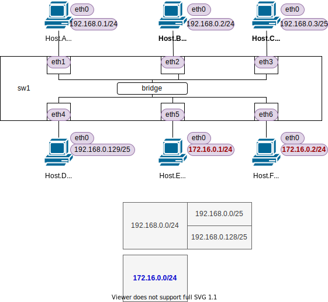

<!-- HEADER -->
[Previous](../l2nw_1/l2nw_1.md) << [Index](../index.md) >> [Next](../l2nw_2/l2nw_2.md)

---
<!-- /HEADER -->

<!-- TOC -->

- [L2NW-1 (解説編)](#l2nw-1-解説編)
  - [構成図](#構成図)
  - [問題1](#問題1)
    - [(補足) 同一L2セグメントに重複サブネットがある場合の動作](#補足-同一l2セグメントに重複サブネットがある場合の動作)
  - [まとめ](#まとめ)
    - [L2セグメントとL3サブネットの対応関係](#l2セグメントとl3サブネットの対応関係)

<!-- /TOC -->

# L2NW-1 (解説編)

## 構成図

図 1: l2nw_1 (`exercise/l2nw_1/l2nw_1.json`)

## 問題1

回答

|No.| ping | ping 成功? | arp | arp 成功? | Host.Aでarp req見えた? |
|---|------|------------|-----|-----------|------------------------|
| 1 | `ha ping -c3 hb` | ok | `ha arp` | ok | 見える |
| 2 | `ha ping -c3 hc` | ok | `ha arp` | ok | 見える |
| 3 | `ha ping -c3 hd` | NG (Destination Host Unreachable) | `ha arp` | incomplete | 見える |
| 4 | `ha ping -c3 he` | NG (Network is unreachable) | `ha arp` | 変化しない | 見えない |
| 5 | `he ping -c3 hf` | ok | `he arp` | ok | 見える |

ポイント

* No.1 は一般的な構成です。
* No.2 は L3 サブネットで見ると異なるサブネットマスクのノード間の通信ですが ping は成功します。(後述)
* No.3 も No.2 と同じように見えますが、これは ping が失敗します。(後述)
* No.4 は明らかに異なるサブネットへの通信です。このネットワークにはルータがありませんし、どのホストにもデフォルトゲートウェイが設定されていません。送り先が不明なため、そもそも arp request を送信していません。(そのため arp table は変化しません)
  * 本来であれば異なるセグメントにいるノードとの通信なので「郵便局役」(デフォルトゲートウェイ)に中継を依頼するパターンです。もし Host.A にデフォルトゲートウェイが設定されていれば、デフォルトゲートウェイ IP の MAC アドレスを問い合わせる ARP リクエストを投げます。
* No.5 は Host.A (キャプチャ) とは異なるサブネットに属しているノード間 (Host.E → Host.F) の通信です。同じ L2 セグメントに接続されているため、ブロードキャストが Host.A にも届いています。(同じメディアにつながっている = "同じ部屋にいる" ため、全員宛の発言だけは "聞こえ" ます。)

### (補足) 同一L2セグメントに重複サブネットがある場合の動作

同一L2セグメントに重複サブネットがある場合の動作

Host.A, Host.C/D のサブネットについて改めて確認します。(図 1 も参照)

* 192.168.0.0/24 の範囲は 192.168.0.0-192.168.0.255 になります。(Host.A,B)
* 192.168.0.0/25 の範囲は 192.168.0.0-192.168.0.127 になります。(Host.C)
  * 192.168.0.0/24 の前半分のブロック
* 192.168.0.128/25 の範囲は 192.168.0.128-192.168.0.255 になります。(Host.D)
  * 192.168.0.0/24 の後半分のブロック

No.2 (Host.A → Host.C) は、ホストのサブネットマスクが異なっています。しかし通信はできました。

* Host.A から見ると、192.168.0.3 (Host.C) は同じサブネットにいるように見えます。そのため ARP request を送信して MAC アドレスを尋ねます。
* Host.C は Host.A と同じ L2 セグメントにいるため、ARP request (broadcast) を受け取ります。
  * ARP リクエストの中には、以下の情報が含まれていますが、それらにはサブネットマスクの情報は含まれません。(tcpdump ではそこまで詳しく表示されません)
    * リクエスト送信元 (Host.A) の IP アドレス : 192.168.0.1
    * リクエスト送信先 (Host.C) の IP アドレス : 192.168.0.3
  * そのため、Host.C は、自分のアドレスを尋ねられている、かつ、送信者 (Host.A) は自分の所属しているサブネットに所属しているように見えます。
  * Host.C は arp request が同一サブネットのノードから送信されたとみなすので、応答 (arp response) を返します。
* Host.A は arp response をうけとり、192.168.0.3 に対応する MAC アドレスが解決できたので、ping の送受信を行います。

No.3 (Host.A → Host.D) についても途中までは同様です。

* Host.A → 192.168.0.129 の MAC アドレスを尋ねる ARP request が送信されます。
* Host.D は ARP request を受信しますが、Host.D から見ると、送信元の 192.168.0.1 (Host.A) は自分とは異なるサブネットにいるように見えます。
* Host.D は自分がいるサブネットとは異なるサブネットにいる 192.168.0.1 (Host.A) へ応答するための中継先情報を持っていないので、何もパケットを送信しません。
  * Host.A は ARP request が返ってこないので、ARP テーブルが "incomplete" になります。Host.A から見ると同じサブネットにいるため ping を送信しようとしますが、MAC アドレスが解決できないのでタイムアウトになります。

No.3 動作については、Host.D → Host.A へ ping してみてください。Host.D から見ると別なサブネットに見えるため "Network is unreachable" となります。Host.A 視点・Host.D 視点でそれぞれ相手の見え方 (同じサブネットにいるように見えるか) が異なるため、通信できません。

:white_check_mark: No.3 について: Linux は ARP 応答する際にルーティングテーブルを参照して、ARP リクエスト送信元が解決するかなどをチェックしています。そのため、デフォルトルート等の有無によっても動作が変わったりもします。(参考: [Linux ARP応答のコーナーケースを攻める - Qiita](https://qiita.com/corestate55/items/ee67ccf2989111e5dc4f))

## まとめ

### L2セグメントとL3サブネットの対応関係

[チュートリアル2](../tutorial_2/tutorial_2.md) では、1 つの L2 セグメントに 1 つのサブネットがマップされていました (1-subnet : 1-L2segment)。一方、この問題では 1 つの L2 セグメントに複数のサブネットがマッピングされています (N-subnet : 1-L2segment)。

IP (L3) を使って、L2 ネットワーク内で通信ができるためには下の 2 つの条件が必要です。

* L3 の観点で同じサブネットにいるか?
* L2 の観点で同じセグメント(ブロードキャストドメイン)にいるか?

No.1/5 からわかるように、同一 L2 セグメントで複数のサブネットが使われていても、同じサブネット内のノード同士は問題なく通信できます。

No.2 のように、同一 L2 セグメント上にある場合、サブネットマスクが違うノード同士でも L3 (IP アドレス) 範囲がかぶってしまうと通信できてしまいます。No.2/3 を比べるとわかるように、こうしたサブネットマスクの入力ミスや勘違いなどは予期せぬ通信トラブルにつなるので注意してください。L2 セグメントの中で一部は通信できるが一部は通信できないなど、中途半端でわかりにくい障害になるおそれがあります。

No.5 で見たように、あるノードの L2 ブロードキャストは、(ノードの IP アドレスにかかわらず) 同一 L2 セグメント内の全てのノードに届けられます。Host.A は、同じ L2 セグメント上に別サブネットのアドレスを持つノードがいることはわかります。

* 通常、1 つの L2 セグメントの中では、そのセグメントに属するどのノードも相互に通信できることが期待されています。そうでなければ "全員に直接声がかけられる部屋" に集められることはないからです。同一 L2 セグメントにいるということは "隣人 (neighbor)" であり、近い関係性になります。
* 同じセグメントに誰がいるかがわかってしまうことが起点となるセキュリティ上の問題(攻撃)もあります。設計上はこうした観点も加味されて L2/L3 の設計がおこなわれます。

<!-- FOOTER -->

---

[Previous](../l2nw_1/l2nw_1.md) << [Index](../index.md) >> [Next](../l2nw_2/l2nw_2.md)
<!-- /FOOTER -->
