<!-- HEADER -->
[Previous](../l3nw1/question.md) << [Index](../index.md) >> [Next](../l3nw2/question.md)

---
<!-- /HEADER -->

<!-- TOC -->

- [L3NW-1 (解説編)](#l3nw-1-解説編)
  - [構成図](#構成図)
  - [問題1](#問題1)
  - [問題2](#問題2)
  - [問題3](#問題3)
  - [まとめ](#まとめ)
    - [ネットワーク内に重複するIPアドレスがある場合の動作](#ネットワーク内に重複するipアドレスがある場合の動作)
    - [最長一致の動作](#最長一致の動作)

<!-- /TOC -->

# L3NW-1 (解説編)

## 構成図



## 問題1

回答

|No.| ping                         | ping 成功? | 通信先? |
|---|------------------------------|------------|---------|
| 1 | `sc1 ping -c3 192.168.1.200` | ok | Server.C2       |
| 2 | `sc1 ping -c3 192.168.1.25`  | NG | Server.B3       |
| 3 | `sc1 ping -c3 192.168.1.50`  | ok | Server.C3       |

ポイント

* Server.C1 → 192.168.1.200, .25, .50 の通信を試す場合、Server.C1 は相手が自分と同じサブネットにいることがわかります。サブネット（に対応している L2 セグメント）で ARP request を送信し、"となり" にいるノードと通信することになります。NW.C に 192.168.1.25 を持つノードは存在しないので、No.2 は失敗します。

## 問題2

回答

|No.| ping                        | ping 成功? | 通信先? |
|---|-----------------------------|------------|---------|
| 4 | `ha ping -c3 192.168.1.20`  | ok | Server.B1       |
| 5 | `ha ping -c3 192.168.1.200` | ok | Server.C2       |
| 6 | `ha ping -c3 192.168.1.25`  | ok | Server.B3       |
| 7 | `ha ping -c3 192.168.1.50`  | NG | Server.C3       |

ポイント

* Router.A の経路情報を確認してください。図の通り、192.168.1.0/24 は 2 箇所 (NW.B or NW.C) にあります。
* Router.A は 192.168.1.0/25 (192.168.1.0/24 の前半半分のブロック❶) を Router.B 方向へ送っています。それ以外はデフォルトルート設定に従って Router.C 方向へ送っています(❷ [[*1]](#fn1))。

```text
mininet> ra ip route
default via 192.168.0.37 dev ra-eth1                                   ... ❷
172.16.0.0/25 dev ra-eth2 proto kernel scope link src 172.16.0.1 
192.168.0.32/30 dev ra-eth0 proto kernel scope link src 192.168.0.34 
192.168.0.36/30 dev ra-eth1 proto kernel scope link src 192.168.0.38 
192.168.1.0/25 via 192.168.0.33 dev ra-eth0                            ... ❶
```

* Host.A から送られた 192.168.1.0/25 (.0-.127 の範囲) 宛のパケットは❶にマッチして NW.B の方へ送信されます。No.4, No.6 が NW.B 内のサーバと通信できるのはそのためです。
* Host.A から送られた 192.168.1.0/25 **以外** 宛のパケットはデフォルトルート❷にマッチして[[*1]](#fn1) NW.C の方へ送信されます。No.5 が NW.C 内のサーバと通信できるのはそのためです。また、No.7 が失敗するのは、Server.C3 のアドレスが 192.168.0/25 の範囲内にあり、❶にマッチして NW.B 側に転送されてしまうためです。

<span id="fn1">[*1]</span> : 正確には、Router.A のルーティングテーブル内にあるマッチ条件のいずれともマッチしない宛先を持つパケットが、一番最後にデフォルトルートとマッチします。Router.A のルーティングテーブルには、Router.A が直結して知っている NW.p/q/r と静的に設定されている 192.168.1.0/25 の経路 (マッチ条件) があります。

## 問題3

回答

|No.| ping                        | ping 成功? | 通信先? |
|---|-----------------------------|------------|---------|
| 8 | `ha ping -c3 192.168.1.50`  | ok | Server.C3       |

ポイント

* ここでは 192.168.1.50/32 (宛先が 192.168.1.50 と完全にマッチする場合) を NW.C 側へ送信するように設定しています。Router.A の経路情報を確認してください。

```text
mininet> ra ip route add 192.168.1.50/32 via 192.168.0.37
mininet> ra ip route
default via 192.168.0.37 dev ra-eth1                                   ... ❷
172.16.0.0/25 dev ra-eth2 proto kernel scope link src 172.16.0.1 
192.168.0.32/30 dev ra-eth0 proto kernel scope link src 192.168.0.34   ... ❸
192.168.0.36/30 dev ra-eth1 proto kernel scope link src 192.168.0.38 
192.168.1.0/25 via 192.168.0.33 dev ra-eth0 
192.168.1.5 via 192.168.0.37 dev ra-eth1                               ... ❶
```

* 問題 2 の内容 (No.4-7) については、全ての ping 成功するようになります。すなわち、当初問題 2 で ping が失敗していた No.7 Host.A → 192.168.1.50 (Server.C1) への通信も成功します。
* これは、192.168.1.50 (Server.C1) 宛のパケット **だけ** (/32) を NW.C 側へ転送するよう設定しているからです(❸)。
  * Router.A は 192.168.1.0/25 (.0-.127) 宛のパケットを NW.B 方向に転送するよう設定されていました(❶)。ここへ、/25 よりも長くマッチする(より優先される)経路を足すことで、Server.C1 宛の経路を NW.C 側に変更しています。

## まとめ

### ネットワーク内に重複するIPアドレスがある場合の動作

問題 1,2 からわかるとおり、重複する IP アドレスがある場合、通信したいノード(送信元)からみたときに経路選択として優先される **いずれか片方としか通信できません** (両方とは通信できません)。重複している IP サブネットのうちどれを選択するかは、送信元・先をふくめて中間経路の経路制御設定 (どちらの方に中継していくか) によります。もしも実際のシステムで、このように間違えて同じ IP アドレスを重複させて設定してしまうとどうなるでしょうか? 周囲のノードからは、重複してしまった IP アドレスを持つ機器のいずれか片方にしか接続させることができません。

[チュートリアル 3](../tutorial3/scenario.md) では L2 セグメント内で IP アドレス重複がおきた場合を見ましたが、その場合もどちらか片方としか通信できませんでした。これは、見方によっては、本来通信したい相手へのパケットが別なノードに「吸い込まれて」しまったようにも捉えられます。サブネット (IP アドレスブロック) についても同様です。システム内に同じ範囲のアドレスがあると、本来通信したいノード (がいるネットワーク) へのパケットは別なところに「吸い込まれて」しまいます。IP アドレス管理が適切に行なわれず、アドレスの一意性が失われてしまうと、大きな障害につながります。

こうした問題がおきないように、システムのどこでどの IP アドレスブロックを使っているかを管理する必要があります。単一の組織やシステムの中で管理方針が統一できているとよいのですが、会社の合併などで、異なる管理方針のシステムを相互接続させなければいけないような場合には特に注意が必要になります。(そうしたシナリオについては [App-2](../app2/question.md) (応用) で取り上げています。)

### 最長一致の動作

問題 3 で追加した設定は、Router.A の中で、重複する IP アドレスを持ったノードに対してより優先度の高い経路でした。そのため、Router.A からみた "192.168.1.50" がどちらにいるのかを切り替えることができていました。こうした経路の判断をネットワークにつながっている個々のノード (エンドポイントである Host/Server を含めて) が行っています。ネットワークの中でどことどこが通信するのか・それらがどうつながっているのかを元に、それぞれの通信元・先を正しく判断できるよう、パケット転送先のルールを設定する必要があります。パケットの宛先を見て、どの方向に転送するかを見るのは、複数のネットワーク(サブネット)の間にいる機械の共通する基本動作です。

<!-- FOOTER -->

---

[Previous](../l3nw1/question.md) << [Index](../index.md) >> [Next](../l3nw2/question.md)
<!-- /FOOTER -->
