<!-- HEADER -->
[Previous](../l2nw2/answer.md) << [Index](../index.md) >> [Next](../l3nw1/answer.md)

---
<!-- /HEADER -->

# L3NW-1 (問題編)

## 前置き

前提

- [チュートリアル 5](../tutorial5/scenario.md): L3 基礎

この問題で知ってほしいこと :

- L3 ネットワークの基本的な経路制御
- ネットワーク内で IP アドレスブロックが重複したときの動作
  * システム中で IP アドレスが一意に識別できない (IP アドレスが重複している・同じものが複数ある) 場合、どのような弊害があるのか?
  * なぜ IP アドレスを雑に割り振ってはいけないのか?
- 最長一致 (longest-match) 経路選択の動作
  * 静的経路の設定方法・静的経路設定による通信経路(パケットがどこを通るべきか)の指定
  * 複数のネットワークセグメントに接続されている機械は、どのように「どちらに向けて通信を投げるか」を選択しているのか

<details>

<summary>:bulb: この問題で使用するコマンド :</summary>

* インタフェースの一覧表示・設定確認
  * IP アドレス一の確認
    * `ip addr show [dev インタフェース名]`
* ルーティングテーブルの確認
  * `ip route`
* L3 の通信確認
  * `ping 宛先IPアドレス` (オプション `-c N` は送信するパケット数を指定します。)
* ルーティングテーブルの操作 (静的経路の追加・削除)
  * `ip route add 宛先ネットワーク via 中継先ルータ(nexthop)IPアドレス`
  * `ip route del 宛先ネットワーク`
* パケットキャプチャ (必要に応じて)
  * `tcpdump -l [-i インタフェース名]` : オプション `-l` がないとリアルタイムに表示されません。

</details>

## 構成図

図 1: l3nw1/question (`exercise/l3nw1/question.json`)



* NW.B/C が、間に 3 台のルータを置いて接続されています。
* NW.B/C には同じ IP サブネットが割り当てられています (IP アドレス重複)
* Host.A は NW.B/C の中間地点にいます。
* 各 L3 機器にはデフォルトゲートウェイが設定されています。
* Router.A にはデフォルトゲートウェイ以外の経路情報も設定されています。

## 問題1

Server.C1 で :

* No.1: ping 192.168.1.200 したときに通信しているのは Server.B2 or C2? そうなる理由は?
* No.2: ping 192.168.1.25 は応答がある? その理由は?
* No.3: ping 192.168.1.50 は応答がある? その理由は?

|No.| ping                         | ping 成功? | 通信先? |
|---|------------------------------|------------|---------|
| 1 | `sc1 ping -c3 192.168.1.200` | ? | Server.B2? C2?   |
| 2 | `sc1 ping -c3 192.168.1.25`  | ? | Server.B3        |
| 3 | `sc1 ping -c3 192.168.1.50`  | ? | Server.C3        |

## 問題2

Host.A で :

* No.4: ping 192.168.1.20 したときに通信しているのは Server.B1 or C1? そうなる理由は?
* No.5: ping 192.168.1.200 したときに通信しているのは Server.B2 or C2? そうなる理由は?
* No.6: ping 192.168.1.25 したときに応答はある?
* No.7: ping 192.168.1.50 したときに応答はある?

|No.| ping                        | ping 成功? | 通信先? |
|---|-----------------------------|------------|---------|
| 4 | `ha ping -c3 192.168.1.20`  | ? | Server.B1? C1?   |
| 5 | `ha ping -c3 192.168.1.200` | ? | Server.B2? C2?   |
| 6 | `ha ping -c3 192.168.1.25`  | ? | Server.B3        |
| 7 | `ha ping -c3 192.168.1.50`  | ? | Server.C3        |

## 問題3

Router.A に以下の設定を追加してください。

```sh
ra ip route add 192.168.1.50/32 via 192.168.0.37
```

この状態で問題 2 No.7 を再度試してください。

|No.| ping                        | ping 成功? | 通信先? |
|---|-----------------------------|------------|---------|
| 8 | `ha ping -c3 192.168.1.50`  | ? | Server.C3        |

<!-- FOOTER -->

---

[Previous](../l2nw2/answer.md) << [Index](../index.md) >> [Next](../l3nw1/answer.md)
<!-- /FOOTER -->
