<!-- HEADER -->
[Previous](../l3nw_2/l3nw_2.md) << [Index](../index.md) >> [Next](../l4nw_1/l4nw_1.md)

---
<!-- /HEADER -->

<!-- TOC -->

- [L3NW-2 (解説編)](#l3nw-2-解説編)
  - [問題1](#問題1)
    - [Host.A 経路制御設定について](#hosta-経路制御設定について)
    - [Server 経路制御設定について](#server-経路制御設定について)
    - [解説](#解説)
  - [問題2](#問題2)
  - [まとめ](#まとめ)
    - [複数のセグメントに接続するサーバの経路設定](#複数のセグメントに接続するサーバの経路設定)
    - [ルーティング(静的経路制御)の考え方](#ルーティング静的経路制御の考え方)
    - [ルーティング設定の不整合で起こるトラブル](#ルーティング設定の不整合で起こるトラブル)

<!-- /TOC -->

# L3NW-2 (解説編)

図 1: 回答用のファイルがあります (`exercise/l3nw_2/l3nw_2ans.json`)


## 問題1

### Host.A 経路制御設定について

回答 1: 最小かつ必須

```bash
# default to Router.B (via.q)
ha ip route add default via 192.168.0.33
# NW.A to Router.A (via.p)
ha ip route add 172.16.0.128/25 via 172.16.0.1
# NW.C to Router.C (via.r)
ha ip route add 192.168.0.28/30 via 192.168.0.37
```

こうなります。

```text
mininet> ha ip route
default via 192.168.0.33 dev ha-eth0 
172.16.0.0/25 dev ha-eth2 proto kernel scope link src 172.16.0.22 
172.16.0.128/25 via 172.16.0.1 dev ha-eth2 
192.168.0.28/30 via 192.168.0.37 dev ha-eth1 
192.168.0.32/30 dev ha-eth0 proto kernel scope link src 192.168.0.34 
192.168.0.36/30 dev ha-eth1 proto kernel scope link src 192.168.0.38 
```

回答 2: やや冗長だけど問題なし

```bash
# default to Router.B (via.q)
ha ip route add default via 192.168.0.33
# NW.A to Router.A (via.p)
ha ip route add 172.16.0.128/25 via 172.16.0.1
# NW.B to Router.B or C
ha ip route add 192.168.0.24/30 via 192.168.0.37 # or 192.168.0.33
# NW.C to Router.C (via.r)
ha ip route add 192.168.0.28/30 via 192.168.0.37
# NW.D to Router.B or C
ha ip route add 192.168.0.20/30 via 192.168.0.37 # or 192.168.0.33
```

ポイント

* Server.E との通信について、"203.0.113.0/24" (inet) などを直接指定して経路設定している場合、出題意図としては減点です。
  * Server.E はあくまでも、インターネット上にあるノードの代表例として使用しています。本来、インターネット上のノードはあらかじめ IP アドレスを指定できません。デフォルトルートで通信できるようになっている必要があります。
  * インターネット上のサービスを使う際、デフォルトルートがどのような役割を果たしているかを考えてみてください。
* Host.A→各サーバの経路(行き)だけでなく、各サーバ→Host.A(戻り)の経路についても検討できているか。
  * この問題では Host.A にフォーカスしていますが、実際には通信したい全てのノードについて行き・戻りが正しく実現できるように通信経路を考える必要があります。(source/destination 組み合わせを考える必要がある。)

### Server 経路制御設定について

回答

* Server.A-E で経路設定が不足しているのは Server.A だけです。
* Server.A 以下の設定を追加する必要があります。

```bash
# default to Router.A
sa ip route add default via 172.16.0.129
# OR: NW.p to Router.A
# sa ip route add 172.16.0.0/25 via 172.16.0.129
```

### 解説

図 2: Host.A を中核として、どのノードがどちらに中継していくのかを図示しています。
* Host.A から各サーバ(行き)
  * Host.A からは 3 方向に行けますが、Router.A 側は自明です (Server.A 宛のパケットは明らかに Router.A に投げる必要があります)。そのため、Router.B に投げた場合と Router.C に投げた場合の 2 通りについて詳しく見ています。
  * Server.B/D 宛のパケットは、Router.B/C どちらに投げても届きます。
  * Server.C 宛のパケットを Router.B に投げると途中でループに吸い込まれてしまって届きません。そのため、Server.C 宛は Router.C に投げる必要があります。
  * Server.E (inet) 宛のパケットを Router.C 方向に投げると全て破棄されてしまいます。(Router.C がデフォルトルートを持っていないため。)
* 各サーバから Host.A (戻り/帰り)
  * Server.A から Host.A に戻るための情報がありません。
  * Server.B-E は、Host.A のどちらの足 (NW.q/r) についても到達可能です。

図 2 : Host.A を起点・終点としたときの経路




## 問題2

回答

|No.| ping                        | ping 成功? |
|---|-----------------------------|------------|
| 1 | `sb ping -c3 192.168.0.22`  | ok (sb → rb → re → rd → sd, sd → rd → rb → sb) |
| 2 | `sc ping -c3 203.0.113.117` | NG (Destination Not Unreachable) |
| 3 | `sd ping -c3 192.168.0.30`  | NG (Time to live exceeded) |

ポイント

* No.1: 行きと帰りの経路が違うことに気づきましたか? (非対称ルーティング)
* No.2, No.3 は L3 経路設定の不備によって発生するトラブル 2 種類です。

解説

図 3: サーバ間通信の経路



No.1 非対称経路の有無 : Server.B から・Server.D から、それぞれ traceroute を取ってみると経由するルータの数が違う = 異なる経路を通っていることがわかります。

```text
mininet> sb traceroute 192.168.0.22
traceroute to 192.168.0.22 (192.168.0.22), 30 hops max, 60 byte packets
 1  192.168.0.25 (192.168.0.25)  0.285 ms  0.249 ms  0.240 ms
 2  192.168.0.5 (192.168.0.5)  0.232 ms  0.210 ms  0.200 ms
 3 ❶ 192.168.0.9 (192.168.0.9)  0.189 ms  0.167 ms  0.154 ms
 4  192.168.0.22 (192.168.0.22)  0.142 ms  0.119 ms  0.104 ms
mininet> sd traceroute 192.168.0.26
traceroute to 192.168.0.26 (192.168.0.26), 30 hops max, 60 byte packets
 1  192.168.0.21 (192.168.0.21)  0.303 ms  0.268 ms  0.258 ms
 2 ❷ 192.168.0.6 (192.168.0.6)  0.250 ms  0.224 ms  0.211 ms
 3  192.168.0.26 (192.168.0.26)  0.199 ms  0.177 ms  0.162 ms
mininet> 
```

:white_check_mark: 非対称経路の traceroute について: 下記の点が着目ポイントになります。traceroute 動作原理についての知識が必要なので演習の範囲外ですが、気になる方は調べてみてください。

* `sb traceroute 192.168.0.22` したときの、Router.C では (.2 ではなく) ❶ 192.168.0.9 から返っている
* 同様に、`sd traceroute 192.168.0.26` したとき、Router.B では (.10 ではない) ❷ 192.168.0.6 から返っている

No.2: Router.C にはデフォルトルートがありません。そのため、Server.C からインターネット (Server.E) 宛の通信は宛先がわからず破棄されてしまいます。

No.3: Server.D → Server.C への通信ですが、ルーティングテーブルを追いかけると、ループが置きていることがわかります。(図 2 も参照)

* IP パケットヘッダには TTL (Time to live) というカウントがあり、ルータはパケット転送時にこのカウンタを 1 つ減らします。TTL が 0 になったパケットは破棄されます。そのため、転送ループがおきていますが、L2 ブロードキャストストームのような極端な影響は出ていません。
  * L2 に比べるとコントロールされているというだけで、大きな障害につながる点では L3 転送ループも変わりません。局所的に使われる L2 とくらべると、L3 の障害は、その性質上、より広域にまたがるものとなります。
* ループがおきていることは traceroute の結果からもわかります。(.21→.6→.1 が何回も繰り返し出てきます。)

```text
mininet> sd traceroute 192.168.0.30
traceroute to 192.168.0.30 (192.168.0.30), 30 hops max, 60 byte packets
 1  192.168.0.21 (192.168.0.21)  0.222 ms  0.191 ms  0.183 ms
 2  192.168.0.6 (192.168.0.6)  0.176 ms  0.157 ms  0.147 ms
 3  192.168.0.1 (192.168.0.1)  0.135 ms  0.122 ms  0.113 ms
 4  192.168.0.21 (192.168.0.21)  0.103 ms  0.092 ms  0.082 ms
 5  192.168.0.6 (192.168.0.6)  0.072 ms  0.061 ms  0.049 ms
 6  192.168.0.1 (192.168.0.1)  0.038 ms  0.015 ms  0.077 ms
 7  * * *
 8  * * *
 9  * * *
10  * * *
11  * * *
12  * 192.168.0.1 (192.168.0.1)  0.046 ms  0.014 ms
13  192.168.0.21 (192.168.0.21)  0.014 ms  0.012 ms  0.015 ms
14  192.168.0.6 (192.168.0.6)  0.015 ms  0.031 ms  0.013 ms
15  192.168.0.1 (192.168.0.1)  0.014 ms  0.014 ms  0.015 ms
16  192.168.0.21 (192.168.0.21)  0.013 ms  0.013 ms *
17  192.168.0.6 (192.168.0.6)  0.014 ms  0.015 ms *^
^C
```

## まとめ

### 複数のセグメントに接続するサーバの経路設定

Host.A は NW.p/q/r の 3 つに接続しているサーバです。そのため、どこ宛のパケットをどのネットワークに向けて送信するべきかを設定する必要があります。この時、直接接続されているネットワークは自明なので気にする必要がありません。インタフェースに IP アドレスを設定した段階で、connected network としてルーティングテーブルに載ります。

問題は、ルータを経由してパケットを送付する、**間接的に接続されているネットワーク**です。直結されていないネットワークについては原則情報がなく、設計に応じて指定しておく必要があります。

* 間接的につながるネットワークで最もシンプルなものが NW.A (Server.A) でした。Host.A は NW.A 内にパケットを送るためには、NW.p 方向にあるルータへパケットを送付する必要があります。
* 上記以外については NW.q/r どちらの方へ投げても (物理接続上は) 良さそうに見えますが、この環境内ではルータの設定が色々おかしいため、適切な送付先を設定する必要がありました。
  * 実際のシステムの中でこうした特殊な状況を意図して発生させることはありません。ここでは、サーバの経路設定はネットワーク側のルーティングポリシに応じて決まるものだということを知っておいてください。(ケーブルでつながっているかといって問題なく通信できるとは限らない)

:bulb: 静的経路設定の際に指定するゲートウェイ (転送先; ネクストホップ) IP アドレスは、自分が接続しているネットワークセグメント内にある IP アドレスのいずれかになります。L2 で「直結されている」状態でないとパケットが転送できません。

### ルーティング(静的経路制御)の考え方

L3NW-2 はルーティングの「ポリシ」について考えてほしい問題でした。
そのため、設定対象とした Host.A や各ルータで、転送先が自明にならない、複数方向への選択肢を持つネットワークになっています。

* 一般的なネットワークでも、経路の冗長化を考えると 2 方向は転送先の選択肢を持ちます。(ネットワーク内の 1 箇所が障害で停止しても、他の経路を使って通信サービスが停止しないようにする。)
  * :white_check_mark: 障害時の経路切り替えは、この問題のような静的経路制御では困難です。そうした要件に対しては、ルータ間が相互に経路情報を交換して、リンクの状態を元に各ルータのルーティングテーブルをつくる動的経路制御が使用されます。
* 複数の経路が考えられる場合は、どんなときに・どのトラフィックを・どう転送するかというルール = 経路制御ポリシが重要になります。
  * L3NW-2 の各ルータ設定では、それらのルールの整合性が取れておらず、ネットワーク全体で見たときに一部の宛先へのパケット破棄されてしまったり、ループしたりするトラブルが発生していました。
* 行きと帰り、それぞれができて初めて "会話" が成立します。
  * 問題 1 では特に Host.A を起点・終点としてみていますが、これをネットワークにつながる各ノードで考えていく必要があります。

### ルーティング設定の不整合で起こるトラブル

L3 経路制御設定に起因するトラブルが複数発生していました。「通信できない」にどういった原因がありうるのかを考えてみてください。"End-to-End で設定の整合性が取れていること" にはレイヤの考え方も含まれます。L1/L2 の設定に問題がなくても、L3 の設定で整合性が合わなくなっていればこうした問題が発生します。

前節でも挙げたとおり、これらのトラブルはネットワーク内での経路制御ルール (ポリシ) が設定されていないこと、設定のレビューや設定後の通信テストが正しく行なわれていないことなどによって発生します。単純に、隣接するノード間での通信ができるだけではなく、通信するノードの組み合わせ・経路 (パス) のパターンを洗い出してテストをする必要があります。

<!-- FOOTER -->

---

[Previous](../l3nw_2/l3nw_2.md) << [Index](../index.md) >> [Next](../l4nw_1/l4nw_1.md)
<!-- /FOOTER -->
