<!-- HEADER -->
[Previous](../l4nw1/question.md) << [Index](../index.md) >> [Next](../l4nw2/question.md)

---
<!-- /HEADER -->

# L4NW-1 (解説編)

図 1: 回答用のファイルがあります (`exercise/l4nw1/answer.json`)



## 問題1

回答

|No.| Web 接続                  |Web 接続できる?|
|---|---------------------------|---------------|
| 1 |`hb curl 192.168.0.2:8080` | ok |
| 2 |`hb curl 192.168.0.10:8080`| ok |
| 3 |`hb curl 192.168.0.6:8080` | ok |
| 4 |`hb curl 192.168.0.14:8080`| NG (Connection refused) |
| 5 |`hc curl 192.168.0.2:8080` | ok |
| 6 |`hc curl 192.168.0.10:8080`| ok |
| 7 |`hc curl 192.168.0.6:8080` | NG (Network is unreachable) |
| 8 |`hc curl 192.168.0.14:8080`| NG (Connection refused) |

ポイント

* No.4/8 と No.7 のエラーの違いがどこに起因しているか確認してください。
  * No.4/8 は L4 の問題です: L3 は問題なく通信ができるが、Web サーバのプロセス側に問題がある
  * No.7 は L3 の問題です: そもそも Host.C → 192.168.0.6 にパケットが到達できていない
* 各事象の具体的な原因については問題 2 で解説します。

### No.4/8 について

パケットは到達します (L3 までは ok)

```text
mininet> hb ping -c1 192.168.0.14
PING 192.168.0.14 (192.168.0.14) 56(84) bytes of data.
64 bytes from 192.168.0.14: icmp_seq=1 ttl=63 time=0.048 ms

--- 192.168.0.14 ping statistics ---
1 packets transmitted, 1 received, 0% packet loss, time 0ms
rtt min/avg/max/mdev = 0.048/0.048/0.048/0.000 ms
mininet> 
mininet> hc ping -c1 192.168.0.14
PING 192.168.0.14 (192.168.0.14) 56(84) bytes of data.
64 bytes from 192.168.0.14: icmp_seq=1 ttl=63 time=0.055 ms

--- 192.168.0.14 ping statistics ---
1 packets transmitted, 1 received, 0% packet loss, time 0ms
rtt min/avg/max/mdev = 0.055/0.055/0.055/0.000 ms
mininet> 
```

サーバプロセスの設定を確認してみます。Server.A1 では特にオプション指定がありませんが(❶)、Server.A2 では `--bind` オプションつきでサーバが起動しています(❷)。これは、サーバプロセスが listen するアドレスを指定するオプションです。
* :bulb: [http.server --- HTTP サーバ — Python 3.9.4 ドキュメント](https://docs.python.org/ja/3/library/http.server.html)

```text
mininet> sa1 ps -o pid,args
    PID COMMAND
   4635 bash --norc -is mininet:sa1
   4690 python3 -m http.server 8080 -d /exercise/l4nw1/docroot-sa1  ...❶
   4740 ps -o pid,args
mininet> sa2 ps -o pid,args --width 100
    PID COMMAND
   4637 bash --norc -is mininet:sa2
   4696 python3 -m http.server 8080 -d /exercise/l4nw1/docroot-sa2 --bind 192.168.0.6  ...❷
   4742 ps -o pid,args --width 100
mininet> 
```

`ss` コマンドでもサーバプロセスが listen しているアドレスが限定されていることがわかります。
* Server.A1 では listen しているアドレスが 0.0.0.0 となっています。これは「任意の IP アドレス」を指します (そのホストが持っている全ての IP アドレスで listen する。)

```text
mininet> sa1 ss -ltn
State    Recv-Q   Send-Q     Local Address:Port     Peer Address:Port  Process  
LISTEN   0        5              ❶0.0.0.0:8080          0.0.0.0:*
mininet> sa2 ss -ltn
State    Recv-Q   Send-Q     Local Address:Port     Peer Address:Port  Process  
LISTEN   0        5          ❷192.168.0.6:8080          0.0.0.0:*
```

### No.7 について

パケットが到達していません (L3 の時点で問題がある)

```text
mininet> hc ping -c1 192.168.0.6
PING 192.168.0.6 (192.168.0.6) 56(84) bytes of data.
From 192.168.0.25 icmp_seq=1 Destination Net Unreachable

--- 192.168.0.6 ping statistics ---
1 packets transmitted, 0 received, +1 errors, 100% packet loss, time 0ms
```

## 問題2

### Server.A2サーバプロセスの修正

まず、No.4,8 については、そもそも Server.A2 上では eth1 で Web サーバが listen していないことが原因でした。そのため、Server.A2 上で eth0/1 どちらでも listen するように Web サーバを起動します。

回答 1: 単純に、追加でもう 1 つ Web サーバを起動する

* :customs: この演習問題ではこの方法でも可能ですが、一般的なサーバプロセスに対しては通常こういった方法では対応できません。(この演習では Linux プロセス操作について触れていないので、こうした方法でも可とします。ただし、イレギュラーなやり方であることを認識してください。)

```text
sa2 python3 -m http.server 8080 -d /exercise/l4nw1/docroot-sa2 --bind 192.168.0.14
```

回答 2: 現在動いている Web サーバプロセスを停止して、全てのポートで listen するように設定の上、起動し直す

```sh
# sa2 で動作している Web サーバのプロセス ID を取り出して kill する
sa2 ps -o pid,cmd | grep http.server | grep -v grep | sed -e 's/^\s*//' | cut -d' ' -f1 | xargs kill -9
# Webサーバを起動する (--bind をつけない:デフォルトでは全てのインタフェースで listen します)
sa2 python3 -m http.server 8080 -d /exercise/l4nw1/docroot-sa2 &
```

### L3経路の修正

No.7 については、Router.C → NW.q2 への経路がなく、パケット到達不能になっています。Router.C に不足している経路情報を追加します。

* Host.C から 192.168.0.6 への traceroute をすると、直近の 1-hop で終わってしまいます。

```text
mininet> hc traceroute 192.168.0.6
traceroute to 192.168.0.6 (192.168.0.6), 30 hops max, 60 byte packets
 1  192.168.0.25 (192.168.0.25)  0.177 ms !N  0.142 ms !N *
```

回答 1: 足りないエントリを追加する

```sh
rc ip route add 192.168.0.4/30 via 192.168.0.21
```

回答 2: Router.B と等価になるように Router.C の経路を設定する

* Router.C にはデフォルトルートがないので、Router.B の設定と同等(対称)になるようデフォルトルートとして追加してもよいでしょう。
* この場合、すでに入っているルートは冗長なので消しても問題ありません。

```sh
rc ip route add default via 192.168.0.21
rc ip route del 192.168.0.0/30
rc ip route del 192.168.0.16/30
```

## (補足) Reverse Path Filter

:white_check_mark: Linux の場合、**Reverse Path Filter (RPF)** という機能があります。図 1 のような構成でトラブルを防止するために使用される機能ですが、本演習ではあえて無効化してあります。(応用的な内容なので興味のある人向け。)

<details>

<summary>Reverse Path Filter</summary>

Linux の場合、Reverse Path Filter (RPF) という機能があります。この機能は、ノードが経路情報を持っていない送信元から受信したパケットや、経路情報が送信元インタフェースと異なるパケットを破棄します。RPF を有効にすると、受信したパケットの送信元と、自分が知っている送信元の経路情報のチェックを行います。これによって、送信元情報が偽装されたパケットに対してアクションすることを避けられます。(参考: [戻り経路フィルタ (Reverse Path Filtering)](https://linuxjf.osdn.jp/JFdocs/Adv-Routing-HOWTO/lartc.kernel.rpf.html))


例えば L4NW-1 問題 1 で、Host.B/C から 192.168.0.10 (sa1-eth1) 宛のパケットを送信したケースを考えましょう。Server.A1 は、sa1-eth1 で要求を受信し、sa1-eth0 から応答を返していました。これは、上記の「経路情報が送信元インタフェースと異なる」状態です。Server.A1 において、実際に受信したパケットを元にすると Host.B/C は sa1-eth1 方向です。しかし、自分が知っている Host.B.C の宛先 (経路情報) は sa1-eth0 方向になっていて、異なっています。RPF を設定すると、要求が入ってくるインタフェースと応答を返す経路のインタフェースが一致するよう要求する = 非対称な経路で応答することを回避できます。(問題 1 の表 No.2/6 については応答しなくなる: 要求が破棄されるためタイムアウトとなります。)



:customs: 本演習 (L4NW-1 だけでなく他の演習すべて) の前提として、あえて厄介な状況をつくるために厳密な RPF を有効にしていません。したがって、他の環境でも常にこの演習と同様の挙動を取るとは限りません。「設定によってはこういう動作をすることもある」程度で捉えてください。

* :warning: ベストプラクティスとしては RPF を有効にすることが推奨されています。実際の案件で複数のインタフェース (複数の IP アドレス) をもつサーバを構築する際には、これらの機能の設定がどうなっているかに注意してください。(Linux でもバージョンやディストリビューションによってデフォルトの設定が異なっている可能性があります。)
* 参考: [IPv4 リバース パス フィルタリングを使用するようにホスト システムを構成する](https://docs.vmware.com/jp/vRealize-Operations-Manager/8.4/com.vmware.vcom.core.doc/GUID-0AAA4D96-5FDE-49A7-8BB3-D7F56C89137C.html)

</details>

## まとめ

問題 1/2 では「通信できない」のバリエーションを L3/L4 の組み合わせで見ました。アプリケーションは「ネットワークを経由して何らかの会話ができる」状態を前提として、「どんな会話をするか」の部分を担当しています。そのため、「ノード (OS) まで声は届いているがアプリケーション側の都合で会話できていない」のか「そもそもノード (OS) まで声が届いていない」のかを見極める必要があります。

ネットワーク (L1-L3) とアプリケーションとで担当者が分かれている場合、これらの機能的な違いやトラブルの原因を理解していないとトラブルシュートができません。「通信できない」にあたって何がどこまでできているのかを正しく切り分けること、特に「そもそも声 (パケット) が届いているのか」見極めることが重要です。これは、パケットキャプチャやアプリケーションのログなどを元に判断していくことができるでしょう。実際にはサーバやホストの中でもファイアウォール機能が働いていて、OS までパケットが届いているが OS 上のアプリケーションに届いていないなど、様々なケースがあります。「通信できない」即ネットワークの問題ではありません。まずは範囲や場所の絞り込みをして問題箇所を切り分けることが必要です。

<!-- FOOTER -->

---

[Previous](../l4nw1/question.md) << [Index](../index.md) >> [Next](../l4nw2/question.md)
<!-- /FOOTER -->
