<!-- HEADER -->
[Previous](../l3nw_2/l3nw_2ans.md) << [Index](../index.md) >> [Next](../l4nw_1/l4nw_1ans.md)

---
<!-- /HEADER -->

<!-- TOC -->

- [L4NW-1 (問題編)](#l4nw-1-問題編)
  - [前置き](#前置き)
  - [構成図](#構成図)
  - [問題1](#問題1)
  - [問題2](#問題2)
    - [(補足) 問題2の完了判定方法について](#補足-問題2の完了判定方法について)

<!-- /TOC -->

# L4NW-1 (問題編)

## 前置き

前提

- [チュートリアル5](../tutorial_5/tutorial_5.md): L4 基礎

この問題で知ってほしいこと :

* L3 と L4 の動作の違い
* アプリケーション(サーバ)動作
  * プロセス (L4) と IP (L3; インタフェース) との対応関係
  * 「通信できない」のバリエーションを見極められるようになる
    * ホスト内で設定する L4-L3 対応の問題・うまく設定できていないとどのような動きになるのか
    * ネットワーク側の問題とサーバ側の問題の違い・切り分け方法 : ノード内 (OS やアプリケーション) の設定による通信トラブルなのかどうかを見極められないと適切なトラブル対応ができません

<details>

<summary>この問題で使用するコマンド :</summary>

* インタフェースの一覧表示・設定確認
  * IP アドレス一の確認
    * `ip addr show [dev インタフェース名]`
* ノード内のプロセス操作
  * プロセス一覧表示
    * `ps -o pid,args` : `-o` 表示するフィールドの指定。長い文字列が途中で削られるのを防ぎたい場合は `--width 100` のように最大幅を数字で指定する。
  * プロセス停止
    * `kill プロセスID`
* ノード内でオープンされているポートの一覧
  * `ss -ltn` : `-l` (listen), `-t` (tcp), `-n` (numeric), オプションは適宜選択すること
* L3 の通信確認
  * `ping 宛先IPアドレス` (オプション `-c N` は送信するパケット数を指定します。)
* L3 通信経路の確認
  * `traceroute 宛先IPアドレス`
* ルーティングテーブルの確認
  * `ip route`
* ルーティングテーブルの操作 (静的経路の追加・削除)
  * `ip route add 宛先ネットワーク via 中継先ルータ(nexthop)IPアドレス`
  * `ip route del 宛先ネットワーク`
+ L4 の通信確認 (:white_check_mark: 演習内では L4 はすべて Web サーバになっています)
  * `curl URL`
* パケットキャプチャ (必要に応じて)
  * `tcpdump -l [-i インタフェース名]` : オプション `-l` がないとリアルタイムに表示されません。

</details>

## 構成図

図 1: l4nw_1 (`exercise/l4nw_1/l4nw_1.json`)



* Server.A1/A2 はそれぞれ 2 つのネットワークに接続しています。
* Server.A1/A2 では Web サーバが 8080/tcp で起動しています。
  * アクセスすると、サーバ名をアスキーアートで表示します。
  * :bulb: [http.server --- HTTP サーバ — Python 3.9.4 ドキュメント](https://docs.python.org/ja/3/library/http.server.html)

## 問題1

Host.B/C から以下の IP/port (Serer.A1/A2 の IP/Port) に接続し、Web サーバに接続されるかを確認してください。接続されない場合はその理由を挙げてください。

|No.| Web 接続                  |Web 接続できる?|
|---|---------------------------|---------------|
| 1 |`hb curl 192.168.0.2:8080` | ? |
| 2 |`hb curl 192.168.0.10:8080`| ? |
| 3 |`hb curl 192.168.0.6:8080` | ? |
| 4 |`hb curl 192.168.0.14:8080`| ? |
| 5 |`hc curl 192.168.0.2:8080` | ? |
| 6 |`hc curl 192.168.0.10:8080`| ? |
| 7 |`hc curl 192.168.0.6:8080` | ? |
| 8 |`hc curl 192.168.0.14:8080`| ? |

## 問題2

問題 1 の表にある接続パターン全てについて、Web サーバ接続が成功するようにサーバ・ルータの設定を追加してください。

:bulb: サーバプロセスの起動・停止

<details>

<summary>サーバプロセスの起動</summary>

Mininet ホストでサーバアプリケーションをバックグラウンド実行することによって実現できます。
- :white_check_mark: この環境内では Python の http モジュールを使用して Web サーバとしています。(コマンド末尾の `&` がバックグラウンド実行を指定しています。)
- :bulb: 実行オプションについては [http.server --- HTTP サーバ — Python 3.9.4 ドキュメント](https://docs.python.org/ja/3/library/http.server.html) 参照

```bash
# Mininet ターミナル
sa1 python3 -m http.server &
```

</details>

<details>

<summary>サーバプロセスの停止</summary>

バックグラウンド実行されているプロセスはそのまま (フォアグラウンドから) では操作できません。
Mininet ホストで動作しているプロセス ID を確認し、`kill`コマンドでプロセス ID を指定してプロセスを停止してください。

```bash
# プロセス・プロセスIDの確認
ps -Ho pid,args
# プロセス停止 (プロセスID 12345 のプロセスの停止)
kill 12345
```

</details>


### (補足) 問題2の完了判定方法について

表 1 のすべてが成功するかチェックするスクリプトがあります。(テストスクリプトの詳細については [L3NW-2 問題1](../l3nw_2/l3nw_2.md) にある解説を参照してください)

```bash
cd /exercise
./nw_test.sh l4nw_1
```

下記のように全てのテストが成功したらこの問題は完了です。

```text
root@nwtraining01:/exercise# ./nw_test.sh l4nw_1
................

Total Duration: 0.526s
Count: 16, Failed: 0, Skipped: 0
```

<!-- FOOTER -->

---

[Previous](../l3nw_2/l3nw_2ans.md) << [Index](../index.md) >> [Next](../l4nw_1/l4nw_1ans.md)
<!-- /FOOTER -->
