<!-- HEADER -->
[Previous](../l4nw_2/l4nw_2.md) << [Index](../index.md) >> Next

---
<!-- /HEADER -->

<!-- TOC -->

- [L4NW-2 (解説編)](#l4nw-2-解説編)
  - [問題1](#問題1)
    - [問題1A](#問題1a)
    - [問題1B](#問題1b)
    - [問題1C](#問題1c)
  - [問題2](#問題2)
  - [まとめ](#まとめ)
    - [ファイアウォールの考え方](#ファイアウォールの考え方)
    - [IP アドレス設計とファイアウォールの関係](#ip-アドレス設計とファイアウォールの関係)
    - [通信要件とファイアウォールの関係](#通信要件とファイアウォールの関係)

<!-- /TOC -->

# L4NW-2 (解説編)

図 1: l4nw_1 (`exercise/l4nw_2/l4nw_2.json`)


## 問題1

### 問題1A

回答

|No.| HTTP request                                     | 成功? |
|---|--------------------------------------------------|-------|
| 1 | `hb curl http://192.168.0.2:8080/`  (hb → sa1 eth0) | ok |
| 2 | `hb curl http://192.168.0.10:8080/` (hb → sa1 eth1) | NG (Connection refused) |
| 3 | `hb curl http://192.168.0.6:8080/`  (hb → sa2 eth0) | NG (Connection refused) |
| 4 | `hb curl http://192.168.0.14:8080/` (hb → sa2 eth1) | NG (Connection refused) |

### 問題1B

回答

|No.| HTTP request                                     | 成功? |
|---|--------------------------------------------------|-------|
| 5 | `hb curl http://192.168.0.2:8080/`  (hb → sa1 eth0) | ok |
| 6 | `hb curl http://192.168.0.10:8080/` (hb → sa1 eth1) | NG (Connection refused) |
| 7 | `hb curl http://192.168.0.6:8080/`  (hb → sa2 eth0) | ok |
| 8 | `hb curl http://192.168.0.14:8080/` (hb → sa2 eth1) | NG (Connection refused) |

### 問題1C

問題 1A/1B で変化した設定は、パケットフィルタのルール、その中の `-d 192.168.0.0/30` (問題 1A) が `192.168.0.0/29` (問題 1B) に変化したことでした。iptables のルール指定では、`-d` オプションは宛先 (送信先) の IP アドレスです。つまり、問題 1A/1B では、Host.B から「どこ宛のパケットであれば転送してよいか」を設定しています。宛先について、変更されているのはアドレスプレフィックスの長さ (/30 → /29) でした。これを図にすると次のようになります。



問題 1A では、図の青色のアドレスブロック、宛先が 192.168.0.0/30 (192.168.0.0 - .3 の範囲) についてのみ通信を許可していました。この範囲に含まれるのは、表の No.1-4 のうち No.1 だけです。一方、問題 1B では、図の緑色のアドレスブロック、宛先が 192.168.0.0/29 (192.168.0.0 - 7 の範囲) に広げて通信を許可していました。この範囲に含まれるのは、表 No.5-8 のうち No.5,7 となります。

少し見方を返ると、問題 1A では NW.q1 のみを許可していましたが、問題 1B では　NW.q1/q2 の 2 つを許可しているとも言えます。許可するネットワーク (サブネット) が増えているのに、パケットフィルタのルールは 1 つだけで数が増えていません。このように、同じ管理方針 = ポリシで管理できるネットワークが隣接している・より上位のサブネットとしてまとめて表現できるようになっているとファイアウォールのフィルタルールをシンプルにできます。同様のことが L3 経路制御 (静的経路設定など) でも言うことができて、複数のサブネットをまとめて 1 つのサブネットとして **集約** し、まとめて扱うことができます。

このように、IP アドレス(サブネット)には分割・集約のルール、順序、包含関係があります。ネットワークにつながるものとそれらの管理方針を元に、適切なアドレス設計ができているかいないかで管理にかかる手間が大きく変わります。

## 問題2

回答

|No.| From   | To          | Router.Bで遮断可能? |
|---|--------|-------------|---------------------|
| 1 | Host.B | Server.A1 eth0 (192.168.0.2)  | ok |
| 2 | Host.B | Server.A2 eth1 (192.168.0.14) | ok |
| 3 | Host.C | Server.A1 eth0 (192.168.0.2)  | ok |
| 4 | Host.C | Server.A2 eth1 (192.168.0.14) | NG |

図 1 より、No.1/2, Host.B が送信する全ての通信は Router.B を経由することがわかります。したがって、Host.B が送信するパケットは全て Router.B (Firewall) で許可・拒否を設定できます。一方、No.3/4, Host.C については、Host.C が送信した通信が全て Router.B (Firewall) を経由するかどうかは自明ではありません。よって、Host.C から指定された宛先に到達するのに、どのような中間経路をたどっているかを確認する必要があります。

No.3: Host.C → Router.C → Router.B → Server.A1(eth0) という経路をたどります。途中で Router.B (Firewall) を経由するので、No.3 については Router.B で許可・拒否を制御できます。

```text
mininet> hc traceroute 192.168.0.2
traceroute to 192.168.0.2 (192.168.0.2), 30 hops max, 60 byte packets
 1  192.168.0.25 (192.168.0.25)  0.228 ms  0.188 ms  0.177 ms
 2  192.168.0.21 (192.168.0.21)  0.169 ms  0.147 ms  0.134 ms
 3  192.168.0.21 (192.168.0.21)  0.123 ms  0.111 ms  0.100 ms
```

No.4: Host.C → Router.C → Server.A2(eth1) という経路をたどります。この場合、Router.B を経由しません。したがって、Router.B (Firewall) では No.4 の通信を制御できません。

```text
mininet> hc traceroute 192.168.0.14
traceroute to 192.168.0.14 (192.168.0.14), 30 hops max, 60 byte packets
 1  192.168.0.25 (192.168.0.25)  0.191 ms  0.165 ms  0.139 ms
 2  192.168.0.14 (192.168.0.14)  0.131 ms  0.115 ms  0.106 ms
```

## まとめ

### ファイアウォールの考え方

ファイアウォールを使うことによって、特定のアプリケーション (TCP or UDP の指定・ポート番号の指定) の通信許可・拒否を制御できます。ファイアウォールに置いて重要なのは「拒否できること」です。許可・拒否を決める際の方法として大きく 2 つの考え方があります。

* ホワイトリスト方式: 原則拒否にして、許可して良い (安全な) ものを列挙していく方法
* ブラックリスト方式: 原則許可にして、拒否して良い (安全でない) ものを列挙していく方法

一般的には、セキュリティ的に強固になるホワイトリスト方式が採用されます。この問題でも、許可してよい通信のルールを列挙して、最後に「それ以外を全て拒否する」ルールを設定していました。ルータやファイアウォール製品の仕様によっては、フィルタルールの末尾に自動的に拒否ルールが追加されるようになっているものがあるので注意してください (これを「暗黙の Deny」と呼びます)。

:white_check_mark: ホワイトリスト・ブラックリストという用語はファイアウォールのルールに限らず、何らかの許可・拒否を設定するポリシ管理において共通して使われる言葉です。こうした一部の用語が差別用語 (と捉えられる恐れがある) として、異なる表現を使うことがあります。denylist/allowlist（拒否リスト/許可リスト）あるいは blocklist/passlist（ブロックリスト/パスリスト）なども同様の考え方を指します。(参考: [Linuxでも「ブラックリスト」「スレーブ」などの用語を変更へ - ZDNet Japan](https://japan.zdnet.com/article/35156658/))


### IP アドレス設計とファイアウォールの関係

ある通信について、それがどこを通って宛先まで届くのかを、中間経路を決めているのは Layer3 です。ファイアウォールは、その上でその通信が何についてのものか・通信 (コネクション) がどのような状態なのかをみて、通信を許可したり拒否したりします。

* ファイアウォールは、自身を経由する通信しか制御できません。(問題 2)
* Layer3 (IP アドレス) 設計によってファイアウォールのパケットフィルタルールが書きやすくなったり書きにくくなったりします。(問題 1)
  * ネットワーク (サブネット) を分割する際、同じ管理方針(ポリシ)のものが 1 つのネットワークにまとまっているか? いくつかまとめて管理したいネットワークが隣り合っている・集約可能なアドレスが付与されているか? など

こうした「アドレス体系」がわかりやすく管理しやすいものになっているかどうかは、そもそもこのシステムをどのように管理したいかが設計時に洗い出せているかによって決まっていきます。このシステムは、誰が・どこから使いますか? 使う機器は何でしょうか? 必要なアプリケーションはなんですか? それらが発生させる通信はどこから、どこに対して通信するものですか? こうした必要な通信に関する要求がうまく出せていないと、適切なネットワーク設計にするのが難しくなります。

### 通信要件とファイアウォールの関係

「通信に関する要求」として、システム内でどういった通信が発生するのかを検討するために必要なのが「通信仕様」と呼ばれる情報です。これは、システム内のどのノードとどのノードが、どんなアプリケーションで (プロトコル・ポート番号) で通信するかに関する情報です。これらを元に、ネットワーク全体の構造、物理的な配置、管理単位や論理的なグルーピング (サブネットの分け方等) を設計していくことになります。

:customs: より実際の業務に近い通信要件については [App-1](../app_1/app_1.md) (応用) の中で出てきます。

こうした情報をうまくネットワーク担当者と連携できていないと、適切にグループ分けができていなかった、必要な通信がファイアウォールで拒否されており使いたいときに使えなかった、などの弊害が発生します。自分の担当している要素が「勝手にどこかの誰かと話をしている」ではなく、「何のために、どのノードと、どんな通信をしているか」を意識するようにしてください。

<!-- FOOTER -->

---

[Previous](../l4nw_2/l4nw_2.md) << [Index](../index.md) >> Next
<!-- /FOOTER -->
