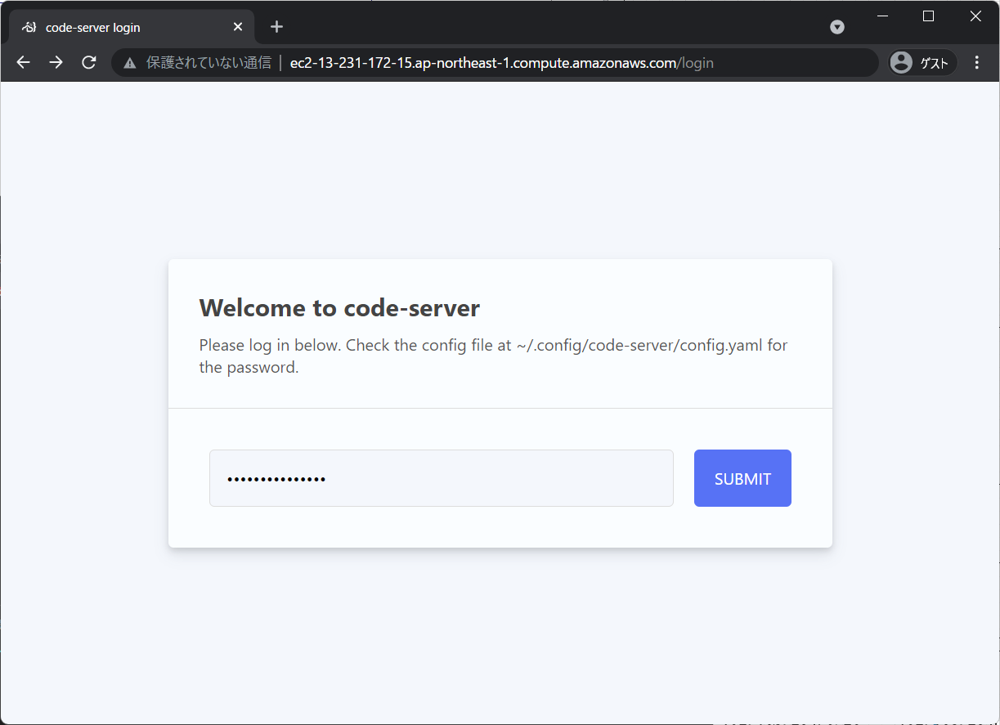
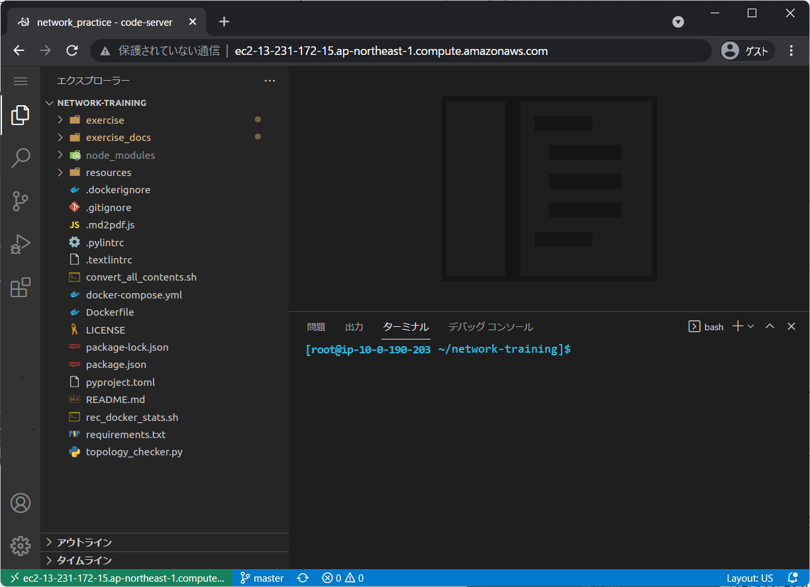
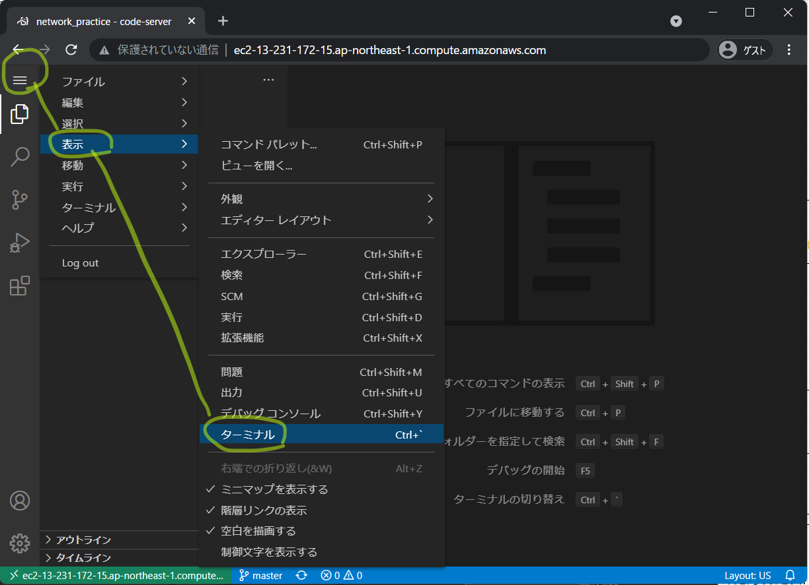
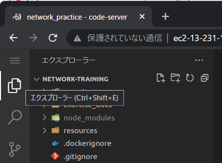
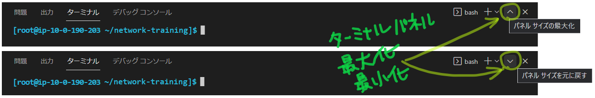
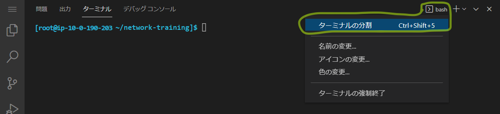
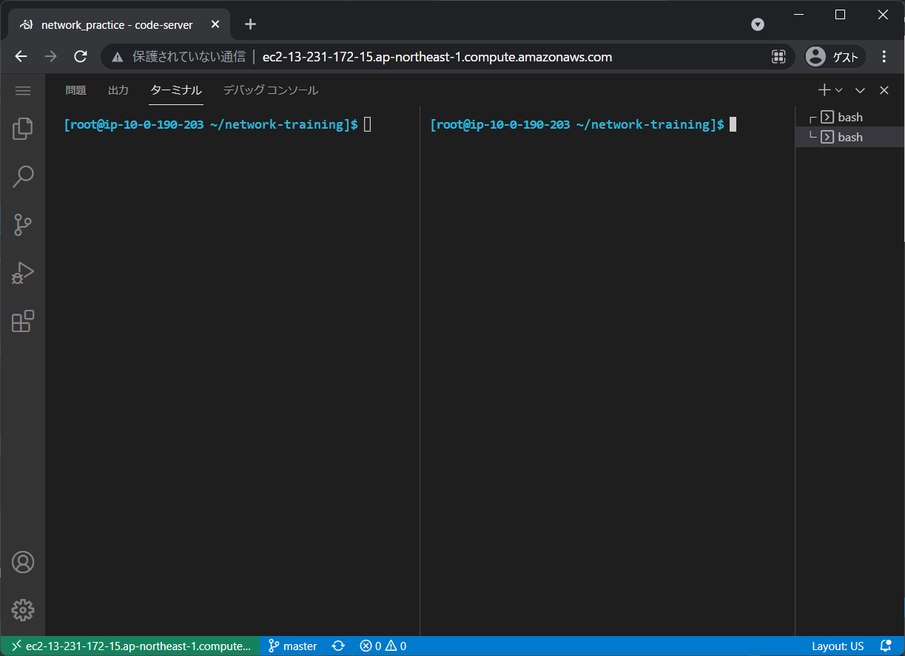
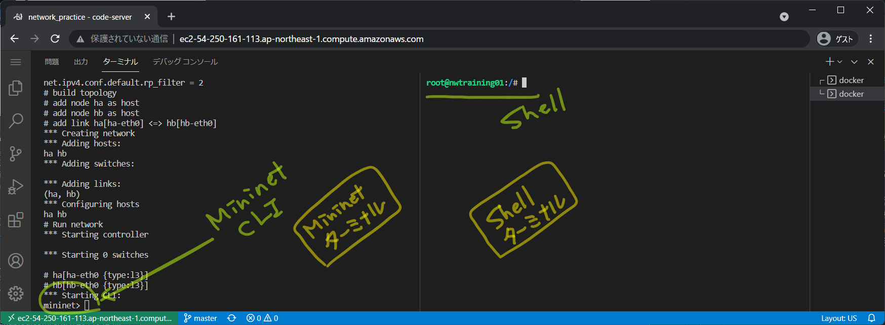

<!-- HEADER -->
Previous << [Index](../index.md) >> [Next](../tutorial1/scenario.md)

---
<!-- /HEADER -->

<!-- TOC -->

- [チュートリアル0](#チュートリアル0)
  - [このチュートリアルの目的](#このチュートリアルの目的)
  - [演習環境に接続する](#演習環境に接続する)
  - [Code-server の表示操作](#code-server-の表示操作)
    - [ターミナルが表示されない・閉じてしまった](#ターミナルが表示されない・閉じてしまった)
    - [ファイルエクスプローラー(サイドバー)の開閉](#ファイルエクスプローラーサイドバーの開閉)
    - [エディタグループの開閉](#エディタグループの開閉)
    - [ターミナルを2面用意する](#ターミナルを2面用意する)
  - [演習ネットワークの起動・停止・リセット](#演習ネットワークの起動・停止・リセット)
    - [作業ディレクトリへの移動](#作業ディレクトリへの移動)
    - [事前確認: コンテナ起動](#事前確認-コンテナ起動)
    - [コンテナに入る](#コンテナに入る)
    - [起動](#起動)
    - [停止](#停止)
    - [リセット](#リセット)
  - [チュートリアル0のまとめ](#チュートリアル0のまとめ)

<!-- /TOC -->

# チュートリアル0

## このチュートリアルの目的

使い方の理解

* 演習環境へのアクセス
* 演習ネットワークの起動・停止の方法

## 演習環境に接続する

演習環境にブラウザでアクセスします。

:warning: ブラウザ拡張機能によっては、ブラウザ内で起動するアプリ(code-server)の操作と干渉することがあります。動作がおかしい場合はゲストモードで試してみてください。



- 運営から指定された接続情報を用意する
  - 接続先 IP アドレス・ポート番号
  - パスワード
- 指定されたアドレス・ポート番号でブラウザからアクセスする
- パスワード入力が要求されるので、指定されたパスワードを入力する

パスワード認証が通ると、ブラウザで code-server (VSCode, Visual Studio Code) が起動します。



## Code-server の表示操作

:bulb: Code-server (VSCode) の画面構成要素の名称については [Visual Studio Code User Interface](https://code.visualstudio.com/docs/getstarted/userinterface) を参照してください。

### ターミナルが表示されない・閉じてしまった

アクティビティバーのメニューから[表示]-[ターミナル]等でターミナルを表示してください。



### ファイルエクスプローラー(サイドバー)の開閉

アクティビティバーのファイルエクスプローラーボタンでサイドバーを開閉できます。チュートリアル・演習はターミナル操作が中心になります。ファイルエクスプローラー(サイドバー)が不要な場合は閉じてターミナルを広く使えるようにしてください。



### エディタグループの開閉

ターミナルパネル右上のパネル最大化・元に戻すボタンでエディタグループの開閉 (ターミナルパネルの最大化・戻す) ができます。チュートリアル・演習はターミナル操作が中心になります。エディタグループが不要な場合は閉じて (ターミナルパネルを最大化して) ターミナルを広く使えるようにしてください。




### ターミナルを2面用意する

演習の中で、ターミナルを 2 枚表示した上で並行操作する箇所があります。ターミナルパネルのメニューから「ターミナルの分割」を選択してターミナルを分割してください。



図のようにターミナルを 2 面表示します。



## 演習ネットワークの起動・停止・リセット

### 作業ディレクトリへの移動

現在のディレクトリが `~/network-training` になっていない場合はこのディレクトリへ移動してください。

```shell
cd ~/network-training
```

### 事前確認: コンテナ起動

演習コンテナ `network-training_lab_1`  が `Up` になっていることを確認してください。(コンテナは常時起動するように設定していますが念のため。)

```text
[root@ip-10-0-190-203 ~/network-training]$ docker-compose --compatibility ps
         Name                       Command               State   Ports
-----------------------------------------------------------------------
network-training_lab_1   /bin/bash -c ovs-ctl start ...   Up
```

:warning: コンテナが起動していない場合は下記のコマンドで起動させてください。

```sh
cd ~/network-training
docker-compose --compatibility up -d
```

### コンテナに入る

:warning: ターミナルを分割している場合、どちらのターミナルでも `docker-compose exec lab bash` してコンテナ内に入ってからチュートリアル・演習作業をしてください。code-server はコンテナ外 (docker host) で動いているのでコンテナ内に入る操作が必要になります。

コンテナ内に入ると、下記のように `root@nwtraining01` プロンプトに変化します。

```text
[root@ip-10-0-190-203 ~/network-training]$ docker-compose exec lab bash
# --compatibility オプションがない場合 WARNING が出るかもしれませんが無視してください
root@nwtraining01:/#
```

### 起動

コンテナ内、`/exercise` ディレクトリに演習ネットワークを起動するためのスクリプトがあります。

チュートリアル 1 用のネットワークを起動してみましょう。

```bash
cd /exercise
./nw_training.py tutorial1/scenario.json
```

起動すると下記のように `mininet>` プロンプトが表示されます。



:customs: 以降、上の図のように 2 つのターミナルを使って操作します。各ターミナルを以下のように呼びます。
- **Mininet ターミナル**: Mininet CLI を実行しているターミナル
- **Shell ターミナル**: 通常のシェルを実行しているターミナル

### 停止

Mininet ターミナルで `exit` を入力すると Mininet CLI が終了して起動していた演習ネットワークが全部クリアされます。

:warning: 演習ネットワーク内で設定した情報等は残りません

```text
mininet> exit
*** Stopping 0 controllers

*** Stopping 1 links
.
*** Stopping 0 switches

*** Stopping 2 hosts
ha hb 
*** Done
root@nwtraining01:/exercise# 
```

停止後、また別の演習ネットワークを起動できます。

:warning: `nw_training.py` は同時に複数起動できません。(同じ名前のリソースを作ろうとして競合が発生してしまうため。)

### リセット

起動がうまくいかない場合は、停止した際に何かしらのゴミが残っていることが想定されます。その場合、Mininet のクリーニングコマンド (`mn -c`) および `rm -rf /var/run/netns/*` を実行してください。

```text
root@nwtraining01:/exercise# mn -c
*** Removing excess controllers/ofprotocols/ofdatapaths/pings/noxes

[省略]

*** Cleanup complete.
root@nwtraining01:/exercise# rm -rf /var/run/netns/*
root@nwtraining01:/exercise# 
```

## チュートリアル0のまとめ

* 演習環境操作の基本
  * ブラウザから演習環境にアクセスする
  * Code-server (VSCode) の操作方法
  * 演習ネットワークの起動・停止

チュートリアル 0 はここまでです。演習ネットワークを終了させて[チュートリアル 1](../tutorial1/scenario.md) に進んでください。

```text
mininet> exit
```

<!-- FOOTER -->

---

Previous << [Index](../index.md) >> [Next](../tutorial1/scenario.md)
<!-- /FOOTER -->
