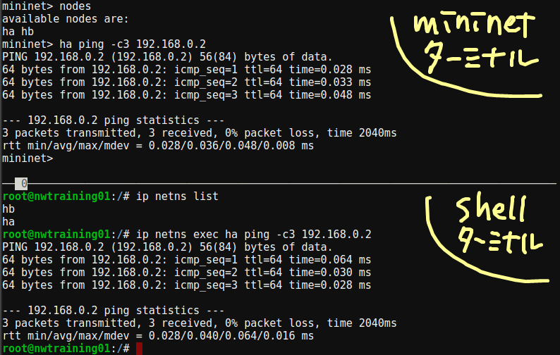

<!-- HEADER -->
[Previous](../tutorial0/scenario.md) << [Index](../index.md) >> [Next](../tutorial2/scenario.md)

---
<!-- /HEADER -->

# チュートリアル1

## このチュートリアルの目的

使い方の理解

* 演習ネットワークとして用意されるものとその操作
  * ノード・インタフェース・リンク
  * インタフェースの情報 (IP アドレス)確認・設定変更
  * ノードでのコマンド実行方法
    * コンテキストの理解 (Mininet CLI の内側・外側)

ネットワーク知識の理解

* 最小のネットワーク (ノード 2 台直結) の動作


## ネットワーク構成を確認する

Mininet ターミナル (Mininet ターミナルとして使う側の shell) でチュートリアル 1 用のネットワークを起動します。

```sh
cd /exercise
./nw_training.py tutorial1/scenario.json
```

このコマンドでは下の図のようなネットワークが作られています。


Mininet CLI で、実際に作られているものを確認してみましょう。

`nodes` コマンド

- ha, hb の 2 つのノードがいます
```text
nodes
```
```text
mininet> nodes
available nodes are: 
ha hb
```

`links` コマンド

- ha-eth0 インタフェースと hb-eth0 インタフェースが 1 つのリンクでつながっています。

```sh
links
```
```text
mininet> links
ha-eth0<->hb-eth0 (OK OK)
```

:customs: インタフェース名の表記ルール (ドキュメント中表記と mininet 内の違い):

*  構成図では、インタフェース名についてはノード名を省略して "ethX" とだけ表記しています。実際にはホスト名をつけて "ホスト名-ethX" の形式です。(この他のチュートリアル・演習問題で同様です。)
* これは、mininet のなかではリンク・リンク端点のインタフェースはノードとは独立して扱われるためです。インタフェース名にホスト名をつけていないと `links` コマンドの表示は `eth0<->eth0` のようになってしまい、何がつながっているのかわかりにくくなってしまいます。

`net` コマンドは `nodes`, `links` の情報を複合した全体的な接続関係を出力します。

- ノード ha の ha-eth0 インタフェースは hb-eth0 とつながっています。
- ノード hb の hb-eth0 インタフェースは ha-eth0 インタフェースとつながっています。

```sh
net
```
```text
mininet> net
ha ha-eth0:hb-eth0
hb hb-eth0:ha-eth0
```

## ノードを操作する

### ノードインタフェース情報を見る

Mininet CLI では、`ノード名 コマンド` の形式で、「ノードの中で」コマンドを実行できます。

- ノード ha のインタフェース（IP アドレス）情報を確認する
  - ノード ha には lo と ha-eth0 の 2 つのインタフェースがある
  - ha-eth0 は 192.168.0.1/24 という IP アドレスを持つ

```sh
ha ip addr show
```
```text
mininet> ha ip addr show
1: lo: <LOOPBACK,UP,LOWER_UP> mtu 65536 qdisc noqueue state UNKNOWN group default qlen 1000
    link/loopback 00:00:00:00:00:00 brd 00:00:00:00:00:00
    inet 127.0.0.1/8 scope host lo
       valid_lft forever preferred_lft forever
    inet6 ::1/128 scope host 
       valid_lft forever preferred_lft forever
2: ha-eth0@if2: <BROADCAST,MULTICAST,UP,LOWER_UP> mtu 1500 qdisc noqueue state UP group default qlen 1000
    link/ether 6e:f0:c9:83:5f:03 brd ff:ff:ff:ff:ff:ff link-netns hb
    inet 192.168.0.1/24 brd 192.168.0.255 scope global ha-eth0
       valid_lft forever preferred_lft forever
    inet6 fe80::6cf0:c9ff:fe83:5f03/64 scope link 
       valid_lft forever preferred_lft forever
```

- ノード hb のインタフェース (IP アドレス) 情報を確認する
  - ノード hb には lo と hb-eth0 の 2 つのインタフェースがある
  - hb-eth0 は 192.168.0.2/24 という IP アドレスを持つ

```sh
hb ip addr show
```
```text
mininet> hb ip addr show
1: lo: <LOOPBACK,UP,LOWER_UP> mtu 65536 qdisc noqueue state UNKNOWN group default qlen 1000
    link/loopback 00:00:00:00:00:00 brd 00:00:00:00:00:00
    inet 127.0.0.1/8 scope host lo
       valid_lft forever preferred_lft forever
    inet6 ::1/128 scope host 
       valid_lft forever preferred_lft forever
2: hb-eth0@if2: <BROADCAST,MULTICAST,UP,LOWER_UP> mtu 1500 qdisc noqueue state UP group default qlen 1000
    link/ether b6:b2:1b:8d:5f:3d brd ff:ff:ff:ff:ff:ff link-netns ha
    inet 192.168.0.2/24 brd 192.168.0.255 scope global hb-eth0
       valid_lft forever preferred_lft forever
    inet6 fe80::b4b2:1bff:fe8d:5f3d/64 scope link 
       valid_lft forever preferred_lft forever
```

### ノード間の通信確認をする

ha から hb に対して ping を実行して通信可能であることを確認します。

- `ha ping 宛先` として、ha の中で実行する必要があります
- ping の `-c` オプションは ping を送付する回数の指定です

```sh
ha ping -c3 192.168.0.2
```
```text
mininet> ha ping -c3 192.168.0.2
PING 192.168.0.2 (192.168.0.2) 56(84) bytes of data.
64 bytes from 192.168.0.2: icmp_seq=1 ttl=64 time=0.043 ms
64 bytes from 192.168.0.2: icmp_seq=2 ttl=64 time=0.070 ms
64 bytes from 192.168.0.2: icmp_seq=3 ttl=64 time=0.076 ms

--- 192.168.0.2 ping statistics ---
3 packets transmitted, 3 received, 0% packet loss, time 2032ms
rtt min/avg/max/mdev = 0.043/0.063/0.076/0.014 ms
```

## Shellターミナルからノードを操作する

演習ネットワークを起動している (Mininet CLI を実行している) とき、Shell ターミナルからも演習ネットワーク内のノードを操作できます。Shell ターミナルで以下の操作をしてください。

```sh
ip netns list
ip netns exec ha ping -c3 192.168.0.2
```
```text
root@nwtraining01:/# ip netns list
hb
ha
root@nwtraining01:/# ip netns exec ha ping -c3 192.168.0.2
PING 192.168.0.2 (192.168.0.2) 56(84) bytes of data.
64 bytes from 192.168.0.2: icmp_seq=1 ttl=64 time=0.027 ms
64 bytes from 192.168.0.2: icmp_seq=2 ttl=64 time=0.029 ms
64 bytes from 192.168.0.2: icmp_seq=3 ttl=64 time=0.134 ms

--- 192.168.0.2 ping statistics ---
3 packets transmitted, 3 received, 0% packet loss, time 2056ms
rtt min/avg/max/mdev = 0.027/0.063/0.134/0.049 ms
root@nwtraining01:/# 
```



Mininet CLI では同時に 1 つのノードしか操作できないため、複数のノードを操作するときには Shell ターミナル側を併用します。

## 同時に2ノードを操作する(パケットキャプチャをとる)

同時に 2 ノード操作してみましょう。

- Mininet ターミナル (Mininet CLI) : ha → hb への ping
- Shell ターミナル : hb で送受信しているパケット情報の表示 (パケットキャプチャ)

以下の順序で操作します。

> **Important**
> `tcpdump` コマンドは `-l` オプション (Make stdout line buffered) がないと出力がバッファリングされてリアルタイムに表示されません。

1. Shell ターミナルで `ip netns exec hb tcpdump -l -i hb-eth0` コマンドを実行して通信が実行されていることを確認してください。
1. Mininet CLI で ping コマンドを実行します: `ha ping 192.168.0.2`
    - `-c` オプションをつけずに実行しつづけてください。
1. Shell ターミナル (tcpdump) で通信(パケットのやり取り)が表示されることを確認してください。ここでは Host.B のインタフェース (hb-eth0) を出入りするパケットを表示しています。
1. Mininet CLI, Shell ターミナルでそれぞれ `Ctrl-c` を入力して、`ping` および `tcpdump` の実行を停止します。


## チュートリアル1のまとめ

* 演習の実施方法
  * 演習ネットワークの起動
  * Mininet ターミナルと Shell ターミナルの使い分け ("コンテキスト"とコマンドの実行方法)
  * 演習ネットワークの構成要素 : ノード(ホスト), リンク, ポート(インタフェース)
  * 演習ネットワークの構成要素の情報確認・操作

チュートリアル 1 はここまでです。演習ネットワークを終了させて[チュートリアル 2](../tutorial2/scenario.md) に進んでください。

```text
mininet> exit
```

<!-- FOOTER -->

---

[Previous](../tutorial0/scenario.md) << [Index](../index.md) >> [Next](../tutorial2/scenario.md)
<!-- /FOOTER -->
