<!-- HEADER -->
[Previous](../tutorial1/scenario.md) << [Index](../index.md) >> [Next](../tutorial3/scenario.md)

---
<!-- /HEADER -->

<!-- TOC -->

- [チュートリアル2](#チュートリアル2)
  - [このチュートリアルの目的](#このチュートリアルの目的)
  - [演習ネットワークを起動する](#演習ネットワークを起動する)
  - [復習](#復習)
  - [ノードのパケット転送ルールを確認する](#ノードのパケット転送ルールを確認する)
    - [準備・初期状態の確認](#準備・初期状態の確認)
  - [単一のL2セグメント内の通信](#単一のl2セグメント内の通信)
    - [(1) Host.A](#1-hosta)
    - [(2) Switch.1](#2-switch1)
    - [(3) Host.C](#3-hostc)
    - [(4) Host.B](#4-hostb)
    - [(5) Switch.1](#5-switch1)
    - [(6) Host.A](#6-hosta)
    - [(7) Switch.1](#7-switch1)
    - [(8) Host.B](#8-hostb)
    - [(9) Switch.1](#9-switch1)
    - [(10) Host.A](#10-hosta)
  - [補足](#補足)
    - [L2 テーブルのエージアウト](#l2-テーブルのエージアウト)
    - [マッチする MAC アドレステーブルエントリがない場合の動作](#マッチする-mac-アドレステーブルエントリがない場合の動作)
  - [チュートリアル2のまとめ](#チュートリアル2のまとめ)

<!-- /TOC -->

# チュートリアル2

## このチュートリアルの目的

使い方の理解
* 演習ネットワークとして用意されるものとその操作
  * 通信確認コマンドの動作 (ping)
  * ホスト・スイッチの L2/L3 テーブルの確認方法

ネットワーク知識の理解

* 単一の L2 セグメントの動作 : "同じ部屋の中の複数ノード" で通信がどう成立するかを見てみる
* スイッチが "媒体 (メディア)" としてどのように動くかを確認する

## 演習ネットワークを起動する

チュートリアル 2 のネットワークを起動します。

```shell
cd /exercise
./nw_training.py tutorial2/scenario.json
```

起動したら Mininet CLI で `nodes`, `links`, `net` を実行し、図のようなトポロジになっていることを確認してください。


## 復習

座学では、広域で使える住所氏名 (IP アドレス) と、特定の部屋の中でだけ使う座席番号 (MAC アドレス) の例えで説明していました。

* メディア = 通信媒体 = 部屋の中の空気 (情報を伝えるための物理実体)
* 部屋 = 直接声をかけられる範囲 = ブロードキャストが届く範囲 = **ブロードキャストドメイン** = ひとつの **L2 セグメント**
  * 教室ごとに、広域で使う住所 (IP アドレス) を設定します。
  * 教室の中の座席に番号をつけて (MAC アドレス)、部屋の中で誰がどこにいるかを識別します。
  * 同じ部屋にいる = 隣接している = 同じメディアを共有しているノードとは、"座席番号" を使って情報をやり取りします。
* どこでも共通して通用する住所氏名 = IP アドレス
  * 教室の住所 = サブネット, (IP アドレスの表記として) ネットワークアドレスで指定
  * 個人の住所氏名: IP アドレス
* 教室の住所の中に、個人の IP アドレスが含まれている場合、その個人は教室の中にいると判定
* ネットワーク機器の基本動作: テーブルを検索して、マッチしたらアクション

ネットワーク構成図の右側と左側は等価です。
図左はネットワークを構成する実体に着目しています。図右は実体によって実現される論理的な接続関係に着目しています。
図左のスイッチ (Switch.1) は、図右では "ノード間を接続する線" に対応しています。
スイッチは、ノード間で情報をやり取りするための "通信媒体" の役割を果たしています。

## ノードのパケット転送ルールを確認する

各ノードやスイッチがパケットを処理するときは、**ルーティングテーブル**・**ARP テーブル**や **MAC アドレステーブル**を元にパケットをどう扱うかを決めています。チュートリアル 2 では、それらの基本動作を順を追って見ていきます。

### 準備・初期状態の確認

各ホスト (h1-h3) は IP アドレスを持ち、L3 のデバイスとして動作します。そのため、IP アドレスを元に中継先(転送先)を決めるためのルーティングテーブルと、中継先が通信媒体(メディア; L2)上で持つアドレスとの対応関係を管理するための ARP テーブルを持ちます。それぞれのテーブルを確認してみます。

(Mininet ターミナル) 各ノードでインタフェースの IP アドレス、MAC アドレス、ルーティングテーブルおよび ARP テーブルを確認します。

```shell
# Host.A
ha ip -4 addr show dev ha-eth0  # L2/L3アドレス: MAC アドレス・IP アドレスの確認
ha ip link show dev ha-eth0     # L2アドレス: MAC アドレスの確認
ha ip route                     # L3テーブル: ルーティングテーブルの確認
ha ip neigh                     # L2テーブル: ARP テーブルの確認
# Host.B
hb ip -4 addr show dev hb-eth0
hb ip link show dev hb-eth0
hb ip route
hb ip neigh
# Host.C
hc ip -4 addr show dev hc-eth0
hc ip link show dev hc-eth0
hc ip route
hc ip neigh
```

実行結果は以下のようになります (Host.A 分のみ記載: その他のノードについてもそれぞれ確認してください)。
初期状態 (まだ何も通信をしていない状態) では、ARP テーブルは空になります。
空になっていない場合は後述するコマンドでクリアしてください。

```text
# Host.A

mininet> ha ip -4 addr show dev ha-eth0
2: ha-eth0@if12: <BROADCAST,MULTICAST,UP,LOWER_UP> mtu 1500 qdisc noqueue state UP group default qlen 1000 link-netnsid 0
    inet 192.168.0.1/24 brd 192.168.0.255 scope global ha-eth0
       valid_lft forever preferred_lft forever
mininet> ha ip link show dev ha-eth0
2: ha-eth0@if12: <BROADCAST,MULTICAST,UP,LOWER_UP> mtu 1500 qdisc noqueue state UP mode DEFAULT group default qlen 1000
    link/ether 00:00:5e:00:53:0a brd ff:ff:ff:ff:ff:ff link-netnsid 0
mininet> ha ip route
192.168.0.0/24 dev ha-eth0 proto kernel scope link src 192.168.0.1 
mininet> ha ip neigh
mininet> 
```

以降、L2 の動作は MAC アドレスを元に見ていきます。各インタフェースの IP アドレス・MAC アドレスの対応表が下の表のようになっていることを確認してください。
* :customs: チュートリアル 2 の演習ネットワークでは表のように MAC アドレスを設定して固定しています。

| Node   |Interface| IP address  | MAC address       |
|--------|---------|-------------|-------------------|
|Host.A  | ha-eth0 |192.168.0.1  |`00:00:5e:00:53:0a`|
|Host.B  | hb-eth0 |192.168.0.2  |`00:00:5e:00:53:0b`|
|Host.C  | hc-eth0 |192.168.0.3  |`00:00:5e:00:53:0c`|

もし、ARP テーブルになにかデータが入っている場合は、以下のコマンドでクリアしてください。

```shell
# クリア
ha ip neigh flush dev ha-eth0
hb ip neigh flush dev hb-eth0
hc ip neigh flush dev hc-eth0
# 確認
ha ip neigh
hb ip neigh
hc ip neigh
```

L2 スイッチ (Switch.1) は IP アドレスを持ちません。L2 スイッチは L2 のデバイスなので、入ってくるパケットの L2 の情報 (送信元・先 MAC アドレス) だけを見て、パケットをどこに転送するかを決めています。そのため、宛先 MAC アドレスをどこのポートに送ればよいかを管理する MAC アドレステーブルを持っています。

(Shell ターミナル) Switch.1 のポート番号の確認 (OS 上のインタフェース名と、スイッチ内部で扱うポート番号の対応)

```text
root@nwtraining01:/# ovs-dpctl show
system@ovs-system:
  lookups: hit:12 missed:15 lost:0
  flows: 0
  masks: hit:24 total:0 hit/pkt:0.89
  port 0: ovs-system (internal)
  port 1: sw1-eth1
  port 2: sw1-eth0
  port 3: sw1-eth2
  port 4: sw1 (internal)
```

(Shell ターミナル) Switch.1 の MAC アドレステーブルの確認
初期状態(まだ何も通信をしていない状態)では、下記のように MAC アドレステーブルは空になっています。

```text
root@nwtraining01:/# ovs-appctl fdb/show sw1
 port  VLAN  MAC                Age
root@nwtraining01:/#
```

もし、ARP テーブルになにかデータが入っている場合は、以下のコマンドでクリアしてください。(Shell ターミナルで実行)

```shell
# sw1 MACアドレステーブルをクリア
ovs-appctl fdb/flush sw1
# クリアされたことを確認
ovs-appctl fdb/show sw1
```

```text
root@nwtraining01:/# ovs-appctl fdb/flush sw1
table successfully flushed
root@nwtraining01:/# ovs-appctl fdb/show sw1
 port  VLAN  MAC                Age
root@nwtraining01:/# 
```

## 単一のL2セグメント内の通信

初期状態にした上で、Host.A から Host.B へ通信します。ノード間のやり取りと、各ノードが持つテーブルの情報を確認してみましょう。各ノードが何を見てどのような判断をするのかに着目してください。

(Mininet ターミナル) Host.A → Host.B への通信:

```shell
ha ping -c3 192.168.0.2
```

Host.A-C の ARP テーブルの確認:

```text
mininet> ha ip neigh
192.168.0.2 dev ha-eth0 lladdr 00:00:5e:00:53:0b STALE  ...❹
mininet> hb ip neigh
192.168.0.1 dev hb-eth0 lladdr 00:00:5e:00:53:0a STALE  ...❷
mininet> hc ip neigh
mininet> 
```

Switch.1 の MAC アドレステーブルの確認:

```text
mininet> sh ovs-appctl fdb/show sw1
 port  VLAN  MAC                Age
    1     0  00:00:5e:00:53:0a  152  ...❶
    2     0  00:00:5e:00:53:0b  152  ...❸
mininet> 
```

この時、どのノードが何を見てどのようにパケットを送信(転送)しているのかをトレースしてみます。以下のシーケンス図と合わせて確認してみてください。

* どのノードで何のテーブルを参照・更新しているのか?
* パケットにつける L2/L3 の送信元・宛先情報をどのようにセットしているのか?



### (1) Host.A

送信元である Host.A は、宛先 (Host.B) の "住所氏名" をルーティングテーブルから参照し、データ(パケット)をどこに送信するべきかを (L3 レベルで) 決定します。チュートリアル 2 のネットワークでは、Host.A (B, C) のルーティングテーブルには 1 つのエントリだけがあります。L3/ルーティング動作 (ルータの動作) については[チュートリアル 5](../tutorial5/scenario.md) 以降で見ます。ここではまず L2/スイッチング動作 (スイッチの動作) に着目してください。

```shell
mininet> ha ip route
192.168.0.0/24 dev ha-eth0 proto kernel scope link src 192.168.0.1 
```

パケットを送信する際、その宛先が 192.168.0.0/24 にマッチする場合はこのエントリを使用します。`scope link` は、自身が直接接続しているネットワークで、直接通信する範囲を示しています。Host.A-C には、192.168.0.0/24 にマッチしないその他の宛先をどこに送ればよいのかが定義されていません。そのため、そうした場合にはパケットは送付しません(できません)。

いま、ping の宛先 192.168.0.2 (Host.B) はこのエントリとマッチするので、宛先は自分 (Host.A) が直接接続しているネットワーク内にあることがわかります。よって、"同じ部屋の中" = ha-eth0 と同じメディア上に Host.B がいるはずです。あとは Host.B の "座席番号" = MAC アドレスが分かれば直接パケットを送ることができます。

そこで、Host.A は Host.B の "座席番号" を知るために、"部屋内" 全員宛に呼びかけます (**ブロードキャスト**; **ARP request**)。ここではまだ本来送りたかったパケット (ping) は送信していません。送信するための情報…宛先の MAC アドレスが不明なので、まずそれを解決します。

### (2) Switch.1

Switch.1 は L2 のデバイス…メディアとして動作するデバイスです。

Host.A が送信した ARP request はまず Switch.1 に届きます。これはブロードキャスト = "任意の座席" 宛になっていますから、Switch.1 は、ARP request を、同じ "部屋内" の全てのポートにコピーして送信します (**フラッディング**)。

このとき同時に、Switch.1 は MAC アドレステーブルを作ります。Switch.1 視点では、sw1-eth1 から Host.A を送信元とする ARP request が入ってきました。そのため、"Host A は sw1-eth1 の先にいる" ことがわかります。
そこで、MAC アドレステーブルに ❶ のエントリを書き込みます。
* スイッチのポート番号については、[準備・初期状態の確認](#準備・初期状態の確認)の "Switch.1 のポート番号の確認" 参照

```text
 port  VLAN  MAC                Age
    1     0  00:00:5e:00:53:0a  152  ...❶
```

### (3) Host.C

Switch.1 がフラッディングした ARP request が届きました。"任意の座席" 宛 (ブロードキャスト) なので開封しますが、自分が持つ IP アドレスについて尋ねられていないので、これを無視します。

### (4) Host.B

Switch.1 がフラッディングした ARP request が届きました。"任意の座席" 宛なので開封し、かつ自分が持つ IP アドレスについて尋ねられているので、応答します。
このとき、ARP request のヘッダおよびデータのなかに送信元 IP アドレス・MAC アドレスが含まれています。
したがって、Host.B は (これから応答を送る) Host.A の "住所氏名" "座席番号" がわかります。

まず "座席番号" "住所氏名" の対応表 (ARP テーブル) にエントリ❷を登録します。

```text
mininet> hb ip neigh
192.168.0.1 dev hb-eth0 lladdr 00:00:5e:00:53:0a STALE  ...❷
```

その上で応答 (**ARP reply**) を組み立て、宛先 (Host.A) に返信します。宛先がどの "座席番号" かはわかっているので、一意な宛先を設定したパケット (**ユニキャスト**) で送信します。

### (5) Switch.1

Host.B が送信した ARP reply は Switch.1 に届きます。Switch.1 から見ると、sw1-eth2 の先に Host.B がいるとわかります。さきほどと同様に MAC アドレステーブルにエントリ❸を登録します。

```text
 port  VLAN  MAC                Age
    1     0  00:00:5e:00:53:0a  152  ...❶
    2     0  00:00:5e:00:53:0b  152  ...❸
```

そして、Switch.1 は受取った ARP reply の宛先 "座席番号" を確認します。これは Host.A の MAC アドレスになっており、MAC アドレステーブルのエントリ❶とマッチします。
そこで、そのエントリに従って port 1 (sw1-eth1) へ転送します。

### (6) Host.A

Host.B からの応答が Switch.1 経由で届きます。宛先 "座席番号" が自分宛てになっているので開封します。
この応答(データ)には、Host.B の "住所氏名" (IP アドレス) に対応する "座席番号" (MAC アドレス) が書かれているので、その対応表 = ARP テーブルを更新します。

```text
mininet> ha ip neigh
192.168.0.2 dev ha-eth0 lladdr 00:00:5e:00:53:0b STALE  ...❹
```

これで、ping を送るために必要な情報 = Host.B の "住所氏名" "座席番号" がわかりました。実際に ping パケットを送るのはここからになります。Host.C 宛に ping パケット (ICMP echo request) を送ります。

### (7) Switch.1

Switch.1 は Host.A-Host.B 間での ping パケットを中継します。
ping パケットには、送信元・先の "座席番号" がついています。Switch.1 が見るのはこの座席番号だけです ("住所氏名" = IP アドレスは見ません)。

Host.A が送信した ping 要求の宛先 "座席番号" を MAC アドレステーブルで検索するとエントリ❸が見つかるので、そのエントリに従ってパケットを転送します。

### (8) Host.B

Host.A からの ping パケット (echo request) を受信したので応答 (ICMP echo reply) を返します。

### (9) Switch.1

Host.B が送信した ping 応答の宛先 "座席番号" を MAC アドレステーブルで検索するとエントリ❶が見つかるので、そのエントリに従ってパケットを転送します。

### (10) Host.A

Switch.1 が転送した ping 応答が届きます。これで 1 回の往復が完了しました。
以降同様に、次の ping パケット(要求)を送信してやり取りしていきます。


## 補足

:white_check_mark: 以降は技術面での補足情報です。L2/L3 のトラブルシュートの際にはこれらの知識が必要になるケースがあります。また、こうした L2/L3 の動作を利用したネットワーク上での攻撃もあり、セキュリティ検討の際にも必要になる可能性があります。

### L2 テーブルのエージアウト

<details>

<summary>L2 テーブルのエージアウト</summary>

L2 の情報を管理するテーブル (ARP テーブル, MAC アドレステーブル) のエントリは、原則として、ノード間のパケットやり取りをから動的 (dynamic) に作成されます。そして、これらのテーブルに登録されたエントリは、一転時間が立つと削除されます (**エージアウト, aging-timeout**)。例えば Switch.1 では以下のように `Age` 列が表示されますが、これは (このエントリを参照しなければ) あと何秒でエントリを削除するか、という秒数です。

```text
mininet> sh ovs-appctl fdb/show sw1
 port  VLAN  MAC                Age
    1     0  00:00:5e:00:53:0a  152
```

なぜなら、"住所氏名" はルールに基づいて明示的に割り当てられますが、"座席番号" はそうでないからです。"部屋" の例で考えれば、いわば "フリーアドレス" で、同じ "住所氏名" の人が部屋を出入りしたり、座席を移動したりします。

* ノードは起動・停止、増加・減少します。
* "同じ部屋内での席移動" があります。(例: 機材の設置位置変更、機器の移転・引越し、仮想マシンのライブマイグレーション etc)
* "住所氏名" は維持するが、OS やハードウェアなどを替える、切り替える…結果として "座席番号" を変更することがあります。(例: ハードウェアの故障と機材変更・更改・リプレース、複数台で冗長構成を組む場合は、異なるノード間で 1 つの IP アドレスを受け渡すような動作をするものもあります。)

MAC アドレスには IP アドレスのように、複数の情報を階層化する・束ねるような仕組み (サブネット) がありません。ですから、ひとつひとつ全ての "座席番号" のエントリを持つ必要があります。そのためにブロードキャストを元に "座席番号" のやり取りをしており、ブロードキャストは "部屋内" 全てのノードに伝わります。よって、L2 スイッチは "部屋内" 全ノードのエントリを持つ可能性があります。ノードが持つ "座席番号" の変更・増減・移動がある前提では、全ての "座席番号" をノードに (人間が) 設定するのは非現実的です。また、使っていない MAC アドレスの情報を保持し続けることは無駄・トラブルの原因になってしまいます。

これらの理由から、ある一定の時間範囲内で有効な "住所氏名・座席番号" をキャッシュするかたちで、L2 のテーブルは動的に構成されるようになっています。
なお、エントリが消える(エージアウトする)までの時間は、何らかのパケット送受信が行なわれてエントリが参照されるとリセットされます。

</details>

### マッチする MAC アドレステーブルエントリがない場合の動作

<details>

<summary>マッチする MAC アドレステーブルエントリがない場合の動作</summary>

[L2 テーブルのエージアウト](#l2-テーブルのエージアウト) で説明したように、L2 テーブルの情報は動的に作成され、一定時間使われないと消えるようになっています。この時、エージアウトするまでの時間はノードごとに変更できます。ですから、例えば Host.A では ARP テーブルが残っていて ping パケットを送信した時、Switch.1 MAC アドレステーブル内の対応するエントリが消えている可能性があります。IP アドレスを持っているノードの場合、ARP テーブルにエントリがなければ ARP request を投げて IP/MAC アドレスの対応関係を作り直します。では IP アドレスを持たない L2 スイッチはどのように動作するのでしょうか?

L2 スイッチから見ると、何らかのユニキャストのパケットを受信した時、宛先 MAC アドレスが MAC アドレステーブル内に存在しない = 宛先不明のユニキャストパケットを受信したことになります。こうしたパケットを **アンノウン・ユニキャスト** と呼びます。この場合、L2 スイッチは単純に、そのパケットをフラッディングします。フラッディングによって運良く送信先に届き、応答があれば、その応答を元に MAC アドレステーブルのエントリを復活させられます。

フラッディングは、"部屋内全体にばらまく" と同様の動作で、部屋内のノード全体に対して通信帯域を食いつぶしてしまうおそれがあります。ノードの位置変更や切替の際に速くネットワークが切り替わるようにしたい…などでエージアウトのタイマを変更することが選択肢にあがるかもしれません。しかし、エージアウトタイマを過度に小さい値に設定してしまうと、フラッディングを多発させてネットワーク全体の性能低下を招くリスクがあります。

</details>

## チュートリアル2のまとめ

* "通信媒体" とスイッチ
  * ブロードキャストドメイン
* Layer2 ネットワークの基本的な動作: ARP メッセージのやり取りと ARP テーブルの管理
  * 各ノードがどんなテーブルを参照しているのか、テーブルを元にどのように動作しているのか
  * ノードの L2/L3 テーブル情報の確認

チュートリアル 2 はここまでです。演習ネットワークを終了させて[チュートリアル 3](../tutorial3/scenario.md) に進んでください。

```text
mininet> exit
```

<!-- FOOTER -->

---

[Previous](../tutorial1/scenario.md) << [Index](../index.md) >> [Next](../tutorial3/scenario.md)
<!-- /FOOTER -->
