<!-- HEADER -->
[Previous](../tutorial2/scenario.md) << [Index](../index.md) >> [Next](../tutorial4/scenario.md)

---
<!-- /HEADER -->

<!-- TOC -->

- [チュートリアル3](#チュートリアル3)
  - [このチュートリアルの目的](#このチュートリアルの目的)
  - [演習ネットワークを起動する](#演習ネットワークを起動する)
  - [L2スイッチの設定情報を確認する](#l2スイッチの設定情報を確認する)
  - [初期状態の確認](#初期状態の確認)
  - [通常のL2セグメント内の通信を見てみる](#通常のl2セグメント内の通信を見てみる)
  - [IPアドレス重複がある場合の動作を見てみる](#ipアドレス重複がある場合の動作を見てみる)
  - [チュートリアル3のまとめ](#チュートリアル3のまとめ)

<!-- /TOC -->

# チュートリアル3

## このチュートリアルの目的

使い方の理解

* 演習ネットワークとして用意されるものとその操作
  * スイッチ (ブリッジ)
  * スイッチの設定情報の確認
  * スイッチの状態の確認
  * 通信確認コマンドの動作 (ping)

ネットワーク知識の理解

* 単一の L2 セグメントの動作 : "同じ部屋の中の複数ノード" で通信がどう成立するかを見てみる
  * ARP メッセージ
  * 障害をおこしてみる: IP アドレス重複

## 演習ネットワークを起動する

チュートリアル 3 のネットワークを起動します。

```bash
cd /exercise
./nw_training.py tutorial3/scenario.json
```

起動したら Mininet CLI で `nodes`, `links`, `net` を実行し、図のようなトポロジになっていることを確認してください。



- ネットワークには 2 台スイッチがあります (Switch.1, Switch.2)。
- 4 台のノードが Switch.1 に接続されています。
  - 4 台とも、192.168.0.0/24 のサブネットに所属しています。
  - Host.C と Host.D は同じ IP アドレスを持っています(IP アドレス重複)。

## L2スイッチの設定情報を確認する

スイッチは Open vSwitch というソフトウェアで構成されています。`ovs-vsctl show` (Shell ターミナル) で設定情報を確認できます。

```text
root@nwtraining01:/# ovs-vsctl show
83c670f3-306d-4f3f-be2f-a8f5d0c461ed
    Bridge sw2
        fail_mode: standalone
        Port sw2-eth1
            Interface sw2-eth1
        Port sw2
            Interface sw2
                type: internal
        Port sw2-eth0
            Interface sw2-eth0
    Bridge sw1
        fail_mode: standalone
        Port sw1-eth4
            Interface sw1-eth4
        Port sw1-eth10
            Interface sw1-eth10
        Port sw1-eth2
            Interface sw1-eth2
        Port sw1
            Interface sw1
                type: internal
        Port sw1-eth11
            Interface sw1-eth11
        Port sw1-eth1
            Interface sw1-eth1
        Port sw1-eth3
            Interface sw1-eth3
    ovs_version: "2.13.0"
```

以下の点を認識してください:

* 2 つのスイッチ (`Bridge`) がある
  * 1 つのスイッチが 1 つの L2 セグメントになる
* スイッチに対してポート (`Port`) が割り当てられている

スイッチは[チュートリアル 2](../tutorial2/scenario.md) と同じくデフォルトの状態です。ひとつのスイッチ (`Bridge`) が単一の L2 ブロードキャストドメインとして動作しきます。(こうした動作を変化させるケースは[チュートリアル 4](../tutorial4/scenario.md) で扱います。)

:customs: Switch2 の用途について:
* チュートリアル 3 では Switch2 は使用しません。
* [チュートリアル 8](../tutorial8/scenario.md) で動作比較するためにあらかじめ設定してあります。

:customs: 用語の使い分けについて:

* 以下の用語について、この演習の中では厳密な使い分けをしていません。同様の意味合いで見てください。
  * スイッチ/ブリッジ
  * ポート/インタフェース
* Open vSwitch (OVS) 設定のなかでは `Bridge`, `Port`, `Interface` を OVS 内部のデータモデル定義として使用しています。演習中で使用する「スイッチ」「ポート」「インタフェース」などの用語とは厳密に一致しているわけではないので注意してください。

## 初期状態の確認

以降、L2 の動作は MAC アドレスを元に見ていきます。各インタフェースの IP アドレス・MAC アドレスの対応表が下の表のようになっていることを確認してください。
* :customs: チュートリアル 3 の演習ネットワークでは表のように MAC アドレスを設定して固定しています。

IP アドレス・MAC アドレスの確認方法は[チュートリアル 2](../tutorial2/scenario.md)と同様です。

```shell
# Host.A
ha ip -4 addr show dev ha-eth0  # L3アドレス: IP アドレスの確認
ha ip link show dev ha-eth0     # L2アドレス: MAC アドレスの確認
```

| Node   |Interface| IP address  | MAC address       |
|--------|---------|-------------|-------------------|
|Host.A  | ha-eth0 |192.168.0.1  |`00:00:5e:00:53:0a`|
|Host.B  | hb-eth0 |192.168.0.2  |`00:00:5e:00:53:0b`|
|Host.C  | hc-eth0 |192.168.0.3  |`00:00:5e:00:53:0c`|
|Host.D  | hc-eth0 |192.168.0.3  |`00:00:5e:00:53:0d`|

各ノードの L2 ステーブルをクリアしておきます。

(Mininet ターミナル) 各ノードの ARP テーブルをクリア

```shell
# クリア
ha ip neigh flush dev ha-eth0
hb ip neigh flush dev hb-eth0
hc ip neigh flush dev hc-eth0
hd ip neigh flush dev hd-eth0
# 確認
ha ip neigh
hb ip neigh
hc ip neigh
hd ip neigh
```

(Shell ターミナル) MAC アドレステーブルをクリア

```shell
# クリア
ovs-appctl fdb/flush sw1
# 確認
ovs-appctl fdb/show sw1
```

## 通常のL2セグメント内の通信を見てみる

まず、同一 L2 セグメント内での一般的な通信がどのように行なわれているかを見てみます。Host.A のパケット送受信をパケットキャプチャで取りながら Host.A - Host.B 間で通信してみます。ここまでは[チュートリアル 2](../tutorial2/scenario.md) と同様です。チュートリアル 2 でみたノード間のやりとり (シーケンス図) を参考に、どんな通信が行なわれているのかを確認してください。

(Shell ターミナル) パケットキャプチャ@Host.A
* :bulb: tcpdump コマンドの `-n` はアドレスをそのまま表示する、`-e` は L2 の情報を表示するオプションです。

```text
root@nwtraining01:/# ip netns exec ha tcpdump -nle
...
```

(Mininet ターミナル) ping Host.A → 192.168.0.2 (Host.B)

```text
mininet> ha ping -c3 192.168.0.2
PING 192.168.0.2 (192.168.0.2) 56(84) bytes of data.
64 bytes from 192.168.0.2: icmp_seq=1 ttl=64 time=0.405 ms
64 bytes from 192.168.0.2: icmp_seq=2 ttl=64 time=0.048 ms
64 bytes from 192.168.0.2: icmp_seq=3 ttl=64 time=0.046 ms

--- 192.168.0.2 ping statistics ---
3 packets transmitted, 3 received, 0% packet loss, time 2007ms
rtt min/avg/max/mdev = 0.046/0.166/0.405/0.168 ms
mininet> ha ip nei
❶192.168.0.2 dev ha-eth0 lladdr ❷00:00:5e:00:53:0b REACHABLE
```

[チュートリアル 2](../tutorial2/scenario.md) で確認たとおり、Host.A の ARP テーブルに、❶ IP アドレス (L3) と ❷ MAC アドレス (L2) の対応関係が登録されます。Shell ターミナルで実行したパケットキャプチャを確認してください。

```text
...
00:52:50.150056 00:00:5e:00:53:0a > ❺ff:ff:ff:ff:ff:ff, ❸ethertype ARP (0x0806), length 42: Request who-has 192.168.0.2 tell 192.168.0.1, length 28
00:52:50.150437 00:00:5e:00:53:0b > ❻00:00:5e:00:53:0a, ❹ethertype ARP (0x0806), length 42: Reply 192.168.0.2 is-at 00:00:5e:00:53:0b, length 28
00:52:50.150445 00:00:5e:00:53:0a > 00:00:5e:00:53:0b, ethertype IPv4 (0x0800), length 98: 192.168.0.1 > 192.168.0.2: ICMP echo request, id 1511, seq 1, length 64
00:52:50.150558 00:00:5e:00:53:0b > 00:00:5e:00:53:0a, ethertype IPv4 (0x0800), length 98: 192.168.0.2 > 192.168.0.1: ICMP echo reply, id 1511, seq 1, length 64
00:52:51.158876 00:00:5e:00:53:0a > 00:00:5e:00:53:0b, ethertype IPv4 (0x0800), length 98: 192.168.0.1 > 192.168.0.2: ICMP echo request, id 1511, seq 2, length 64
00:52:51.158900 00:00:5e:00:53:0b > 00:00:5e:00:53:0a, ethertype IPv4 (0x0800), length 98: 192.168.0.2 > 192.168.0.1: ICMP echo reply, id 1511, seq 2, length 64
00:52:52.183029 00:00:5e:00:53:0a > 00:00:5e:00:53:0b, ethertype IPv4 (0x0800), length 98: 192.168.0.1 > 192.168.0.2: ICMP echo request, id 1511, seq 3, length 64
00:52:52.183052 00:00:5e:00:53:0b > 00:00:5e:00:53:0a, ethertype IPv4 (0x0800), length 98: 192.168.0.2 > 192.168.0.1: ICMP echo reply, id 1511, seq 3, length 64
...
```

この ARP テーブルの情報は、ノード間で **ARP メッセージ** のやり取りをすることで取得されます。このとき Shell ターミナルで見ていたパケットキャプチャを見ると、**ARP request/reply** ❸❹ が行なわれてから ping (ICMP) 通信が実行されています。❸ ARP request の ”この IP アドレスを持っているのは誰? (who-has)"、❹ ARP reply の ”その IP アドレスは <MAC アドレス> にいるよ (is-at)" というやり取りに注目してください。ここで L2/L3 の対応表を作ってから通信 (ping; ICMP echo request/reply) が実行されています。

ARP request は ❺ 全員宛 (**ブロードキャスト**; MAC アドレスの全てのビットが `1`) になります。また、ARP reply は持ち主から質問元 ❻ への返答 (ユニキャスト) になります。チュートリアル 2 のシーケンス図と照らし合わせて、どのようにパケットをやり取りしているのかを改めて確認してください。


## IPアドレス重複がある場合の動作を見てみる

もし同一 L2 セグメントの中に同じ IP アドレスを持つノードが複数(ここでは 2 ノード)いるとどうなるでしょうか? Host.A と Host.C/D との通信で同様にパケットキャプチャを取ってみます。

(Shell ターミナル) パケットキャプチャの準備 @Host.A

```text
root@nwtraining01:/# ip netns exec ha tcpdump -nle
...
```

(Mininet ターミナル) ping Host.A → 192.168.0.3 (Host.C or Host.D)

* いったん 192.168.0.3 についての ARP テーブルエントリをクリアしてから ping します

```text
mininet> ha ip neigh flush dev ha-eth0
mininet> ha ping -c3 192.168.0.3
PING 192.168.0.3 (192.168.0.3) 56(84) bytes of data.
64 bytes from 192.168.0.3: icmp_seq=1 ttl=64 time=0.351 ms
64 bytes from 192.168.0.3: icmp_seq=2 ttl=64 time=0.038 ms
64 bytes from 192.168.0.3: icmp_seq=3 ttl=64 time=0.072 ms

--- 192.168.0.3 ping statistics ---
3 packets transmitted, 3 received, 0% packet loss, time 2051ms
rtt min/avg/max/mdev = 0.038/0.153/0.351/0.140 ms
```

通信できていますが、これは Host.C/D どちらでしょうか?

```text
mininet> ha ip neigh
192.168.0.2 dev ha-eth0 lladdr   00:00:5e:00:53:0b STALE
192.168.0.3 dev ha-eth0 lladdr ❶00:00:5e:00:53:0d REACHABLE
```

Host.A の ARP テーブル ❶を見ると `00:00:5e:00:53:0d` になっているので、192.168.0.3 として Host.D と通信していたようです。

* __:warning: 通信応答順(タイミング)等にもよるので、必ず同じ結果になるわけではありません。__ 自分の環境ではどちらと通信していたかを確認してください。

Host.A でとっていた、ping したときのパケットキャプチャも確認してみましょう。

* 1 回の ARP Request ❷ に対して 2 個の ARP Reply ❸❹ が返ってきている点に注目してください
  * ARP reply ❸ が返ってきて IP/MAC アドレスの解決ができた時点で ping 送信を開始しているようです

```text
01:00:42.358952 00:00:5e:00:53:0a > ff:ff:ff:ff:ff:ff, ethertype ARP (0x0806), length 42: ❷Request who-has 192.168.0.3 tell 192.168.0.1, length 28
01:00:42.359212 00:00:5e:00:53:0d > 00:00:5e:00:53:0a, ethertype ARP (0x0806), length 42: ❸Reply 192.168.0.3 is-at 00:00:5e:00:53:0d, length 28
01:00:42.359212 00:00:5e:00:53:0c > 00:00:5e:00:53:0a, ethertype ARP (0x0806), length 42: ❹Reply 192.168.0.3 is-at 00:00:5e:00:53:0c, length 28
01:00:42.359218 00:00:5e:00:53:0a > 00:00:5e:00:53:0d, ethertype IPv4 (0x0800), length 98: 192.168.0.1 > 192.168.0.3: ICMP echo request, id 1517, seq 1, length 64
01:00:42.359381 00:00:5e:00:53:0d > 00:00:5e:00:53:0a, ethertype IPv4 (0x0800), length 98: 192.168.0.3 > 192.168.0.1: ICMP echo reply, id 1517, seq 1, length 64
01:00:43.379909 00:00:5e:00:53:0a > 00:00:5e:00:53:0d, ethertype IPv4 (0x0800), length 98: 192.168.0.1 > 192.168.0.3: ICMP echo request, id 1517, seq 2, length 64
01:00:43.379969 00:00:5e:00:53:0d > 00:00:5e:00:53:0a, ethertype IPv4 (0x0800), length 98: 192.168.0.3 > 192.168.0.1: ICMP echo reply, id 1517, seq 2, length 64
01:00:44.403804 00:00:5e:00:53:0a > 00:00:5e:00:53:0d, ethertype IPv4 (0x0800), length 98: 192.168.0.1 > 192.168.0.3: ICMP echo request, id 1517, seq 3, length 64
01:00:44.403889 00:00:5e:00:53:0d > 00:00:5e:00:53:0a, ethertype IPv4 (0x0800), length 98: 192.168.0.3 > 192.168.0.1: ICMP echo reply, id 1517, seq 3, length 64
...
```

このとき、Host.A から通信したいのが本当は Host.C だったとすると、同じ IP アドレスを持つ別なノードに "吸い込まれて" しまっており、意図した相手と通信できていない状況です。

(Mininet ターミナル) 通信できなかった側 (Host.C) から Host.A へ ping してみましょう。

```text
# [1]

mininet> ha ip neigh
192.168.0.2 dev ha-eth0 lladdr   00:00:5e:00:53:0b STALE
192.168.0.3 dev ha-eth0 lladdr ❺00:00:5e:00:53:0d STALE

# [2]

ininet> hc ping -c3 ha
PING 192.168.0.1 (192.168.0.1) 56(84) bytes of data.

--- 192.168.0.1 ping statistics ---
3 packets transmitted, 0 received, ❻100% packet loss, time 2053ms

# [3]

mininet> ha ip neigh
192.168.0.2 dev ha-eth0 lladdr   00:00:5e:00:53:0b STALE
192.168.0.3 dev ha-eth0 lladdr ❼00:00:5e:00:53:0c STALE

# [4]

mininet> hc ping -c3 ha
PING 192.168.0.1 (192.168.0.1) 56(84) bytes of data.
64 bytes from 192.168.0.1: icmp_seq=1 ttl=64 time=0.260 ms
64 bytes from 192.168.0.1: icmp_seq=2 ttl=64 time=0.130 ms
64 bytes from 192.168.0.1: icmp_seq=3 ttl=64 time=0.046 ms

--- 192.168.0.1 ping statistics ---
3 packets transmitted, 3 received, ❽0% packet loss, time 2033ms
rtt min/avg/max/mdev = 0.046/0.145/0.260/0.088 ms
```

1. 前提条件として、Host.A の ARP テーブルでは、192.168.0.3 を ❺ Host.D (`...:0d`) へ送るようになっています
2. そのため、Host.C から Host.A へ ping request を送ると、ping reply は Host.A から Host.D に送信されます。Host.C は応答を受信できずに、❻ 100％ packet loss となります。
3. その後、Host.A で再度 ARP テーブルを確認すると 192.168.0.3 が ❼ Host.C (`...:0c`) の MAC アドレスに変わっています。 (2. ping に際して Host.C - Host.A の ARP 更新が行なわれる)
4. この状態であれば、Host.C から Host.A への ping は正しく送受信できます(❽)

このように、同じブロードキャストドメインの中で IP アドレスが重複する場合、通信先が ARP 応答や ARP テーブルエントリの変化のタイミングなどで変わってしまい、非常に不安定な状態になります。([チュートリアル 2](../tutorial2/scenario.md) で解説したとおり、ARP テーブルのエントリは使用されない場合一定時間で消えます。)

## チュートリアル3のまとめ

* Layer2 ネットワークの基本的な動作: ARP メッセージのやり取りと ARP テーブルの管理
* IP アドレス重複問題

チュートリアル 3 はここまでです。演習ネットワークを終了させて[チュートリアル 4](../tutorial4/scenario.md) に進んでください。

```text
mininet> exit
```

<!-- FOOTER -->

---

[Previous](../tutorial2/scenario.md) << [Index](../index.md) >> [Next](../tutorial4/scenario.md)
<!-- /FOOTER -->
