<!-- HEADER -->
[Previous](../tutorial3/scenario.md) << [Index](../index.md) >> [Next](../tutorial5/scenario.md)

---
<!-- /HEADER -->

<!-- TOC -->

- [チュートリアル4](#チュートリアル4)
  - [このチュートリアルの目的](#このチュートリアルの目的)
  - [VLAN (Virtual LAN)](#vlan-virtual-lan)
  - [VLANによるブロードキャストドメインの分割](#vlanによるブロードキャストドメインの分割)
    - [スイッチの設定を確認する](#スイッチの設定を確認する)
    - [ノード間通信確認](#ノード間通信確認)
    - [ノード間通信確認(IPアドレス重複)](#ノード間通信確認ipアドレス重複)
    - [スイッチL2テーブル確認](#スイッチl2テーブル確認)
  - [VLAN で使用するポートの種類と役割](#vlan-で使用するポートの種類と役割)
    - [演習ネットワークの切替](#演習ネットワークの切替)
    - [スイッチ設定情報確認](#スイッチ設定情報確認)
    - [ホスト側トランクポート設定確認](#ホスト側トランクポート設定確認)
    - [(補足)インタフェースのVLAN設定確認](#補足インタフェースのvlan設定確認)
    - [(補足)インタフェース・サブインタフェースの依存関係の確認](#補足インタフェース・サブインタフェースの依存関係の確認)
    - [(補足)VLANアクセスポートとトランクポート](#補足vlanアクセスポートとトランクポート)
    - [ノード間通信確認](#ノード間通信確認-1)
  - [チュートリアル4のまとめ](#チュートリアル4のまとめ)

<!-- /TOC -->

# チュートリアル4

## このチュートリアルの目的

ネットワーク知識の理解

* 複数の L2 セグメントの動作(VLAN) : 1 つのスイッチを使って複数の "部屋" を作ってみる
  * ブロードキャストドメインの分割とはなにか? (ARP の見え方などの違い)
- VLAN によるブロードキャストドメインの分割
- VLAN で使用するポートの種類と役割
  - trunk port
  - access port
- Linux サブインタフェースと VLAN

## VLAN (Virtual LAN)

古典的な Ethernet (L2 ネットワーク) は、[チュートリアル 2](../tutorial2/scenario.md) のように 1-switch : 1-L2 セグメントでした。
ネットワーク機器と L2 セグメントが 1:1 に結びついてしまうと、セグメントを増やすたびに、そのセグメント用の機器を増やす (買い足す) ことになります。

このように、L2 セグメントと物理機器が 1:1 で対応付けられてしまうと、ネットワークの拡張性・柔軟性・リソースの利用効率などの面で対応が難しくなります。そのため、1 つのネットワーク機器に複数の L2 セグメントを実現するための機能 : **VLAN** が考えられました。VLAN は IEEE 802.1Q という規格で標準化されており、多くの機器で共通して使用できます。

:white_check_mark: VLAN を実現するためのプロトコルは IEEE 802.1Q 以外にもありますが、802.1Q 以外を使うことはまずありません。

VLAN は 1 つのリソースを複数個の論理リソースに見せるタイプの仮想化技術です。そのメリットは、同じタイプの仮想化技術 (1→複数) である VM (Virtual Machine) や Container を使うメリットに似ています。アプリケーションを動かす際、VM を使用することで、1 つのサーバリソースを複数の OS (その上のアプリケーション) で共有させることができます。これによって、大きな物理リソース (サーバが持つ計算機資源) を複数の OS/アプリケーションで共有したり配分を変えたりでき、リソース利用率やシステムの拡張性・柔軟性が向上しました。VLAN も同様で、物理的なネットワーク(機器)資源を複数の L2 セグメントで共有し、利用効率・拡張性・柔軟性を向上させるために使われています。

## VLANによるブロードキャストドメインの分割

チュートリアル 4 のネットワーク (4a) を起動します。

```bash
cd /exercise
./nw_training.py tutorial4/scenario_a.json
```

起動したら Mininet CLI で `nodes`, `links`, `net` を実行し、図のようなトポロジになっていることを確認してください。



* 1 台のスイッチ (Switch.1) があります。
* 4 台のホスト (Host.A-D) があり、Switch.1 に接続しています。
  * 4 台とも、同じサブネット 192.168.0.0/24 の IP アドレスを持っています。
  * Host.C/D は同じ IP アドレスを持っています (IP アドレス重複)。

このネットワークは、Switch.1 の設定 (スイッチの「中身」)を除けば、[チュートリアル 3](../tutorial3/scenario.md) で使用したネットワークから Switch.2 を外したものと同じです。VLAN を使うと、L2 セグメントとノード/インタフェースの対応関係を 1:1 ではなく N:1 にできます。チュートリアル 4a ネットワークでは、チュートリアル 3 ネットワークのセグメントを 2 つに分割して、重複する IP アドレスを持つノードとの通信がどう変化するかを見てみます。

### スイッチの設定を確認する

(Shell ターミナル) Switch.1 の設定情報を確認します

```text
root@nwtraining01:/# ovs-vsctl show
83c670f3-306d-4f3f-be2f-a8f5d0c461ed
    Bridge sw1
        fail_mode: standalone
        Port sw1-eth2
            tag: 20
            Interface sw1-eth2
        Port sw1-eth3
            tag: 10
            Interface sw1-eth3
        Port sw1
            Interface sw1
                type: internal
        Port sw1-eth4
            tag: 20
            Interface sw1-eth4
        Port sw1-eth1
            tag: 10
            Interface sw1-eth1
    ovs_version: "2.13.0"
```

[チュートリアル 3](../tutorial3/scenario.md) のときにはなかった `tag` という設定が追加されていることがわかります。この `tag` は **VLAN ID** と呼ばれます。L2 セグメント (ブロードキャストドメイン) を識別するための 12bit の整数 (0/4095 を除いた 1-4094 の範囲) が使用できます。このスイッチでは、VLAN ID 10, 20 の 2 つの L2 セグメントがあることになります (各セグメントを VLAN10, VLAN20 と呼びます)。

スイッチの `tag` を見ると、ポート eth1/eth3 は VLAN10 に、eth2/eth4 は VLAN20 に割り当てられています。
これによって、各ポートに入ってきたパケットが指定された VLAN ID の L2 セグメントにマップされていることになります。つまり、Switch.1 は 1-L3 サブネット : 2-L2 セグメントにマッピングされています。IP アドレスだけを見ると同一の "部屋" にいるように見えますが、実は異なる "部屋" (ブロードキャストドメイン) にマップされています。実際に動作を確認してみましょう。

### ノード間通信確認

IP アドレスが重複している Host.C/D の前に、まず Host.A から Host.B の通信が可能かどうかを試してみます。

(Mininet ターミナル) Host.A → Host.B 通信確認

```text
mininet> ha ping -c3 192.168.0.2
PING 192.168.0.2 (192.168.0.2) 56(84) bytes of data.
From 192.168.0.1 icmp_seq=1 Destination Host Unreachable
From 192.168.0.1 icmp_seq=2 Destination Host Unreachable
From 192.168.0.1 icmp_seq=3 Destination Host Unreachable

--- 192.168.0.2 ping statistics ---
3 packets transmitted, 0 received, +3 errors, 100% packet loss, time 2028ms
mininet> 
mininet> ha ip neigh
192.168.0.2 dev ha-eth0  ❶FAILED
```

Host.A, Host.B は、同一サブネットに属する IP アドレスを持っていますが、通信できませんでした。Host.A の ARP テーブルを見ると、192.168.0.2 (Host.B) の MAC アドレスが解決できていません。❶ `FAILED` は ARP request に対する応答がなかったことを示しています。VLAN によって L2 セグメント = ブロードキャストドメインが分割されているため、ARP request (ブロードキャスト) が Host.B に届いていません。結果として Host.A/B は通信できません (L2 = "メディア" がつながっていない状態)。

### ノード間通信確認(IPアドレス重複)

次に、IP アドレスが重複している Host.C/D に対しての通信確認をしてみます。Host.C/D どちらと通信してるかをパケットキャプチャして確認してみましょう。

(Shell ターミナル) パケットキャプチャ@Host.A

```text
root@nwtraining01:/# ip netns exec ha tcpdump -l
...
```

(Mininet ターミナル) Host.A → 192.168.0.3 (Host.C or D)

```text
# ARP テーブルに 192.168.0.3 のエントリがあったら消しておく
mininet> ha ip neigh flush to 192.168.0.3

mininet> ha ping -c3 192.168.0.3
PING 192.168.0.3 (192.168.0.3) 56(84) bytes of data.
64 bytes from 192.168.0.3: icmp_seq=1 ttl=64 time=0.190 ms
64 bytes from 192.168.0.3: icmp_seq=2 ttl=64 time=0.122 ms
64 bytes from 192.168.0.3: icmp_seq=3 ttl=64 time=0.040 ms

--- 192.168.0.3 ping statistics ---
3 packets transmitted, 3 received, 0% packet loss, time 2040ms
rtt min/avg/max/mdev = 0.040/0.117/0.190/0.061 ms
```

このときのパケットキャプチャの様子 @Host.A

```text
...
20:44:49.002743 ❶ARP, Request who-has 192.168.0.3 tell 192.168.0.1, length 28
20:44:49.003038 ❷ARP, Reply 192.168.0.3 is-at e6:e3:9a:71:49:00 (oui Unknown), length 28
20:44:49.003044 IP 192.168.0.1 > 192.168.0.3: ICMP echo request, id 601, seq 1, length 64
20:44:49.003229 IP 192.168.0.3 > 192.168.0.1: ICMP echo reply, id 601, seq 1, length 64
20:44:50.006687 IP 192.168.0.1 > 192.168.0.3: ICMP echo request, id 601, seq 2, length 64
20:44:50.006717 IP 192.168.0.3 > 192.168.0.1: ICMP echo reply, id 601, seq 2, length 64
20:44:51.036845 IP 192.168.0.1 > 192.168.0.3: ICMP echo request, id 601, seq 3, length 64
20:44:51.036888 IP 192.168.0.3 > 192.168.0.1: ICMP echo reply, id 601, seq 3, length 64
...
```

[チュートリアル 3](../tutorial3/scenario.md) で同一 L2 セグメント上の重複する IP アドレスがある場合の動作を思い出してください。重複している IP アドレスへの通信確認をすると、1 回の ARP Request に対して 2 個の応答が返ってきていました。ここでは 1 回の ARP Request ❶ に対して 1 個の応答 ❷ が返ってきており、応答した 1 ノードとだけ通信しています。

Host.A の ARP テーブルを確認してみます。192.168.0.3 に対しては Host.C の MAC アドレスで解決できています (❸=❹, 先のパケットキャプチャの結果も❷=❹となっており同様)。

```text

mininet> ha ip neigh
192.168.0.2 dev ha-eth0  FAILED
192.168.0.3 dev ha-eth0 lladdr ❸e6:e3:9a:71:49:00 STALE

mininet> hc ip link show hc-eth0
2: hc-eth0@if106: <BROADCAST,MULTICAST,UP,LOWER_UP> mtu 1500 qdisc noqueue state UP mode DEFAULT group default qlen 1000
    link/ether ❹e6:e3:9a:71:49:00 brd ff:ff:ff:ff:ff:ff link-netnsid 0
mininet> hd ip link show hd-eth0
2: hd-eth0@if107: <BROADCAST,MULTICAST,UP,LOWER_UP> mtu 1500 qdisc noqueue state UP mode DEFAULT group default qlen 1000
    link/ether ❺4e:59:2a:75:6b:ce brd ff:ff:ff:ff:ff:ff link-netnsid 0
```

さらに、[チュートリアル 3](../tutorial2/scenario.md) と同様に IP アドレスが重複しているもう片方 (Host.D) → Host.A への通信を試してみましょう。チュートリアル 3 ではこれによって Host.A 側の ARP table で 192.168.0.3 に対応する MAC アドレスが書き換わっていました。

```text
mininet> hd ping -c3 ha
PING 192.168.0.1 (192.168.0.1) 56(84) bytes of data.
From 192.168.0.3 icmp_seq=1 Destination Host Unreachable
From 192.168.0.3 icmp_seq=2 Destination Host Unreachable
From 192.168.0.3 icmp_seq=3 Destination Host Unreachable

--- 192.168.0.1 ping statistics ---
3 packets transmitted, 0 received, +3 errors, 100% packet loss, time 2029ms
pipe 3
mininet> hd ip neigh
192.168.0.1 dev hd-eth0  ❻FAILED
```

Host.D から Host.A への通信はできませんでした。そもそも ARP による IP/MAC アドレスの解決ができていません (❻)。

このように、各ノードについて ping/arp を確認すると、次の表のようになります。

|from / to| A | B | C | D |
|---------|---|---|---|---|
|Host.A   |   | x |ok | x |
|Host.B   | x |   | x |ok |
|Host.C   |ok | x |   | x |
|Host.D   | x |ok | x |   |

チュートリアル 4a ネットワークでは、スイッチによって L2 セグメントが分断されている状態になっていることがわかりました。Host.A-D の全てのノードは L3 (IP) の観点では 1 つのサブネットにいるように見えます。しかし、L2 (ethernet) の観点からは 2 つの独立したグループに分割されおり、Host.A-C, Host.B-D のペアに分割されています。(同じ "住所" が異なる "部屋" につけられてしまっている状態です。)

### スイッチL2テーブル確認

Switch.1 の MAC アドレステーブルを確認してみましょう。

```text
# OVS ポート番号/インタフェース名の対応確認
mininet> sh ovs-dpctl show
system@ovs-system:
  lookups: hit:25 missed:35 lost:0
  flows: 0
  masks: hit:70 total:0 hit/pkt:1.17
  port 0: ovs-system (internal)
  port 1: sw1-eth1
  port 2: sw1-eth3
  port 3: sw1-eth4
  port 4: sw1-eth2
  port 5: sw1 (internal)
mininet> 

# MAC アドレステーブルの表示
mininet> sh ovs-appctl fdb/show sw1
 port  VLAN  MAC                Age
    3    10  e6:e3:9a:71:49:00  112
    2    20  da:5c:f4:4b:8e:73  106
    4    20  4e:59:2a:75:6b:ce  102
    1    10  e6:d5:fc:55:54:7b   58
mininet> 
```

MAC アドレステーブルの `VLAN` 列に注目してください。[チュートリアル 2](../tutorial2/scenario.md): OVS デフォルト設定では VLAN 列は 0 になっていました。デフォルトでは全てのポートが VLAN 0 になっています。言い換えれば、OVS がデフォルトで持つ L2 ドメイン (ブロードキャストドメイン) は VLAN ID 0 として識別されて言います。

見てきたように、VLAN ID によって L2 ドメインが分離されますが、これは MAC アドレステーブルで同一 VLAN ID をもつテーブルエントリだけを検索対象にすることで動作しています。どのパケットがどの VLAN に紐付いているのかは、パケットに追加される **VLAN ヘッダ** ・ポートで設定する VLAN ID によって決まります。

## VLAN で使用するポートの種類と役割

VLAN をつくることで、1 つのスイッチに複数の L2 セグメントを作れることがわかりました。では、スイッチ間、スイッチ - ノード間を接続する場合はどのような構成になるでしょうか? L2 セグメントとデバイス (物理的な構成要素) が 1:1 になると不都合があるというのが起点ですから、複数デバイスをつないだ際、L2 セグメント数に応じて変化する物理要素の有無が問題になります。複数のデバイスをつなぐ際に、リンク・インタフェース・ノードの中でどのように複数の L2 セグメントを扱うことができるかを見ていきます。

### 演習ネットワークの切替

(Mininet ターミナル) 演習ネットワークを切り替えます

チュートリアル 4a のネットワークを実行している場合は終了します。

```text
mininet> exit
```

チュートリアル 4b のネットワークを起動します。

```bash
cd /exercise
./nw_training.py tutorial4/scenario_b.json
```

起動したら Mininet CLI で `nodes`, `links`, `net` を実行し、図のようなトポロジになっていることを確認してください。



* 2 台のスイッチ (Switch.1/2) があります。
* 3 台のホストがあり、Host.A は Switch.1 と、Host.B/C は Switch.2 と接続されています。
* どちらのスイッチにも 2 つの VLAN (VLAN10, VLAN20) があるようです。

Switch.2、Host.B/C の接続はこれまで見てきた VLAN 接続と同様に見えます。問題は Switch.1-2 間の接続、Switch.1-Host.A 間の接続です。それぞれ順に見ていきます。

### スイッチ設定情報確認

(Shell ターミナル) スイッチ設定情報確認

```text
root@nwtraining01:/# ovs-vsctl show
83c670f3-306d-4f3f-be2f-a8f5d0c461ed
    Bridge sw2
        fail_mode: standalone
        Port sw2
            Interface sw2
                type: internal
        Port sw2-eth1
            tag: 10
            Interface sw2-eth1
        Port sw2-eth2
            tag: 20
            Interface sw2-eth2
        Port sw2-eth0
            ❶trunks: [10, 20]
            Interface sw2-eth0
    Bridge sw1
        fail_mode: standalone
        Port sw1-eth1
            ❶trunks: [10, 20]
            Interface sw1-eth1
        Port sw1-eth0
            ❶trunks: [10, 20]
            Interface sw1-eth0
        Port sw1
            Interface sw1
                type: internal
    ovs_version: "2.13.0"
```

Host.A-Switch.1 間, Switch.1-2 間のポートについて、❶`trunks: [10, 20]` という設定が入っていることがわかります。

* これは、1 つのポートに対して複数の VLAN をマップしていることを示しています。
  * パケット的には、このポートで入出力されるパケットには VLAN ID を含むヘッダ(タグ)が追加されます。
  * このように 1 port - N vlan でマップされたポートを **VLAN trunk port** と呼びます。

### ホスト側トランクポート設定確認

Switch.1-2 間では、1 つのリンクに VLAN 10/20 のパケットが流れています。では Switch.1-Host.A 間ではどうでしょうか? Switch.1 の Host.A 接続ポートは Switch.1-2 間と同じ trunk port 設定です。

(Mininet ターミナル) Host.A ポート設定確認

```text
mininet> ha ip link show
1: lo: <LOOPBACK,UP,LOWER_UP> mtu 65536 qdisc noqueue state UNKNOWN mode DEFAULT group default qlen 1000
    link/loopback 00:00:00:00:00:00 brd 00:00:00:00:00:00
2: ❶ha-eth0@if7: <BROADCAST,MULTICAST,UP,LOWER_UP> mtu 1500 qdisc noqueue state UP mode DEFAULT group default qlen 1000
    link/ether ea:77:7f:e8:e1:17 brd ff:ff:ff:ff:ff:ff link-netnsid 0
3: ❷ha-eth0.10@ha-eth0: <BROADCAST,MULTICAST,UP,LOWER_UP> mtu 1500 qdisc noqueue state UP mode DEFAULT group default qlen 1000
    link/ether ea:77:7f:e8:e1:17 brd ff:ff:ff:ff:ff:ff
4: ❸ha-eth0.20@ha-eth0: <BROADCAST,MULTICAST,UP,LOWER_UP> mtu 1500 qdisc noqueue state UP mode DEFAULT group default qlen 1000
    link/ether ea:77:7f:e8:e1:17 brd ff:ff:ff:ff:ff:ff
mininet> 
mininet> ha ip -4 addr show
1: lo: <LOOPBACK,UP,LOWER_UP> mtu 65536 qdisc noqueue state UNKNOWN group default qlen 1000
    inet 127.0.0.1/8 scope host lo
       valid_lft forever preferred_lft forever
3: ❷ha-eth0.10@ha-eth0: <BROADCAST,MULTICAST,UP,LOWER_UP> mtu 1500 qdisc noqueue state UP group default qlen 1000
    inet 192.168.0.1/24 scope global ha-eth0.10
       valid_lft forever preferred_lft forever
4: ❸ha-eth0.20@ha-eth0: <BROADCAST,MULTICAST,UP,LOWER_UP> mtu 1500 qdisc noqueue state UP group default qlen 1000
    inet 172.16.0.1/24 scope global ha-eth0.20
       valid_lft forever preferred_lft forever
```

ha-eth0 について以下のようになっています。

* ❶ ha-eth0 (物理ポート)
* ❷ ha-eth0.10: 192.168.0.0/24 サブネット (VLAN10) のアドレスを持つ
* ❸ ha-eth0.20: 172.16.0.0/24 サブネット (VLAN20) のアドレスを持つ

これは Linux で 1 つの物理ポートに複数の IP アドレスを設定する際に使用される機能で、**サブインタフェース** と呼ばれます。
Host.A はこのサブインタフェースを使って trunk port を実現しています。そのため、Switch.1-2 間と同じ形で Switch.1-Host.A 間を接続できています。

:customs: サブインタフェースの命名ルール:

* 演習中でサブインタフェースを使用する場合、以下のルールでインタフェース名が設定されています。
  * 物理インタフェース : "ホスト名 - ethX"
  * サブインタフェース : "物理インタフェース名 **.** VLAN-ID" (ホスト名-ethX.N)

:white_check_mark: サブインタフェースの特徴:

* サブインタフェースは、親(物理)インタフェースの設定を受け継ぎません。独立したインタフェースとして設定されます。
* サブインタフェースは論理的なインタフェースで、物理インタフェースと同等に扱えます。物理インタフェースとの "親子関係" や、VLAN ID 設定についてはオプションを指定して情報表示することで確認できます。

### (補足)インタフェースのVLAN設定確認

<details>

<summary>インタフェースのVLAN設定確認</summary>

演習ネットワークではインタフェース名で VLAN ID がわかるようにしてありますが、実際の設定も確認してみましょう。

(Mininet ターミナル) サブインタフェースの詳細情報表示

```text
mininet> ha ip -d link show ha-eth0.10
3: ha-eth0.10@ha-eth0: <BROADCAST,MULTICAST,UP,LOWER_UP> mtu 1500 qdisc noqueue state UP mode DEFAULT group default qlen 1000
    link/ether ea:77:7f:e8:e1:17 brd ff:ff:ff:ff:ff:ff promiscuity 0 minmtu 0 maxmtu 65535 
    ❹vlan protocol 802.1Q ❺id 10 <REORDER_HDR> addrgenmode eui64 numtxqueues 1 numrxqueues 1 gso_max_size 65536 gso_max_segs 65535
```

ha-eth0.10 について、❹ VLAN のプロトコルとして 802.1Q を使用していること、❺ VLAN ID が 10 であることがわかります。

ノードが持つ VLAN 一覧を確認したい場合は以下のように `/proc/net/vlan/config` を参照してください。(参照: [linux - listing parent interface of a vlan - Server Fault](https://serverfault.com/questions/882754/listing-parent-interface-of-a-vlan))

```text
mininet> ha cat /proc/net/vlan/config
VLAN Dev name    | VLAN ID
Name-Type: VLAN_NAME_TYPE_RAW_PLUS_VID_NO_PAD
ha-eth0.10     | 10  | ha-eth0
ha-eth0.20     | 20  | ha-eth0
```

`/proc/net/vlan/インタフェース名` を参照すると VLAN に関する詳細情報が確認できます。❶ VLAN ID だけでなく、サブインタフェースに対する ❷ 親インタフェースの情報も含まれます。

```text
mininet> ha cat /proc/net/vlan/ha-eth0.10
ha-eth0.10  ❶VID: 10    REORDER_HDR: 1  dev->priv_flags: 1021
         total frames received            9
          total bytes received          560
      Broadcast/Multicast Rcvd            9

      total frames transmitted           12
       total bytes transmitted          956
Device: ❷ha-eth0
INGRESS priority mappings: 0:0  1:0  2:0  3:0  4:0  5:0  6:0 7:0
 EGRESS priority mappings: 
```

</details>

### (補足)インタフェース・サブインタフェースの依存関係の確認

<details>

<summary>インタフェース・サブインタフェースの依存関係の確認</summary>

前節で見たように、サブインタフェースで VLAN を使用している場合は `/proc/net/vlan` 下の情報で親子関係も確認できます。

他にも、インタフェース・サブインタフェースの親子関係は以下のように確認できます。(参照: [linux - listing parent interface of a vlan - Server Fault](https://serverfault.com/questions/882754/listing-parent-interface-of-a-vlan))

```text
mininet> ha readlink /sys/class/net/ha-eth0/upper* | xargs basename -a
ha-eth0.10
ha-eth0.20
mininet> ha readlink /sys/class/net/ha-eth0.10/lower* | xargs basename -a
ha-eth0
mininet> ha readlink /sys/class/net/ha-eth0.20/lower* | xargs basename -a
ha-eth0
```

</details>

### (補足)VLANアクセスポートとトランクポート

<details>

<summary>VLANアクセスポートとトランクポート</summary>

チュートリアル 4b における Switch.2-Host.B/C 間の接続において、Host.B/C は VLAN についての情報を持ちません。VLAN ヘッダのない (通常の) パケットを送信し、スイッチが受け取ったときに、受け取ったポートの `tag` 設定にそって、そのパケットがどのセグメント宛てに送られたものかを判断します。スイッチからホストに送信する際も同様で、VLAN ID をもとにどのセグメント宛か判断し、Host.B/C 宛に出力する際は VLAN ヘッダを外してから送信します。

このようなポートのことを **VLAN access port** と呼びます。

|                 | Access port | Trunk port |
|-----------------|-------------|------------|
| VLAN ヘッダ     | つかない    | つく       |
| VLANへの関連付け| 1-VLAN      | 複数 VLAN  |

</details>

### ノード間通信確認

Host.A → Host.B/C に対して通信できるかどうかを見てみます。

(Mininet ターミナル) Host.A → Host.B/C

```text
mininet> ha ping -c3 hb
...
--- 192.168.0.2 ping statistics ---
3 packets transmitted, 3 received, 0% packet loss, time 2040ms
rtt min/avg/max/mdev = 0.034/0.142/0.287/0.106 ms
mininet> ha ping -c3 hc
...
--- 172.16.0.2 ping statistics ---
3 packets transmitted, 3 received, 0% packet loss, time 2062ms
rtt min/avg/max/mdev = 0.037/0.117/0.208/0.070 ms
```

どちらも成功します。Host.A の ARP テーブルで、Host.B/C の送信先が対応するサブインタフェースになっていることを確認してください。

```text
mininet> ha ip neigh
172.16.0.2 dev ha-eth0.20 lladdr 32:ba:5b:85:51:32 REACHABLE
192.168.0.2 dev ha-eth0 lladdr 42:5d:d5:38:a0:be REACHABLE
```

逆方向 (Host.B/C → Host.A) も見てみます。

```text
mininet> hb ping -c1 ha
ping: ha: Temporary failure in name resolution
mininet> hc ping -c1 ha
ping: ha: Temporary failure in name resolution
```

:customs: Mininet CLI でコマンド中にノード名を指定した場合の動作について :

* ping 等コマンドの引数に演習ネットワーク中で作っているノード名を使うと、(Mininet が) そのノード名を IP アドレスに置き換えてコマンドを実行します。
* Host.B/C のように 1 つのノードが 1 つの IP アドレスを持つ場合は問題なく動作します。しかし、Host.A のように複数のネットワークインタフェース (複数の IP アドレス) があったり、サブインタフェースがあったりする場合、上記のように意図した動作になりません。
  * 上の実行例の場合、Host.A のインタフェース ha-eth0 自体は IP アドレスを持たないので、"failure in name resolution" となっています。
  * Mininet はノードが複数の IP アドレスを持つ場合、いずれか 1 つのアドレスを選択して使用します。複数のネットワークインタフェースを持つ場合は、どこに対して通信確認をしたいのかを明示する (IP アドレスで指定する) 必要があります。

Host.A は複数サブインタフェースを持っているので、それぞれ通信確認したい IP アドレスでを明示的に指定します。

```text
mininet> hb ping -c1 192.168.0.1
PING 192.168.0.1 (192.168.0.1) 56(84) bytes of data.
64 bytes from 192.168.0.1: icmp_seq=1 ttl=64 time=0.349 ms

--- 192.168.0.1 ping statistics ---
1 packets transmitted, 1 received, 0% packet loss, time 0ms
rtt min/avg/max/mdev = 0.349/0.349/0.349/0.000 ms
mininet> 
mininet> hc ping -c1 172.16.0.1
PING 172.16.0.1 (172.16.0.1) 56(84) bytes of data.
64 bytes from 172.16.0.1: icmp_seq=1 ttl=64 time=0.439 ms

--- 172.16.0.1 ping statistics ---
1 packets transmitted, 1 received, 0% packet loss, time 0ms
rtt min/avg/max/mdev = 0.439/0.439/0.439/0.000 ms
```

## チュートリアル4のまとめ

* VLAN
  * ブロードキャストドメインの分割
  * VLAN ID (1-4094) で識別
* デバイス間をまたがる VLAN
  * access port, trunk port
  * Linux sub interface (trunk port 同等の機能を使える)

チュートリアル 4 はここまでです。演習ネットワークを終了させて[チュートリアル 5](../tutorial5/scenario.md) に進んでください。

```text
mininet> exit
```

<!-- FOOTER -->

---

[Previous](../tutorial3/scenario.md) << [Index](../index.md) >> [Next](../tutorial5/scenario.md)
<!-- /FOOTER -->
