<!-- HEADER -->
[Previous](../tutorial4/scenario.md) << [Index](../index.md) >> [Next](../tutorial6/scenario.md)

---
<!-- /HEADER -->

# チュートリアル5

## このチュートリアルの目的

使い方の理解

* 演習ネットワークとして用意されるものとその操作
  * ルータ
  * ルーティングテーブルの確認・静的経路(static route)の追加/削除

ネットワーク知識の理解

* 最小の L3 ネットワーク
* 異なる IP サブネット間の通信方法を理解する : "部屋" をまたぐ通信
* 経路設定が不足しているときの動作を理解する
* デフォルトルートの意味を理解する

## 演習ネットワークを起動する

チュートリアル 5 のネットワークを起動します。

```sh
cd /exercise
./nw_training.py tutorial5/scenario.json
```

起動したら Mininet CLI で `nodes`, `links`, `net` を実行し、図のようなトポロジになっていることを確認してください。



- 最小の L3 ネットワーク
  - 2 つのサブネット・2 つの L2 セグメント
    - 各セグメントに 1 台のホスト
  - セグメント間をつなぐルータ

## ルータに経路情報がない場合の通信を見てみる

(Mininet ターミナル) 以下の通信 (ping) ができるかどうかを試してみてください。

|from|to (IP)|to (interface)|Result|
|----|-------|--------------|------|
|Host.A|192.168.0.254 | ra-eth0 | ? |
|Host.A|172.16.0.254  | ra-eth1 | ? |
|Host.A|172.16.0.2    | hb-eth0 | ? |
|Host.B|172.16.0.254  | ra-eth1 | ? |
|Host.B|192.168.0.254 | ra-eth0 | ? |
|Host.B|192.168.0.1   | ha-eth0 | ? |
|Router.A|192.168.0.1 | ha-eth0 | ? |
|Router.A|172.16.0.2  | hb-eth0 | ? |

```sh
# Host.A
ha ping -c3 192.168.0.254
ha ping -c3 172.16.0.254
ha ping -c3 172.16.0.2
# Host.B
hb ping -c3 172.16.0.254
hb ping -c3 192.168.0.254
hb ping -c3 192.168.0.1
# Router.A
ra ping -c3 192.168.0.1
ra ping -c3 172.16.0.2
```

以下のようになるはずです :

* Host.A/B は Router.A の反対側には通信できない ("Network is unreachable")
  - Host.A/B が自分が所属しているサブネットとは異なるサブネット ("別の部屋") と通信を試みるときに、宛先 (”郵便局役") がわからない = 到達不能となるためです。
* Router.A は Host.A/B どちらとも通信できる
  - Router.A はどちらのサブネットにも直接所属している(間にいる)ため、Host.A/B と通信ができます。

(Mininet ターミナル) Host.A/B, Router.A のルーティングテーブル (宛先ごとの "郵便局役" の設定)を確認してみます。

```sh
# Host.A
ha ip route
# Host.B
hb ip route
# Router.A
ra ip route
```
```text
mininet> ha ip route
192.168.0.0/24 dev ha-eth0 proto kernel scope link src 192.168.0.1 
mininet> hb ip route
172.16.0.0/24 dev hb-eth0 proto kernel scope link src 172.16.0.2 
mininet> ra ip route
172.16.0.0/24 dev ra-eth1 proto kernel scope link src 172.16.0.254 
192.168.0.0/24 dev ra-eth0 proto kernel scope link src 192.168.0.254 
```

各ノードは、自分が直接接続されている ("直接見える") サブネットの情報しか持っていないことがわかります。

## 静的経路設定 (宛先範囲を指定)

では Host.A の "郵便局役" を設定してみます。Host.A が Host.B と通信するためには、Host.B のサブネット ("部屋") 宛のパケットを Router.A へ送付することになります。

(Mininet ターミナル) Host.A の経路情報設定

```sh
# Host.B サブネット(172.16.0.0/24)宛パケットを Router.A (192.168.0.254) に中継してもらう
ha ip route add 172.16.0.0/24 via 192.168.0.254
# 確認
ha ip route
```
```text
mininet> ha ip route add 172.16.0.0/24 via 192.168.0.254
mininet> ha ip route
172.16.0.0/24 via 192.168.0.254 dev ha-eth0 
192.168.0.0/24 dev ha-eth0 proto kernel scope link src 192.168.0.1 
```

(Mininet ターミナル) 再度、通信確認してみます。

```text
ha ping -c3 192.168.0.254
ha ping -c3 172.16.0.254
ha ping -c3 172.16.0.2
```

Router.A の反対側 (ra-eth1) までは応答がありますが、Host.B については応答がありません。今回は "Network is unreachable" (そもそもパケットを送付できていない) ではなく、ping パケットを送付しているものの応答がない状態です。

Host.B のパケットキャプチャを見ながら、再度 Host.A → Host.B への ping を行ってみます。

(Shell ターミナル) Host.B パケットキャプチャ開始

```sh
ip netns exec hb tcpdump -l
```
```text
root@nwtraining01:/# ip netns exec hb tcpdump -l
...
```

(Mininet ターミナル) Host.A → Host.B 通信確認

```sh
ha ping -c3 172.16.0.2
```
```text
mininet> ha ping -c3 172.16.0.2
...
PING 172.16.0.2 (172.16.0.2) 56(84) bytes of data.

--- 172.16.0.2 ping statistics ---
3 packets transmitted, 0 received, 100% packet loss, time 2027ms
```

(Shell ターミナル) Host.B パケットキャプチャ結果

```text
...
10:19:46.511221 IP 192.168.0.1 > 172.16.0.2: ICMP echo request, id 165, seq 1, length 64
10:19:47.516691 IP 192.168.0.1 > 172.16.0.2: ICMP echo request, id 165, seq 2, length 64
10:19:48.537961 IP 192.168.0.1 > 172.16.0.2: ICMP echo request, id 165, seq 3, length 64
...
```

Host.B は ping (ICMP echo) request を受信しているものの、reply を返していません。

* Router.A の宛先セグメント側のインタフェース (ra-eth1) から応答がある時点で、Host.A は宛先セグメントへのパケットを正しく Router.A に送付できている。
* Host.B から応答がないのは、Host.B が Host.A へ返信する際、応答パケットをどこに送ればよいのか ("郵便局役") の情報を持っていないためです。この時点で Host.B は、Host.A に返信するとき、誰に中継してもらえばよいか知りません。(Host.B → Host.A はまだ何も設定していないので "Network is unreachable" のまま。)


ここからわかるのは、パケットの行きの経路と戻りの経路の判断は独立して行われる、ということです。

* ホストあるいはルータ (L3 のノード) がパケットをどこに振り分けるかは、それぞれのノードが独自に判断します。
* 今回のように、ネットワーク内の経路情報が足りていない・正しく設定されていない場合、片道だけ成功しているが戻りが返ってこない・経路の途中で止まってしまうこともあります。
* チュートリアル 5 は一本道なので困りませんが、通信の起点・終点間の経路の選択肢は通常複数あります。応答が返ってくるものの、行きと帰りの経路が異なることもあります(**非対称ルーティング**と呼びます)。

## 静的経路設定 (デフォルトルート)

Host.B にも経路情報を設定しないと Host.A-B 間の通信は成立しないことがわかりました。Host.B も Host.A と同様に経路情報を設定すれば問題ありません。ただ、チュートリアル 5 のような構成の場合、ホストは宛先が自分の所属しているサブネット以外のサブネットであればすべて Router.A に送付するしかありません。任意の "よその部屋" 宛のパケットを Router.A に渡すように設定できます。これを**デフォルトルート**と呼びます。また、デフォルトルートで指定された転送先を **デフォルトゲートウェイ** と呼びます。

(Mininet ターミナル) Host.B にデフォルトルートを設定する

* :warning: `default` キーワードは宛先 0.0.0.0/0 と同等です

```sh
hb ip route add default via 172.16.0.254
hb ip route
```
```text
mininet> hb ip route add default via 172.16.0.254
mininet> hb ip route
default via 172.16.0.254 dev hb-eth0 
172.16.0.0/24 dev hb-eth0 proto kernel scope link src 172.16.0.2 
```

(Mininet ターミナル) Host.A → Host.B 通信確認

```sh
ha ping -c3 172.16.0.2
pingall
```
```text
mininet> ha ping -c3 172.16.0.2
PING 172.16.0.2 (172.16.0.2) 56(84) bytes of data.
64 bytes from 172.16.0.2: icmp_seq=1 ttl=63 time=0.060 ms
64 bytes from 172.16.0.2: icmp_seq=2 ttl=63 time=0.103 ms
64 bytes from 172.16.0.2: icmp_seq=3 ttl=63 time=0.039 ms

--- 172.16.0.2 ping statistics ---
3 packets transmitted, 3 received, 0% packet loss, time 2031ms
rtt min/avg/max/mdev = 0.039/0.067/0.103/0.026 ms
mininet> 
mininet> pingall
*** Ping: testing ping reachability
ha -> hb ra 
hb -> ha ra 
ra -> ha hb 
*** Results: 0% dropped (6/6 received)
```

これで Host.A, Router.A, Host.B 全ての通信ができるようになりました。

## チュートリアル5のまとめ

* ルータ(ルーティング): 異なる L3 サブネット間通信の基本動作
  * 経路情報の確認
  * 経路情報の設定
  * デフォルトルート
  * 行きと戻りの経路を考える必要があること

チュートリアル 5 はここまでです。演習ネットワークを終了させて[チュートリアル 6](../tutorial6/scenario.md) に進んでください。

```text
mininet> exit
```

<!-- FOOTER -->

---

[Previous](../tutorial4/scenario.md) << [Index](../index.md) >> [Next](../tutorial6/scenario.md)
<!-- /FOOTER -->
