<!-- HEADER -->
[Previous](../tutorial5/scenario.md) << [Index](../index.md) >> [Next](../tutorial7/scenario.md)

---
<!-- /HEADER -->

<!-- TOC -->

- [チュートリアル6](#チュートリアル6)
  - [このチュートリアルの目的](#このチュートリアルの目的)
  - [演習ネットワークを起動する](#演習ネットワークを起動する)
  - [L2/L3 ノードのパケット転送ルールを確認する](#l2l3-ノードのパケット転送ルールを確認する)
    - [準備・初期状態の確認](#準備・初期状態の確認)
  - [異なるセグメント間の通信](#異なるセグメント間の通信)
    - [(1) Host.A](#1-hosta)
    - [(2) Switch.1](#2-switch1)
    - [(3) Host.B](#3-hostb)
    - [(4) Router.A](#4-routera)
    - [(5) Switch.1](#5-switch1)
    - [(6) Host.A](#6-hosta)
    - [(7) Switch.1](#7-switch1)
    - [(8) Router.A](#8-routera)
    - [(9) Host.C](#9-hostc)
    - [(10) Router.A](#10-routera)
    - [(11) Host.C](#11-hostc)
    - [(12) Router.A](#12-routera)
    - [(13) Switch.1](#13-switch1)
    - [(14) Host.A](#14-hosta)
  - [補足](#補足)
    - [マッチするルーティングテーブルエントリがない場合の動作](#マッチするルーティングテーブルエントリがない場合の動作)
    - [ネットワークのセグメンテーション](#ネットワークのセグメンテーション)
  - [チュートリアル6のまとめ](#チュートリアル6のまとめ)

<!-- /TOC -->

# チュートリアル6

## このチュートリアルの目的

使い方の理解

* ノードの L2/L3 テーブルの確認方法

ネットワーク知識の理解

* L2/L3 の基本動作の理解
  * L2/L3 がどのように連動して動作するのかを理解する
  * L2/L3 におけるパケット転送ルールを理解する

## 演習ネットワークを起動する

チュートリアル 6 のネットワークを起動します。

```shell
cd /exercise
./nw_training.py tutorial6/scenario.json
```

起動したら Mininet CLI で `nodes`, `links`, `net` を実行し、図のようなトポロジになっていることを確認してください。



## L2/L3 ノードのパケット転送ルールを確認する

[チュートリアル 5](../tutorial5/scenario.md) で見たように、ルータはルーティングテーブルを見て 2 つのセグメント間でパケットを中継しています。また、ノードがどのようにテーブルを参照して動作しているか、基本動作については [チュートリアル 2](../tutorial2/scenario.md)・[チュートリアル 3](../tutorial3/scenario.md) で見ました。チュートリアル 5 はルータ (L3) 中心、チュートリアル 2-3 はスイッチ (L2) 中心のネットワークでした。このチュートリアルでは、L2/L3 がどのように連動して動作しているのかを確認していきます。

### 準備・初期状態の確認

[チュートリアル 2](../tutorial2/scenario.md) と同じように、各ノードの L2/L3 テーブルを確認していきます。

(Mininet ターミナル) 各ノードでインタフェースの IP アドレス、MAC アドレス、ルーティングテーブルおよび ARP テーブルを確認します。

```shell
# Host.A
ha ip -4 addr show dev ha-eth0  # L3アドレス: IP アドレスの確認
ha ip link show dev ha-eth0     # L2アドレス: MAC アドレスの確認
ha ip route                     # L3テーブル: ルーティングテーブルの確認
ha ip neigh                     # L2テーブル: ARP テーブルの確認
```

実行結果は以下のようになります (Host.A 分 + Router.A について記載: その他のノードについてもそれぞれ確認してください)。
初期状態 (まだ何も通信をしていない状態) では、ARP テーブルは空になります。
空になっていない場合は後述するコマンドでクリアしてください。

```text
# Host.A (Host.B/C も同様)

mininet> ha ip -4 addr show dev ha-eth0
2: ha-eth0@if12: <BROADCAST,MULTICAST,UP,LOWER_UP> mtu 1500 qdisc noqueue state UP group default qlen 1000 link-netnsid 0
    inet 192.168.0.1/24 brd 192.168.0.255 scope global ha-eth0
       valid_lft forever preferred_lft forever
mininet> ha ip link show dev ha-eth0
2: ha-eth0@if12: <BROADCAST,MULTICAST,UP,LOWER_UP> mtu 1500 qdisc noqueue state UP mode DEFAULT group default qlen 1000
    link/ether be:b7:5c:54:f6:a2 brd ff:ff:ff:ff:ff:ff link-netnsid 0
mininet> ha ip route
default via 192.168.0.254 dev ha-eth0 
192.168.0.0/24 dev ha-eth0 proto kernel scope link src 192.168.0.1 
mininet> ha ip neigh

# Router.A

mininet> ra ip route
172.16.0.0/24 dev ra-eth1 proto kernel scope link src 172.16.0.254 
192.168.0.0/24 dev ra-eth0 proto kernel scope link src 192.168.0.254 
```

以降、各ノードの動作を IP アドレス・MAC アドレスをつかって見ていきます。各インタフェースの IP アドレス・MAC アドレスの対応表が下の表のようになっていることを確認してください。
* :customs: チュートリアル 6 の演習ネットワークでは表のように MAC アドレスを設定して固定しています。

| Node   |Interface| IP address  | MAC address       |
|--------|---------|-------------|-------------------|
|Host.A  | ha-eth0 |192.168.0.1  |`00:00:5e:00:53:0a`|
|Host.B  | hb-eth0 |192.168.0.2  |`00:00:5e:00:53:0b`|
|Host.C  | hc-eth0 |192.168.0.3  |`00:00:5e:00:53:0c`|
|Router.A| ra-eth0 |192.168.0.254|`00:00:5e:00:53:10`|
|Router.A| ra-eth1 |192.168.0.254|`00:00:5e:00:53:20`|

もし、ARP テーブルになにかデータが入っている場合は、以下のコマンドでクリアしてください。

```shell
# クリア
ha ip neigh flush dev ha-eth0
hb ip neigh flush dev hb-eth0
hc ip neigh flush dev hc-eth0
ra ip neigh flush dev ra-eth0
ra ip neigh flush dev ra-eth1
# 確認
ha ip neigh
hb ip neigh
hc ip neigh
ra ip neigh
```

(Shell ターミナル) Switch.1 のポート番号の確認 (OS 上のインタフェース名と、スイッチ内部で扱うポート番号の対応)

```text
root@nwtraining01:/# ovs-dpctl show
system@ovs-system:
  lookups: hit:36 missed:60 lost:0
  flows: 0
  masks: hit:107 total:0 hit/pkt:1.11
  port 0: ovs-system (internal)
  port 1: sw1-eth1
  port 2: sw1-eth0
  port 3: sw1-eth2
  port 4: sw1 (internal)
```

(Shell ターミナル) Switch.1 の MAC アドレステーブルの確認
初期状態(まだ何も通信をしていない状態)では、下記のように MAC アドレステーブルは空になっています。

```text
root@nwtraining01:/# ovs-appctl fdb/show sw1
 port  VLAN  MAC                Age
root@nwtraining01:/#
```

もし、ARP テーブルになにかデータが入っている場合は、以下のコマンドでクリアしてください。(Shell ターミナルで実行)

```shell
# sw1 MACアドレステーブルをクリア
ovs-appctl fdb/show sw1
# クリアされたことを確認
ovs-appctl fdb/show sw1
```

```text
root@nwtraining01:/# ovs-appctl fdb/flush sw1
table successfully flushed
root@nwtraining01:/# ovs-appctl fdb/show sw1
 port  VLAN  MAC                Age
root@nwtraining01:/# 
```

## 異なるセグメント間の通信

[チュートリアル 2](../tutorial2/scenario.md)・[チュートリアル 3](../tutorial3/scenario.md)では同じ L2 セグメント内での通信について見ていました。
ここでは、異なる L2 セグメントにいるノード同士の通信についてトレースしてみましょう。

(Mininet ターミナル)　Host.A → Host.C への通信:

```shell
ha ping -c3 172.16.0.1
```

Host.A-C, Router.A の ARP テーブルの確認:

```text
mininet> ha ip neigh
192.168.0.254 dev ha-eth0 lladdr 00:00:5e:00:53:10 REACHABLE ...❹
mininet> hb ip neigh
mininet> hc ip neigh
172.16.0.254 dev hc-eth0 lladdr 00:00:5e:00:53:20 REACHABLE  ...❺
mininet> ra ip neigh
192.168.0.1 dev ra-eth0 lladdr 00:00:5e:00:53:0a REACHABLE   ...❷
172.16.0.1 dev ra-eth1 lladdr 00:00:5e:00:53:0c REACHABLE    ...❻
mininet> 
```

Switch.1 の MAC アドレステーブルの確認:

```text
mininet> sh ovs-appctl fdb/show sw1
 port  VLAN  MAC                Age
    3     0  00:00:5e:00:53:10  205  ...❸
    1     0  00:00:5e:00:53:0a  164  ...❶
```

どのノードが何を見てどのようにパケットを送信（転送）しているのかをトレースします。シーケンス図と合わせて動作をトレースしてみてください。

* [チュートリアル 2](../tutorial2/scenario.md) (同一 L2 セグメント内の通信) と同じところ・違うところはどこか?
  * セグメントをまたぐときに Router1 は何をやっているのか?


### (1) Host.A

送信元である Host.A は、宛先 (Host.C) の "住所氏名" をルーティングテーブルから参照し、データ(パケット)をどこに送信するべきかを (L3 レベルで) 決定します。

```text
mininet> ha ip route
default via 192.168.0.254 dev ha-eth0 
192.168.0.0/24 dev ha-eth0 proto kernel scope link src 192.168.0.1 
```

いま、明示的に宛先 172.16.0.1 (Host.C) にマッチするエントリがないため、デフォルトルート (1 行目) が使用されます。このエントリは "デバイス ha-eth0 を使って、192.168.0.254 を経由させる" ように指定されています。そのため、Host.A は 192.168.0.1 (Router.A, **デフォルトゲートウェイ**) にパケットを投げようとします。しかし、初期状態では 192.168.0.1 の "座席番号" (MAC アドレス) がわかりません。そこで "座席番号" を知るために、ARP request を送信します。

### (2) Switch.1

Host.A からの ARP request が届いたので Switch.1 の MAC アドレステーブルにエントリ❶を追加し、ARP request をフラッディングします。
* スイッチのポート番号については、[準備・初期状態の確認](#準備・初期状態の確認)の "Switch.1 のポート番号の確認" 参照

```text
mininet> sh ovs-appctl fdb/show sw1
 port  VLAN  MAC                Age
    1     0  00:00:5e:00:53:0a  164  ...❶
```

### (3) Host.B

Switch.1 がフラッディングした ARP request が届きましたが、自分が持つ IP アドレスについて尋ねられていないので、これを無視します。

### (4) Router.A

Switch.1 がフラッディングした ARP request が届きました。自分が持つ IP アドレスについて尋ねられているので、自身の ARP テーブルに Host.A のエントリ❷を追加して、ARP reply を送信します。

```text
mininet> ra ip neigh
192.168.0.1 dev ra-eth0 lladdr 00:00:5e:00:53:0a REACHABLE   ...❷
```

### (5) Switch.1

Router.A が返した ARP reply を見て、自身の MAC アドレステーブルにエントリ❸を追加します。また、ARP reply の宛先を MAC アドレステーブルで検索し、マッチしたエントリ❶にしたがって転送します。

```text
 port  VLAN  MAC                Age
    3     0  00:00:5e:00:53:10  205  ...❸
    1     0  00:00:5e:00:53:0a  164  ...❶
```

### (6) Host.A

Router.A の ARP reply を受信し、自身の ARP テーブルにエントリ❹を登録します。192.168.0.1 (デフォルトゲートウェイ) の "座席番号" がわかったので、Host.C 宛の ping パケットを送信します。

```text
mininet> ha ip neigh
192.168.0.254 dev ha-eth0 lladdr 00:00:5e:00:53:10 REACHABLE ...❹
```

### (7) Switch.1

ping パケットの送信先 "座席番号" を MAC アドレステーブルで検索し、マッチしたエントリ❸のポートにパケットを転送します。

### (8) Router.A

受信したパケットの宛先 "住所氏名" = IP アドレスをルーティングテーブルで検索します。

```text
mininet> ra ip route
172.16.0.0/24 dev ra-eth1 proto kernel scope link src 172.16.0.254 
192.168.0.0/24 dev ra-eth0 proto kernel scope link src 192.168.0.254 
```

宛先は 172.16.0.1 (Host.C) なので、1 行目のエントリにマッチします。このエントリは、172.16.0.0/24 の "部屋" は ra-eth1 に直結されていることを意味しています。したがって、Router.A は、宛先 172.16.0.1 が ra-eth1 側で "同じ部屋の中" にあり、"座席番号" が分かればパケットを送信できるということになります。

この時点で Router.A の ARP テーブルは [(4) Router.A](#4-routera) の状態になっているので、172.16.0.1 の "座席番号" はわかりません。そのため、172.16.0.0/24 側の "同じ部屋内" の全員に対する呼びかけを行います。

### (9) Host.C

いま Router.A - Host.C は (スイッチを挟まずに) 直結されているので、Router.A の arp request は Host.C に届きます。Host.C は自分の IP アドレスが尋ねられているので、ARP テーブルにエントリ❺を追加し、ARP reply を送信します。

```text
mininet> hc ip neigh
172.16.0.254 dev hc-eth0 lladdr 00:00:5e:00:53:20 REACHABLE  ...❺
```

### (10) Router.A

Router.A は Host.C の ARP reply を受信し、自身の ARP テーブルにエントリ❻を追加します。

```text
mininet> ra ip neigh
192.168.0.1 dev ra-eth0 lladdr 00:00:5e:00:53:0a REACHABLE   ...❷
172.16.0.1 dev ra-eth1 lladdr 00:00:5e:00:53:0c REACHABLE    ...❻
```

Host.C の "座席番号" がわかりました。Host.A から送られてきた ping パケットの送信元・先 "座席番号" を Router.A (ra-eth1)・Host.C (hc-eth0) に変更し、送信します。

### (11) Host.C

Host.C は ping パケット(要求; echo request) を受け取り、ping パケット (応答; echo reply) を送信します。

### (12) Router.A

Router.A は Host.C からの応答パケットの宛先 "住所氏名" = IP アドレスをルーティングテーブルで照合し、転送先を決めます。ルーティングテーブルでは 192.168.0.0/24 は ra-eth0 に直結されている "部屋" であることがわかります。ARP テーブルで宛先 IP アドレスを検索するとエントリ❷が見つかります。Router.A はみつかったエントリ❷に従って、パケットの送信元・先 "座席番号" を Router.A (ra-eth0)・Host.A (ha-eth0) に変更したうえで転送します。

### (13) Switch.1

Router.A が中継した ping 応答の宛先"座席番号" を MAC アドレステーブルで検索するとエントリ❶が見つかるので、そのエントリに従ってパケットを転送します。

### (14) Host.A

Switch.1 が転送した ping 応答が届きます。これで 1 回の往復が完了しました。
以降同様に、次の ping パケット(要求)を送信してやり取りしていきます。

## 補足

:white_check_mark: 以降は技術面での補足情報です。L2/L3 のトラブルシュートの際にはこれらの知識が必要になるケースがあります。また、こうした L2/L3 の動作を利用したネットワーク上での攻撃もあり、セキュリティ検討の際にも必要になる可能性があります。

### マッチするルーティングテーブルエントリがない場合の動作

<details>

<summary>マッチするルーティングテーブルエントリがない場合の動作</summary>

[チュートリアル 2: マッチする MAC アドレステーブルエントリがない場合の動作](../tutorial2/scenario.md#マッチする-mac-アドレステーブルエントリがない場合の動作) では L2 テーブルで宛先に対応する情報が見つからない場合を説明しました。同様に、L3 テーブル = ルーティングテーブルで、宛先に対応する情報が見つからない場合はどのように動作するのでしょうか?

例えば、Router.A はデフォルトルートを持っていませんでした。Router.A に 10.0.0.1 など不明なエントリのパケットが届いた場合、結論からいうと Router.A はそのパケットを破棄します。こうした動作は演習 [L3NW-2](../l3nw2/question.md) などで実際に確認していきます。

</details>


### ネットワークのセグメンテーション

<details>

<summary>ネットワークのセグメンテーション</summary>

[チュートリアル 2](../tutorial2/scenario.md)・[チュートリアル 3](../tutorial3/scenario.md)・チュートリアル 6 では、L2 セグメント = ブロードキャストドメインとは何かを見てきました。"部屋の中"・"部屋の外" で通信の考え方は異なります。"部屋の外" からは、基本的に "部屋の中" に干渉することはありません (他所の部屋の中で何を喋っているかは聞こえません)。一方 "部屋の中" では、誰がどこにいるのかなどが聞こえてきます。また、スイッチが必要なポートにのみパケットを転送するとはいえ、原理的には同じ通信媒体 ("部屋の空気") を共有しています。そのため "部屋内" の他のノードの通信に干渉できます。

システムの設計上、ネットワークの**セグメンテーション**が重要になるのはこのためです。悪意のあるノード(プログラム)が同じ L2 セグメント = "同じ部屋にいる" かどうかでセキュリティ面での攻撃の受けやすさなどが大きく異なります。そのため "部屋" への侵入をどう防ぐか、仮に入られた場合に何がどこまで影響を受けるか、などを適切に設計しておく必要があります。侵入を防ぐための最も基本的な手段が、ファイアウォールで出入りを許可する通信を制限することです ([チュートリアル 7](../tutorial7/scenario.md) で扱います)。

</details>

## チュートリアル6のまとめ

* "部屋内" (L2) の通信動作は共通です。([チュートリアル 2](../tutorial2/scenario.md) 参照)
* "部屋間" (L3) の通信がどう実現されているのか、パケットを中継するノード: Router.A, Switch.1 が何を見てどのように動作しているのかに注意してください。
  * Router.A は Layer3 のデバイス: パケットの L3 情報 = IP アドレス = "住所氏名" を確認します。異なる部屋にパケットを転送する(中継する)場合、"部屋内" でのみ有効な L2 の情報 = "座席番号" を付け替えます。(実際には、パケットヘッダの付け替えを行っています; これを**カプセル化**といいます。)
  * Switch.1 は Layer2 のデバイス: パケットの L2 情報 = MAC アドレス = "座席番号" だけを参照します。自身が持つ情報も、MAC アドレステーブル…誰がどこにいるかの情報 (MAC アドレス (L1) と物理ポート (L1) の対応)だけです。
* レイヤ別のアドレス情報の有効範囲に着目してください。
  * L3: IP アドレス = "住所氏名" は原則として環境全域、広域で一意に識別でき、どこでも使われる情報です。
  * L2: MAC アドレス = "座席番号" は、特定の範囲内 ("部屋内") でのみ使われる情報です。
* ルーティングテーブルと ARP テーブルの使い分けに着目してください。
  * L3: ルーティングテーブル: まず "広域な住所情報" でどこに何を送るべきかを定義する。
  * L2: ARP テーブル, MAC アドレステーブル: 隣接するノードの位置情報を管理する。

チュートリアル 6 はここまでです。演習ネットワークを終了させて[チュートリアル 7](../tutorial7/scenario.md) に進んでください。

```text
mininet> exit
```

<!-- FOOTER -->

---

[Previous](../tutorial5/scenario.md) << [Index](../index.md) >> [Next](../tutorial7/scenario.md)
<!-- /FOOTER -->
