<!-- HEADER -->
[Previous](../tutorial6/scenario.md) << [Index](../index.md) >> Next

---
<!-- /HEADER -->

<!-- TOC -->

- [チュートリアル7](#チュートリアル7)
  - [このチュートリアルの目的](#このチュートリアルの目的)
  - [演習ネットワークを起動する](#演習ネットワークを起動する)
  - [ファイアウォールの設定を確認する](#ファイアウォールの設定を確認する)
  - [L3通信確認](#l3通信確認)
  - [L4通信確認 (許可)](#l4通信確認-許可)
    - [サーバプロセスの確認](#サーバプロセスの確認)
    - [サーバへのアプリケーションアクセス](#サーバへのアプリケーションアクセス)
  - [L4パケットフィルタ操作](#l4パケットフィルタ操作)
    - [パケットフィルタルールの初期化](#パケットフィルタルールの初期化)
    - [(a) 直接 CLI で変更](#a-直接-cli-で変更)
    - [(b) パケットフィルタルール設定スクリプトを編集して変更](#b-パケットフィルタルール設定スクリプトを編集して変更)
    - [(補足) DROPとREJECTの違い](#補足-dropとrejectの違い)
  - [L4通信確認 (拒否)](#l4通信確認-拒否)
  - [チュートリアル7のまとめ](#チュートリアル7のまとめ)

<!-- /TOC -->

# チュートリアル7

## このチュートリアルの目的

使い方の理解

* 演習ネットワークとして用意されるものとその操作
  * ファイアウォール
  * ファイアウォールのフィルタルールの表示・ルールの追加/削除
  * フィルタされた通信の確認方法(ログ表示・パケットカウンタ確認)
* 演習ネットワーク内のサーバプロセス確認
  * curl による HTTP 接続確認方法 (HTTP client)

ネットワーク知識の理解

* 最小の L3 ネットワーク (+ パケットフィルタ)
* ファイアウォール(パケットフィルタ)の動作を理解する

## 演習ネットワークを起動する

チュートリアル 7 のネットワークを起動します。

```bash
cd /exercise
./nw_training.py tutorial7/scenario.json
```

起動したら Mininet CLI で `nodes`, `links`, `net` を実行し、図のようなトポロジになっていることを確認してください。



チュートリアル 7 のトポロジは[チュートリアル 5](../tutorial5/scenario.md) と同等です。ただし、2 つのセグメントをつなぐデバイスが Router ではなく Firewall になっています。

## ファイアウォールの設定を確認する

Firewall.A は L3 ルーティングだけでなく L4 のパケットフィルタをする機能を持っています。パケットフィルタのルールを確認してみます。

(Mininet ターミナル)

* パケットフィルタには `iptables` を使用しています

```text
mininet> fa iptables -nvL
Chain INPUT (policy ACCEPT 0 packets, 0 bytes)
 pkts bytes target     prot opt in     out     source               destination         

Chain FORWARD (policy DROP 0 packets, 0 bytes)
 pkts bytes target     prot opt in     out     source               destination         
❶  0     0 ACCEPT     icmp --  *      *       0.0.0.0/0            0.0.0.0/0           
❷  0     0 ACCEPT     tcp  --  *      *       192.168.0.0/24       172.16.0.2           tcp dpt:8000
❸  0     0 ACCEPT     all  --  *      *       0.0.0.0/0            0.0.0.0/0            state RELATED,ESTABLISHED

Chain OUTPUT (policy ACCEPT 4 packets, 336 bytes)
 pkts bytes target     prot opt in     out     source               destination         
```

3 つのセクションがあります:

* `Chain INPUT`
  - 自分 (Firewall.A) 宛に届けられるパケットをどう扱うか
  - `policy ACCEPT` は、デフォルトの受信ポリシは許可 (accept) であることを示しています
  - その他に特にルールがないので、Firewall.A 宛の通信は全て許可されています。
* `Chain FORWARD`
  - 自分 (Firewall.A) を経由して他のデバイスに転送(forward)するパケットをどう扱うか
  - `policy DROP` は、デフォルトの転送ポリシは拒否 (drop) であることを示しています
  - ただし、いくつかの通信については個別に対応が設定されています。後述します。
* `Chain OUTPUT`
  - 自分 (Firewall.A) から他のノードに送信するパケットをどう扱うか
  - `policy ACCEPT` は、デフォルトの送信ポリシは許可 (accept) であることを示しています。
  - その他に特にルールがないので、Firewall.A 発の通信は全て許可されています

FORWARD chain のルールについて:

- 一般的なパケットフィルタのルールは、マッチする条件(送信元・先・プロトコル等の指定)、マッチしたパケットをどう扱うか(アクション)の組になります。ここでも同様です。
- ❶ 任意の送信元・送信先 (`source 0.0.0.0/0`, `destination 0.0.0.0/0`) について ping (`prot ICMP`) は許可 (`target ACCEPT`) する
- ❷ 192.168.0.0/24 から 172.16.0.2 の 8000/tcp は許可 (`target ACCEPT`) する
- ❸ 任意の送信元・送信先について、TCP セッションが確立したパケット (`state RELATED,ESTABLISHED`) は許可する
- 上記いずれにもマッチしないものはデフォルトのポリシに従う : いま `policy DROP` なのでマッチしないものは拒否(パケット破棄)

:bulb: `state RELATED,ESTABLISHED` について:
* L3 の通信でもそうだったように、L4 パケットフィルタを考える際にも方向(行き・帰り)の考え方が必要になります。この観点では、上のパケットフィルタルールは、http の "行き" はあるものの "帰り" がないように見ます。`state RELATED,ESTABLISHED` はこの "帰り" のルールに相当します。
  - Firewall は、やり取りされる通信 (TCP) の状態を見て許可するかどうかを決定しています (**Stateful inspection**)
  - まず TCP のコネクションを確立しに行くこと (SYN; 行き = コネクション確立要求) が許可されています。
  - TCP で相手とのコネクションを確立した (ESTABLISHED; 帰り = コネクション確立) フラグを含むパケットと、許可された通信に関連する (RELATED) パケットが許可されています。

## L3通信確認

ファイアウォールのフィルタを見る限り、ping は許可されているようなので、まずは ping による L3 の通信確認をしてみます。

(Mininet ターミナル) ping による通信確認

```text
mininet> pingall
*** Ping: testing ping reachability
fa -> ha hb 
ha -> fa hb 
hb -> fa ha 
*** Results: 0% dropped (6/6 received)
```

すべて問題なく通信できています。
このとき、再度パケットフィルタのルール一覧を出してみます。

```text
mininet> fa iptables -nvL
Chain INPUT (policy ACCEPT 4 packets, 336 bytes)
 pkts bytes target     prot opt in     out     source               destination         

Chain FORWARD (policy DROP 0 packets, 0 bytes)
 pkts bytes target     prot opt in     out     source               destination         
  ❶4 ❷336 ACCEPT     icmp --  *      *       0.0.0.0/0            0.0.0.0/0           
    0     0 ACCEPT     tcp  --  *      *       192.168.0.0/24       172.16.0.2           tcp dpt:8000
    0     0 ACCEPT     all  --  *      *       0.0.0.0/0            0.0.0.0/0            state RELATED,ESTABLISHED

Chain OUTPUT (policy ACCEPT 4 packets, 336 bytes)
 pkts bytes target     prot opt in     out     source               destination         
mininet>
```

表としては変わりがありませんが、FORWARD chain の icmp についてのルールで ❶ `pkts` (packets) および ❷ `bytes` の値が増加していることがわかります。`pkts` はルールにマッチして処理されたパケットの数とデータ量(パケットサイズ)を示しています。`pingall` コマンドによって ping パケットが送受信され、Firewall.A を通ったときに許可されたことがわかります。

## L4通信確認 (許可)

### サーバプロセスの確認

L3 の通信確認をしたので次は L4 の通信確認をします。ただ、L4 と言われても、何のアプリケーションプロトコルで通信すべきなのかがわからないので、まずそこを確認します。

パケットフィルタルールの宛先が Host.B (8000/tcp) となっているので、Host.B に tcp port 8000 を使用するアプリケーション(サーバ)がいると想定されます。Host.B で動作しているプロセスを確認してみます。

(Mininet ターミナル) Host.B で動いているプロセス確認

```text
mininet> hb ps -Ho pid,args
    PID COMMAND
     77 bash --norc -is mininet:hb
    104   python3 -m http.server 8000 -d /exercise/tutorial5/docroot-hb
    127   ps -Ho pid,args
```

:customs: チュートリアル/演習で使用するサーバプロセスについて
* チュートリアル 7 およびこの後で実施する演習のなかで登場するサーバプロセスには python3 に同梱されている http.server モジュールを使用しています。(参照: [http.server --- HTTP サーバ — Python 3.9.4 ドキュメント](https://docs.python.org/ja/3/library/http.server.html))
* チュートリアル 7 の Host.B では以下のオプションを起動して実行されています:
  * `python3 -m http.server` : Python の `-m` オプションは、指定したモジュールをスクリプトとして実行します。ここでは http.server モジュールをスクリプトとして実行しており、簡易 HTTP サーバとして動作します。
  * 引数 `PORT` : 指定したポート番号でリクエストを受け付ける (listen)。ここでは 8000/tcp で起動しています。
  * `-d` : ドキュメントルートディレクトリの指定 (HTTP サーバで公開するコンテンツの場所を指定)
* 簡易的な HTTP サーバとして使用するので、ドキュメントディレクトリ内のコンテンツはシンプルなテキストになっています。

### サーバへのアプリケーションアクセス

`python3 -m http.server` で HTTP サーバが動いてるので、CLI の HTTP クライアントでアクセスしてみます。

```text
mininet> hb curl localhost:8000
127.0.0.1 - - [01/Jul/2021 12:21:58] "GET / HTTP/1.1" 200 -
   __ __         __    ___ 
  / // /__  ___ / /_  / _ )
 / _  / _ \(_-</ __/ / _  |
/_//_/\___/___/\__(_)____/ 
                           
```

応答がありました。なお、この段階ではパケットフィルタのテーブル (パケットカウント) は変化しません。Host.B の中で閉じた通信をしていて Firewall.A を経由しないためです。

同様に Host.A からも接続して確認してみます。

```text
mininet> ha curl 172.16.0.2:8000
   __ __         __    ___ 
  / // /__  ___ / /_  / _ )
 / _  / _ \(_-</ __/ / _  |
/_//_/\___/___/\__(_)____/ 
                           
```

接続できました。パケットフィルタテーブルを確認してみましょう。

```text
mininet> fa iptables -nvL
Chain INPUT (policy ACCEPT 4 packets, 336 bytes)
 pkts bytes target     prot opt in     out     source               destination         

Chain FORWARD (policy DROP 0 packets, 0 bytes)
 pkts bytes target     prot opt in     out     source               destination         
    4   336 ACCEPT     icmp --  *      *       0.0.0.0/0            0.0.0.0/0           
❶  6   399 ACCEPT     tcp  --  *      *       192.168.0.0/24       172.16.0.2           tcp dpt:8000
    6   645 ACCEPT     all  --  *      *       0.0.0.0/0            0.0.0.0/0            state RELATED,ESTABLISHED

Chain OUTPUT (policy ACCEPT 4 packets, 336 bytes)
 pkts bytes target     prot opt in     out     source               destination         
```

❶ 192.168.0.0/24 to 172.16.0.2:8000/tcp の行で `pkts`, `bytes` カウントが増加していることがわかります。この行は `ACCEPT` するものを指定しているので、HTTP サーバへのアクセスが明示的に許可されている状態です。

## L4パケットフィルタ操作

ファイアウォールの重要な役割は、パケットをフィルタすること = 不要な通信を遮断することです。
試しに、Host.A → Host.B の http (8000/tcp) を遮断してみましょう。

ここでは、(a) 直接 CLI でルールを変更する方法、(b) シェルスクリプトを使ってルールを設定する方法、2 種類のやり方を紹介します。どちらか好きな方法で操作してください。

* :customs: (b) ではファイル編集が必要ですが、演習環境(コンテナ内)で利用可能なエディタは `vi` になっています。Code-server 利用可能な方は code-server 上で編集できます。
* (a)(b) いずれの方法にせよ、操作を間違えた場合はフィルタルール設定スクリプトを使って初期化してからやり直しができます。

### パケットフィルタルールの初期化

全てのパケットフィルタルールをクリアして、チュートリアル 7 初期状態のパケットフィルタルールを設定します。

(Mininet ターミナル) パケットフィルタルール設定スクリプトの実行

```text
mininet> fa sh /exercise/tutorial5/fa_fw.sh
```

### (a) 直接 CLI で変更

<details>

<summary>CLIで直接ルールを追加・削除する</summary>

(Mininet ターミナル) 行番号付きでルールを確認。いま変更したいのは FORWARD chain の 2 行目 (`num` = 2) のルールです。

```text
mininet> fa iptables -nvL --line-numbers
Chain INPUT (policy ACCEPT 4 packets, 336 bytes)
num   pkts bytes target     prot opt in     out     source               destination         

Chain FORWARD (policy DROP 0 packets, 0 bytes)
num   pkts bytes target     prot opt in     out     source               destination         
1        4   336 ACCEPT     icmp --  *      *       0.0.0.0/0            0.0.0.0/0           
2        7   451 ACCEPT     tcp  --  *      *       192.168.0.0/24       172.16.0.2           tcp dpt:8000
3        5   593 ACCEPT     all  --  *      *       0.0.0.0/0            0.0.0.0/0            state RELATED,ESTABLISHED

Chain OUTPUT (policy ACCEPT 4 packets, 336 bytes)
num   pkts bytes target     prot opt in     out     source               destination         
```

`iptables -D` で FORWARD chain の 2 行目 (`num` = 2) を削除し、ルールが消えたことを確認します。

```text
mininet> fa iptables -D FORWARD 2
mininet> 
mininet> fa iptables -nvL --line-numbers
Chain INPUT (policy ACCEPT 0 packets, 0 bytes)
num   pkts bytes target     prot opt in     out     source               destination         

Chain FORWARD (policy DROP 0 packets, 0 bytes)
num   pkts bytes target     prot opt in     out     source               destination         
1        4   336 ACCEPT     icmp --  *      *       0.0.0.0/0            0.0.0.0/0           
2        5   593 ACCEPT     all  --  *      *       0.0.0.0/0            0.0.0.0/0            state RELATED,ESTABLISHED

Chain OUTPUT (policy ACCEPT 0 packets, 0 bytes)
num   pkts bytes target     prot opt in     out     source               destination         
```

新しいルールを 2 行目に挿入します (マッチ条件は同じでアクションを ACCEPT → REJECT に変更)

* `-I 対象Chain 挿入する位置(行番号) フィルタルール` です

```text
mininet> fa iptables -I FORWARD 2 -s 192.168.0.0/24 -d 172.16.0.2/32 -p tcp --dport 8000 -j REJECT
mininet> 
mininet> fa iptables -nvL --line-numbers
Chain INPUT (policy ACCEPT 0 packets, 0 bytes)
num   pkts bytes target     prot opt in     out     source               destination         

Chain FORWARD (policy DROP 0 packets, 0 bytes)
num   pkts bytes target     prot opt in     out     source               destination         
1        4   336 ACCEPT     icmp --  *      *       0.0.0.0/0            0.0.0.0/0           
2        0     0 REJECT     tcp  --  *      *       192.168.0.0/24       172.16.0.2           tcp dpt:8000 reject-with icmp-port-unreachable
3        5   593 ACCEPT     all  --  *      *       0.0.0.0/0            0.0.0.0/0            state RELATED,ESTABLISHED

Chain OUTPUT (policy ACCEPT 0 packets, 0 bytes)
num   pkts bytes target     prot opt in     out     source               destination         
```
</details>

### (b) パケットフィルタルール設定スクリプトを編集して変更

<details>

<summary>エディタでパケットフィルタルール設定スクリプトを編集</summary>

Code-server 利用時は、code-server から直接編集できます。

* (コンテナ外, Docker ホスト側) `~/network-training/exercise` ディレクトリにチュートリアル・演習用の素材があります。
  * Docker ホスト側の `~/network-training/exercise` をコンテナ内 `/nw_env_defs` にマウントしています。コンテナ内から見える `/nw_env_defs` とこのディレクトリは同じディレクトリです。
  * :warning: ローカルファイルをマウントしているので、変更したファイルは残ります。オリジナルのファイルを直接編集せず、コピーして使ってください。使い終わったものは消してください。
* :warning: code-server のファイルの自動保存機能は有効にしていないので、 `Ctrl-s` で明示的にファイルを保存してください。


CLI からファイル編集したい場合、演習コンテナには `vi` エディタあります。`vi` が使える方はそちらでもスクリプトを編集できます。

* :warning: いったん作業用にファイルをコピーしてください。(元のファイルを取っておいて初期状態に戻せるようする。)
* スクリプト中では最初に `-F` ですべてリセットしているので、パケットカウンタ等はクリアされます。

(Shell ターミナル) スクリプトの編集

```text
root@nwtraining01:~# cd /exercise/tutorial5/
root@nwtraining01:/exercise/tutorial5# cp fa_fw.sh fa_fw_mod.sh
root@nwtraining01:/exercise/tutorial5# cat -n fa_fw_mod.sh
     1  #!/bin/bash
     2
     3  # clear all
     4  iptables -F
     5
     6  # set policy
     7  iptables -P INPUT ACCEPT
     8  iptables -P FORWARD DROP
     9  iptables -P OUTPUT ACCEPT
    10
    11  # FORWARD
    12  iptables -A FORWARD -p icmp -j ACCEPT
    13  iptables -A FORWARD -s 192.168.0.0/24 -d 172.16.0.2/32 -p tcp --dport 8000 -j ACCEPT
    14  iptables -A FORWARD -m state --state ESTABLISHED,RELATED -j ACCEPT
root@nwtraining01:/exercise/tutorial5# vi fa_fw_mod.sh
# 13行目の `-j ACCEPT` を `-j REJECT` に変更して保存
```

(Mininet ターミナル) スクリプトの実行

```text
mininet> fa sh /exercise/tutorial5/fa_fw_mod.sh
mininet> fa iptables -nvL --line-numbers
Chain INPUT (policy ACCEPT 0 packets, 0 bytes)
num   pkts bytes target     prot opt in     out     source               destination         

Chain FORWARD (policy DROP 0 packets, 0 bytes)
num   pkts bytes target     prot opt in     out     source               destination         
1        0     0 ACCEPT     icmp --  *      *       0.0.0.0/0            0.0.0.0/0           
2        0     0 REJECT     tcp  --  *      *       192.168.0.0/24       172.16.0.2           tcp dpt:8000 reject-with icmp-port-unreachable
3        0     0 ACCEPT     all  --  *      *       0.0.0.0/0            0.0.0.0/0            state RELATED,ESTABLISHED

Chain OUTPUT (policy ACCEPT 0 packets, 0 bytes)
num   pkts bytes target     prot opt in     out     source               destination         
```

</details>

### (補足) DROPとREJECTの違い

ここで拒否について DROP と REJECT が出てきました。それぞれパケットを破棄する点では同じですが、送信元に対してどう応答するかが異なります。

* DROP: 送信元に何も返さない (送信元はタイムアウト待ちになる)
* REJECT: 送信元にエラーを返す

実際の動作は次のセクションで確認します。

## L4通信確認 (拒否)

実際にパケットが拒否 (reject) されるかどうかを確認します。

(Mininet ターミナル) Host.A → Host.B HTTP 接続実行

```text
mininet> ha curl 172.16.0.2:8000
curl: (7) Failed to connect to 172.16.0.2 port 8000: ❶Connection refused
mininet>
mininet> fa iptables -nvL --line-numbers
Chain INPUT (policy ACCEPT 0 packets, 0 bytes)
num   pkts bytes target     prot opt in     out     source               destination         

Chain FORWARD (policy DROP 0 packets, 0 bytes)
num   pkts bytes target     prot opt in     out     source               destination         
1        4   336 ACCEPT     icmp --  *      *       0.0.0.0/0            0.0.0.0/0           
2        6   645 ACCEPT     all  --  *      *       0.0.0.0/0            0.0.0.0/0            state RELATED,ESTABLISHED
3      ❷1  ❸60 REJECT     tcp  --  *      *       192.168.0.0/24       172.16.0.2           tcp dpt:8000 reject-with icmp-port-unreachable

Chain OUTPUT (policy ACCEPT 1 packets, 88 bytes)
num   pkts bytes target     prot opt in     out     source               destination         
```

ルール変更前は許可 (accept) されて応答がありましたが、ルール変更後は拒否 (reject) されるようになりました。
* `REJECT` を設定したので、TCP のセッションを確立しようとしたときにエラーが返され、拒否されたこと (❶ `Connection refused`) が明示的にわかります。
* 当該ルールのパケットカウント等の数字 (❷❸) が増加していることを確認してください。

同様の方法で `REJECT` → `DROP` に変更して、どのような動作の違いがあるのかも確認してみてください。(明示的なエラーが起きるのではなく、タイムアウト待ちになります。)

## チュートリアル7のまとめ

* パケットフィルタの基本動作
  * L3 の機能 + L4 (パケットフィルタ) の機能
  * パケットフィルタルールの確認方法
  * パケットフィルタルールの変更方法
  * パケットカウンタによるルールマッチ確認方法
* L4 通信確認
  * サーバプロセスの確認
  * cURL による http アクセス

基礎チュートリアルは以上ですべて終了です。演習ネットワークを終了させて、[演習問題に挑戦してください](../index.md#演習問題)。

```text
mininet> exit
```

<!-- FOOTER -->

---

[Previous](../tutorial6/scenario.md) << [Index](../index.md) >> Next
<!-- /FOOTER -->
