<!-- HEADER -->
Previous << [Index](../index.md) >> [Next](../l2nw3/question.md)

---
<!-- /HEADER -->

<!-- TOC -->

- [チュートリアル8](#チュートリアル8)
  - [このチュートリアルの目的](#このチュートリアルの目的)
  - [ブロードキャストストームを起こしてみる](#ブロードキャストストームを起こしてみる)
    - [ブロードキャストストーム対策機能のない環境を起動](#ブロードキャストストーム対策機能のない環境を起動)
    - [ポート(インタフェース)の状態確認](#ポートインタフェースの状態確認)
    - [スイッチ間ループをつくるとどうなるかを見てみる](#スイッチ間ループをつくるとどうなるかを見てみる)
  - [ブロードキャストストーム対策機能の紹介](#ブロードキャストストーム対策機能の紹介)
    - [チュートリアル8aのSTP設定確認](#チュートリアル8aのstp設定確認)
    - [ブロードキャストストーム対策のある環境を起動する](#ブロードキャストストーム対策のある環境を起動する)
    - [チュートリアル8a/8bネットワークの違いの確認](#チュートリアル8a8bネットワークの違いの確認)
  - [L2設計の定石](#l2設計の定石)
  - [チュートリアル8のまとめ](#チュートリアル8のまとめ)

<!-- /TOC -->

# チュートリアル8

## このチュートリアルの目的

ネットワーク知識の理解

* 障害をおこしてみる
  * ブロードキャストストーム (L2 ループ)

## ブロードキャストストームを起こしてみる

### ブロードキャストストーム対策機能のない環境を起動

チュートリアル 8 のネットワーク (8a) を起動します。(このチュートリアルは [チュートリアル3](../tutorial3/scenario.md) がベースになっています。チュートリアル 8a ネットワークは、チュートリアル 3 ネットワークと同じものです。)

```bash
cd /exercise
./nw_training.py tutorial8/scenario_a.json
```

起動したら Mininet CLI で `nodes`, `links`, `net` を実行し、図のようなトポロジになっていることを確認してください。


### ポート(インタフェース)の状態確認

ポートはソフトウェアから有効化(up)・無効化(down) を設定できます。無効化されているポートは通信しません。

(Mininet ターミナル) Switch.1-Switch.2 間のリンクでポートの up/down を確認してみてください。
* ❶❷ の `state UP`、❷❹ の `state DOWN` に着目してください。
* sw1-eth11 <-> sw2-eth1 リンクの両端を down にしてあります。

```text
mininet> sw1 ip link | egrep "sw1-eth1[01]@"
12: sw1-eth10@sw2-eth0: <BROADCAST,MULTICAST,❶UP,LOWER_UP> mtu 1500 qdisc noqueue master ovs-system ❷state UP mode DEFAULT group default qlen 1000
14: sw1-eth11@sw2-eth1: <BROADCAST,MULTICAST,❸M-DOWN> mtu 1500 qdisc noqueue master ovs-system ❹state DOWN mode DEFAULT group default qlen 1000
mininet> 
mininet> sw2 ip link | egrep "sw2-eth[01]@"
11: sw2-eth0@sw1-eth10: <BROADCAST,MULTICAST,UP,LOWER_UP> mtu 1500 qdisc noqueue master ovs-system state UP mode DEFAULT group default qlen 1000
13: sw2-eth1@sw1-eth11: <BROADCAST,MULTICAST,M-DOWN> mtu 1500 qdisc noqueue master ovs-system state DOWN mode DEFAULT group default qlen 1000
```

### スイッチ間ループをつくるとどうなるかを見てみる

(Shell ターミナル) 観測用に Host.A でパケットキャプチャを取っておきます (任意のノードで構いません)

```text
root@nwtraining01:/# ip netns exec ha tcpdump -l
...
```

この状態で、 sw1-eth11 - sw2-eth1 リンクを有効 (up) にしてみましょう。
これを有効にすると、Switch.1-Switch.2 間は 2 本のリンクでつながることになり、間に「ループ(輪)」ができます。


(Mininet ターミナル) インタフェースの有効化

* __:warning: この操作はネットワーク障害を発生させるものです。実施すると CPU 使用率が上昇するため、操作に対して応答が遅くなるおそれがあります。__

```text
mininet> sw2 ip link set sw2-eth1 up
mininet> sw1 ip link set sw1-eth11 up
```

2 つ目のインタフェースを up にした段階で大量のパケットが流れていることを確認してください。確認できたらインタフェースを down させて事象を止めます。特に何も流れない場合、適当に ping コマンドを(複数の宛先に対して)実行してみてください。

```text
mininet> sw1 ip link set sw1-eth11 down
```

これは**ブロードキャストストーム**と呼ばれています。スイッチは全員あて(ブロードキャスト)のパケットを受け取ると、そのパケットが入ってきたポート以外の、同じ L2 セグメントに属している全ポートにコピーして送付します(**フラッディング**)。L2 セグメントをブロードキャストドメインとも呼んでいますが、その名の通りブロードキャストがフラッディングされる範囲、"ひとつなぎのメディア" でつながっている領域を意味しています。



Switch.1-2 間のように、1 つのブロードキャストドメインの中にループがあると、フラッディングしたものがまた入ってくる・入ってきたものをまたフラッディングする、を無限に繰り返します。(イメージ的にはスピーカーとマイクの間で音が増幅反復してしまう "ハウリング" のようなもの。)


一度ブロードキャストストームが起きると、ループしている箇所をさがしてループをるまで解決できません。大量のブロードキャストがばらまかれて、CPU を食いつぶされて機器がハングアップしまったり、通常の通信が流せなくなったりして、大きな障害につながります。


## ブロードキャストストーム対策機能の紹介

ブロードキャストストームは大きなサービス障害につながる危険な事象です。そのため対策技術が考案されており、標準化されてベンダーによらず広く使えるものや、特定のベンダー固有のものなど複数あります。ここでは代表的な L2 ループ対策機能として **STP** (**Spanning Tree Protocol**, IEEE 802.1D で標準化されている) を紹介します。

### チュートリアル8aのSTP設定確認
この後、STP の動作について見ていきますが、その前に、ここまで使用していたチュートリアル 8a ネットワークで STP が使用されていないことを確認しておきます。

```text
root@nwtraining01:/# ovs-vsctl --columns name,stp_enable list Bridge
name                : sw1
stp_enable          : false

name                : sw2
stp_enable          : false
```

チュートリアル 8a ネットワークでは、どちらのスイッチでも STP が使用されていませんでした。

### ブロードキャストストーム対策のある環境を起動する

(Mininet ターミナル) 演習ネットワークを切り替えます

チュートリアル 8a のネットワークを実行している場合は終了します。

```text
mininet> exit
```

チュートリアル 8b のネットワークを起動します。

```bash
cd /exercise
./nw_training.py tutorial7/scenario_b.json
```

### チュートリアル8a/8bネットワークの違いの確認

scenario_b は、トポロジとしては最初に使用した scenario_a と全く同等です。ただし、scenario_b は Switch.1-Switch.2 間のリンクが全て up になっています。

(Mininet ターミナル) Switch.1-Switch.2 間リンクの状態確認

```text
mininet> sw1 ip link | egrep "sw1-eth1[01]@"
77: sw1-eth10@sw2-eth0: <BROADCAST,MULTICAST,UP,LOWER_UP> mtu 1500 qdisc noqueue master ovs-system state UP mode DEFAULT group default qlen 1000
79: sw1-eth11@sw2-eth1: <BROADCAST,MULTICAST,UP,LOWER_UP> mtu 1500 qdisc noqueue master ovs-system state UP mode DEFAULT group default qlen 1000
mininet>
mininet> sw2 ip link | egrep "sw2-eth[01]@"
76: sw2-eth0@sw1-eth10: <BROADCAST,MULTICAST,UP,LOWER_UP> mtu 1500 qdisc noqueue master ovs-system state UP mode DEFAULT group default qlen 1000
78: sw2-eth1@sw1-eth11: <BROADCAST,MULTICAST,UP,LOWER_UP> mtu 1500 qdisc noqueue master ovs-system state UP mode DEFAULT group default qlen 1000
```

スイッチ間リンクが全て up になっていてループができているはずなのに、scenario_a のようにブロードキャストストームが発生しません。
ブロードキャストストームを回避するため、STP (Spanning Tree Protocol) が有効化されています。チュートリアル 8a/8b ネットワークの違い (STP 設定) について確認してみましょう。

STP を使うとスイッチ間で情報交換をして L2 ループを検出し、__ループとなるリンクのインタフェースを停止させる (ブロックする)__ ことができます。scenario_b では sw1/sw2 両方で STP を有効化しています。

(Shell ターミナル) Switch.1/2 で STP が有効化されていることを確認する

```text
root@nwtraining01:/# ovs-vsctl --columns name,stp_enable list Bridge
name                : sw1
stp_enable          : true

name                : sw2
stp_enable          : true
```

STP により通信を止められているポートを **ブロッキングポート** と呼びます。下記のように検索できます。ポートとしては有効 (❷ `UP`) ですが、STP の機能で止められている (❶ `stp_state=blocking`) ことがわかります。

(Mininet ターミナル) ブロッキングポートの検索

```text
mininet> sh ovs-vsctl --columns name,status list Port | grep -i blocking -B1
name                : sw2-eth1
status              : {stp_port_id="32770", stp_role=alternate, stp_sec_in_state="231", ❶stp_state=blocking}
mininet>
mininet> sw1 ip link show dev sw1-eth11
25: sw1-eth11@sw2-eth1: <BROADCAST,MULTICAST,❷UP,LOWER_UP> mtu 1500 qdisc noqueue master ovs-system state UP mode DEFAULT group default qlen 1000
    link/ether 6e:62:b9:a3:65:1e brd ff:ff:ff:ff:ff:ff
```

:white_check_mark: ここで紹介している 802.1D STP 以外の STP もあります。違いとして、(この後で紹介する) VLAN と組み合わせたときの動作やループ検出の動作などがありますが、演習の範囲(とボリューム)を超えるので触れません。本演習では、L2 ループを回避するための仕組み (Layer2 のプロトコル) として STP というものがあることを覚えておいてください。

便利なものがあるなら最初から使えばいいのにというのは原則としては正しい考え方です。とはいえ、STP の構成によってはうまく障害 (ブロードキャストストーム) を防止できないこともあり、適切な設計が必要です。また、STP にもメリット・デメリットがあります。そうした機能や特徴を理解しながら使い方を考える必要があります。

* デメリットの例として: sw1-sw2 を経由して大量のデータをやり取りする通信を流したくて 2 本(以上)のリンクを作っていたとします。しかし、このままではループ構成になるため STP によってブロックされ、実際には 1 本しか使えません。要件 (大量データ送信) を満たすためにはどのような設計にする必要があるでしょうか?

## L2設計の定石

チュートリアル 8 ではブロードキャストストームとその回避策を紹介しました。このトラブルには以下の特徴がある点に注意してください:

* L2 でパケットを転送するデバイスがつながって、ループ構成ができた瞬間に起こりうる
* ループ構成がおきた L2 範囲全域に影響がおよぶ
  * VLAN を使っていると、ループ構成が置きた L2 (VLAN) を転送しているデバイス全体 (L1) で問題が起きます。そのため、デバイスの上にある他のセグメント (VLAN) などにも影響があります。

ループ回避のための機能も紹介していますが、基本的に L2 は単なる "通信媒体" であり、その中の動作を細かくコントロールできません。こうした管理・運用上の複雑さや広域でのトラブル発生を避けるために、L2 の範囲は小さく・局所的に限定するのが定石です。移転や DR (災害対策) などを検討する場合、L2 延伸などの話が手段として上がるケースがありますが、その必要性やトポロジは慎重に検討する必要があります。

## チュートリアル8のまとめ

* L2 ループとブロードキャストストーム
  * 回避策としての STP (こういうものがあります、くらい)
  * L2 範囲は小さくすることが定石

チュートリアル 8 はここまでです。演習ネットワークを終了させて[L2NW-3](../l2nw3/question.md) に進んでください。

```text
mininet> exit
```

<!-- FOOTER -->

---

Previous << [Index](../index.md) >> [Next](../l2nw3/question.md)
<!-- /FOOTER -->
